# Lesson 1 - An Introduction to Cell Biology: Key Concepts and Biomolecules

[TOC]

## The Living Cell

- Cells vary in complexity and can be highly specialized for their environment or function within a multicellular organism, they share remarkable similarities
  - Animal and plat cells
    - 5 to 100 **micro**meters in diameter
  - Unicellular microorganisms
    - 1 to 2 **micro**meters in diameter

### Plasma Membrane

This is what defines the periphery of a cell and has the following main characterstics

- Thin
- Flexible
- Hydrophobic
  - This is the characterstic that allows a cell to sort "self-assembly" and confine itself from the outer chaos

The membrane includes the following components

- **Transport proteins**

  - Responsible for moving molecules across cell membranes.
  - **Passive transport**: movement of substances down their concentration gradient (e.g., ion channels seen in `Genetica Dei Ricordi - Andrea Levi`).
  - **Active transport**: Pumping substances against their gradient using energy (e.g., sodium-potassium pump).
    - This includes transportation of large molecules (e.g. glucose and glucose transporters)
  - **Ion transport**: Regulatinon of Ion flow to maintain electrical and chemical balance (e.g., calcium or chloride channels).

- **Receptor proteins**

  - Proteins that are responsible for cellular communications by detecting chemical signals from the extracellular environment.
  - Essential for processes like immune response, cell growth, metabolism, and sensory perception.

- **Membrane enzymes**
  - Among these useful things, here are some of the most important
    - **Signal transduction**: Membrane enzymes help relay signals from the outside to the inside
    - **Metabolism**: Some membrane enzymes participate in metabolic pathwways (e.g. **ATP synthase** in the mitochondrial membrane is responsible for producing ATP)
    - **Transport regulation**: Edit substances to facilitate their transport across the cell membrane. For instance, some enzymes modify molecules like glucose, making them easier to transport.

### Cytoplasm

- Internal volume enclosed by the plasma membrane
- Composed of cytosol

  - Higly concentrated solution, it is the fluid portion of the cytoplasm
  - It is a gel-like substance that contains water, dissolved ions, small molecules, and proteins.
  - The cytosol serves as the site for many cellular processes, such as:
    - Metabolic reactions
    - Signal transduction
    - And the transport of materials.

  The cytosol generally provides a medium in which organelles are suspended and facilitates the movement of molecules and ions throughout the cell. It's an isolated enviroment where all sort of cellular processes take place

  Among other things, the cytosol contains enzymes, RNA, amino acids, nucleotides, metabolites, coenzymes, and inorganic ions

### Nucleus and the Genome

**What is the Genome?**

- A genome is the complete set of genetic material in an organism, including all of its DNA
- It contains all the instructions needed for growth, development, functioning, and reproduction. The genome includes not only genes, which code for proteins, but also non-coding regions that regulate gene expression and maintain structural integrity.

What type of information does the various genome components encode?

> _A summarization of what I understood by reading "The Self-Assembling Brain"_:
>
> - The genome is better understood not just as a descriptive set of instructions, but as an algorithmic system—one that operates dynamically to produce complex biological outcomes. Rather than merely listing the static information of genes, the genome functions as an active program that interacts with the environment, executes processes, and adapts its output based on various conditions.

- In **prokaryotes** (bacteria and archaea), the genome is typically stored as a single, circular DNA molecule located in the nucleoid, an area of the cell without a membrane.

- In **eukaryotes**, the genome is organized into multiple linear DNA molecules, stored within a membrane-bound nucleus, with additional genetic material present in organelles like mitochondria and chloroplasts.

### Supramolecular structures

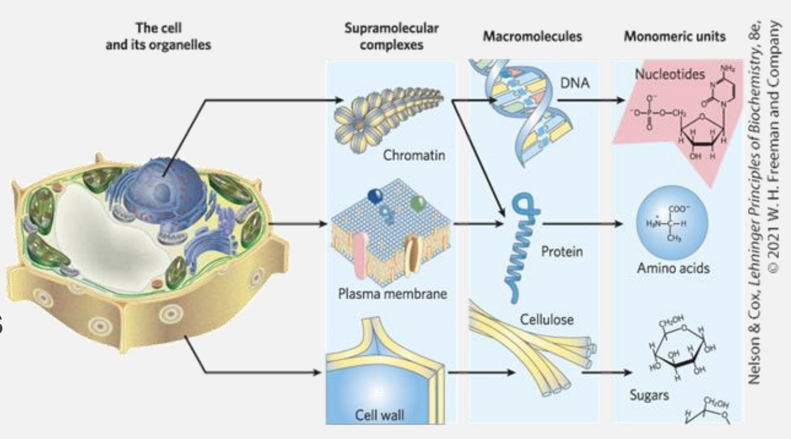

Cells build supramolecular structures which are are large assemblies of molecules held together by noncovalent interactions, including hydrogen bonds, ionic interactions, van der Waals forces, and the hydrophobic effect.

These structures are important because they are flexible and can form or break easily. Examples include:

- **Protein complexes**: Groups of proteins working together.
- **Lipid bilayers**: The main structure of cell membranes.
- **DNA double helix**: Two strands of DNA held by hydrogen bonds.
- **Cell assemblies**: Structures like ribosomes and chromatin in cells.

### The main elements comprising biomolecules

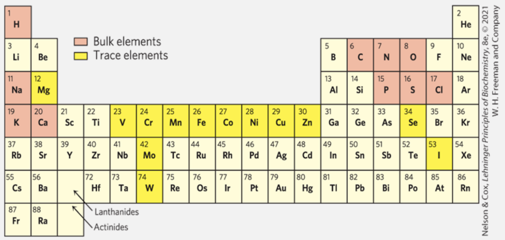

The main elements in biochemical materials are **carbon (C)**, **hydrogen (H)**, **oxygen (O)**, and **nitrogen (N)**. These elements strongly tend to form covalent bonds, leading to a wide variety of chemical and biological compounds.

- **70% of the human body is made up of water (H₂O).**
- **Sulfur (S)** is found in nearly all proteins.
- **Phosphorus (P)** is crucial for metabolism and the structure of nucleic acids like DNA and RNA.

### Functional groups

Functional groups are specific groups of atoms within molecules that determine the characteristic chemical reactions and properties of those molecules.

In biomolecules, functional groups are essential for dictating how molecules interact with each other and perform biological functions

These groups typically replace hydrogen atoms in hydrocarbons, giving rise to molecules with diverse chemical behaviors.

- **Variety of carbon** ($\text{C}$): Carbon's ability to form covalent single, double, and occasionally triple bonds makes it incredibly versatile.

  - In biological molecules, this means carbon can create stable, complex structures essential for life, such as chains and rings, which serve as backbones for biomolecules.

- **Formation of 4 stable single bonds**: Carbon can form up to four stable single covalent bonds with other atoms, including other carbon atoms.

  - This property allows the formation of long carbon chains and branched structures, which are foundational to many biomolecules like carbohydrates, lipids, and proteins.
  - Biomolecules as hydrocarbons: Biomolecules can be thought of as hydrocarbons (compounds made of hydrogen and carbon). In most biomolecules, some of the hydrogen atoms are replaced by functional groups, such as:

    - hydroxyl $\text{-OH}$
    - carboxyl $\text{-COOH}$
    - amino $\text{-NH}_2$

    Giving the molecules distinct properties and reactivity.

### The four classes of biomolecules

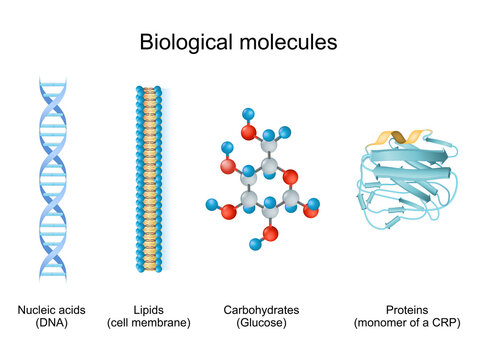

1. **Nucleic Acids**: DNA and RNA, which store and transmit genetic information.
2. **Lipids**: Fats and oils used for energy storage, insulation, and cell membranes.
3. **Carbohydrates**: Sugars and starches used for energy and structure.
4. **Proteins**: Made of amino acids; they act as enzymes, structural components, and in cell signaling.

Macromolecules are the major constituents of a cell $\rightarrow$ these structures are polymers with molecular weight that go beyond $\text{5000 Da } \text{(daltons } \leftrightarrow \text{g/mol)}$. They are assembled from relatively simple precursors:

**Precursors** refer to simpler molecules or building blocks that combine to form larger, more complex structures. Macromolecules like proteins, nucleic acids, and polysaccharides are constructed from these foundational precursors, linking together through chemical bonds to create the intricate structures necessary for cellular function.

1. **Proteins** are large polymers made of amino acids, connected in specific sequences by peptide bonds. Their structure determines their roles, including catalyzing reactions, providing structural support, signaling, and transporting molecules within cells. The sequence of amino acids carries information that dictates the protein’s shape and function.

2. **Nucleic Acids** include DNA and RNA, which are polymers of nucleotides. Each nucleotide contains a nitrogenous base, a sugar, and a phosphate group. DNA stores genetic information, while RNA transmits this information for protein synthesis. The sequence of bases in nucleic acids encodes genetic instructions crucial for cellular processes.

3. **Polysaccharides** are long chains of simple sugars, such as glucose, and function in energy storage (like glycogen in animals and starch in plants) or provide structural support (like cellulose in plants). Though not all are informational, specific short polysaccharides (oligosaccharides) on cell surfaces help in cell recognition and signaling.

4. **Oligomers** are short chains of monomers, typically fewer than ten subunits. These can act as intermediates in forming larger macromolecules or function independently, especially in cellular signaling or molecular assembly.

#### Informational Macromolecules

The term “informational macromolecules” highlights that proteins, nucleic acids, and some oligosaccharides possess sequences that convey specific information. This sequence-dependent information is crucial for encoding biological functions, as seen in DNA’s genetic code, RNA’s message translation, and protein amino acid sequences that specify structure and function. This structured information enables the precise regulation of cellular activities and organismal development.

### Nucleic acids

**Nucleic acids** are molecules essential for storing, transmitting, and processing genetic information in cells.

**What is a gene?**  
A gene is a segment of a DNA molecule that contains the necessary information for synthesizing a functional biological product, either a protein or RNA.

**Basic functions of DNA**:

- Storage of biological information.
- Transmission of that information to subsequent generations.

**Nucleotides**  
Nucleotides are the building blocks of nucleic acids (DNA and RNA). They consist of three main components:

1. A nitrogenous base, which can be either a **pyrimidine** (cytosine, thymine, or uracil) or a **purine** (adenine or guanine).
2. A pentose sugar, either ribose (in RNA) or deoxyribose (in DNA).
3. One or more phosphate groups.

    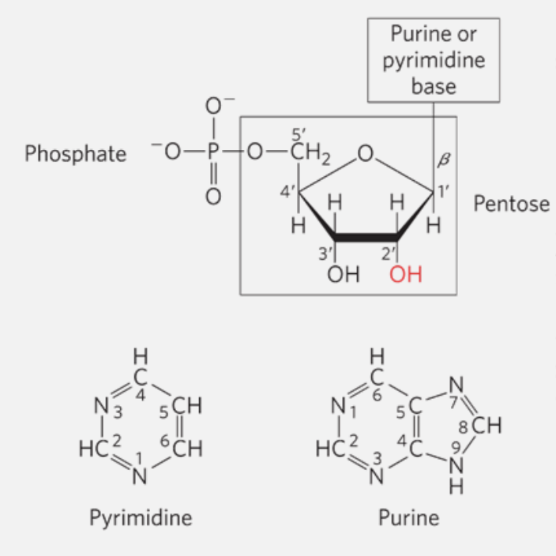

If a nucleotide lacks a phosphate group, it is called a **nucleoside**.

### Differences between DNA and RNA

- **RNA** is ribonucleic acid, which contains the pentose sugar ribose.
- **DNA** is deoxyribonucleic acid, containing deoxyribose, which lacks one oxygen atom compared to ribose.

Some of the key differences can be highlighted below as both functional and structural traits:

- **Sugar**: DNA contains deoxyribose, while RNA contains ribose.
- **Nitrogenous Bases**: DNA includes adenine, guanine, cytosine, and thymine; RNA has uracil instead of thymine.
- **Structure**: DNA is usually double-stranded, forming a double helix, whereas RNA is typically single-stranded.
- **Function**: DNA primarily stores genetic information, while RNA has multiple roles, including protein synthesis (mRNA, tRNA, and rRNA) and regulatory functions.

    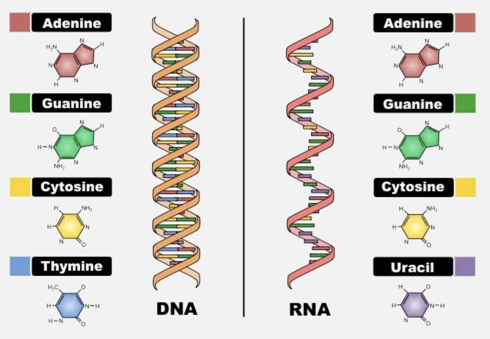

### Nucleotides can also function as monomers

**What even is a monomer? **
A **monomer** is a small molecule that can join with other similar or identical molecules to form a **polymer**. Nucleotides serve as monomers for nucleic acids (DNA and RNA) and play crucial roles beyond building DNA and RNA strands.

#### Functions of Nucleotides Beyond DNA and RNA Synthesis

- **Energy Currency**: ATP (adenosine triphosphate) is a nucleotide that serves as a primary energy carrier in cells. It captures chemical energy from food breakdown and releases it to fuel various cellular processes.

- **Enzyme Cofactors**: Nucleotides form parts of enzyme cofactors, such as NAD⁺ (nicotinamide adenine dinucleotide) and FAD (flavin adenine dinucleotide). These cofactors assist in redox reactions critical for cellular respiration and energy production.

- **Signaling Molecules**: cAMP (cyclic adenosine monophosphate) is a signaling molecule derived from ATP. It helps in transmitting signals within cells, such as those triggered by hormones, allowing cells to respond appropriately to external stimuli.

#### Cellular Metabolism and Signal Transduction

Nucleotides are integral to cellular metabolism as they contribute to energy transfer, signal transmission, and the regulation of metabolic pathways. For example, cAMP acts as a "second messenger" in many signal transduction pathways, relaying messages from hormones outside the cell to elicit responses within the cell, such as enzyme activation or gene expression adjustments.

### Phosphodiester Bonds Link Successive Nucleotides in Nucleic Acids

    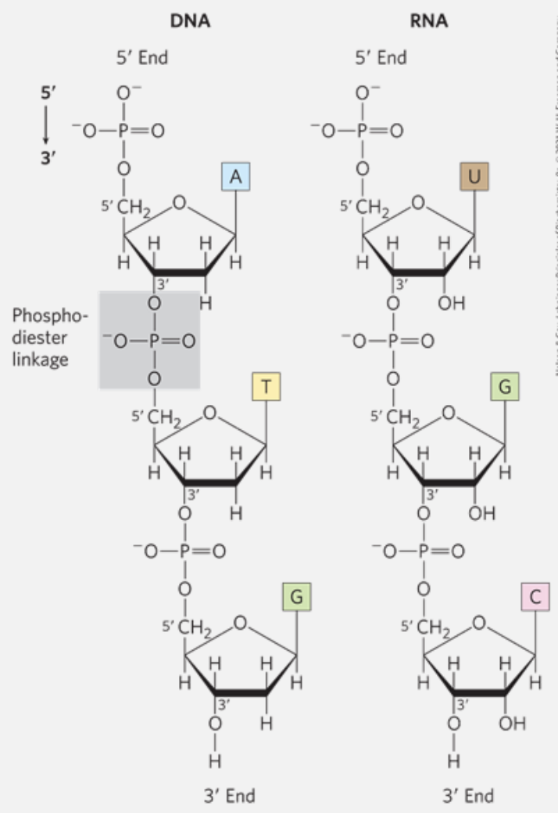

A **phosphodiester linkage** is covalent bond that joins successive nucleotides of both **DNA** and **RNA**. The linkage happens between the **phosphate group** of one nucleotide and the **hydroxyl group** of another neighbor nucleotide.

### Base pairing permits the duplication of genetic information

A **base pair** is a label given to the **hydrogen-bonding** patterns that emerge between complementary strands of nucleic acids. Each nucleotide in DNA pairs specifically with only one other nucleotide: adenine (A) pairs with thymine (T) $\rightarrow \text{A-T T-A}$ , and cytosine (C) pairs with guanine (G) $\rightarrow \text{G-C C-G}$. This specific pairing means that the strand on the opposite side of each base pair serves as a template that complements and mirrors the sequence of the current strand, creating a **complementary strand** (e.g., one strand determines the sequence of the other).

    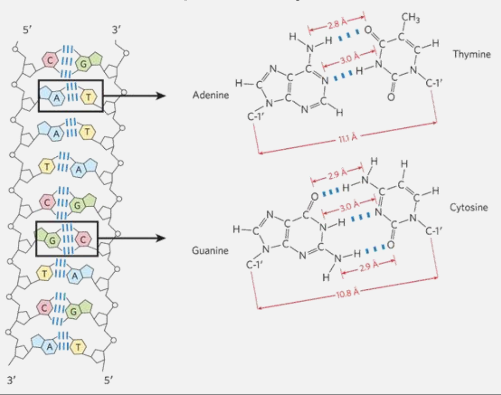

### DNA is a double helix that stores genetic information

Offset pairing of the two strands creates a major groove and a minor groove

    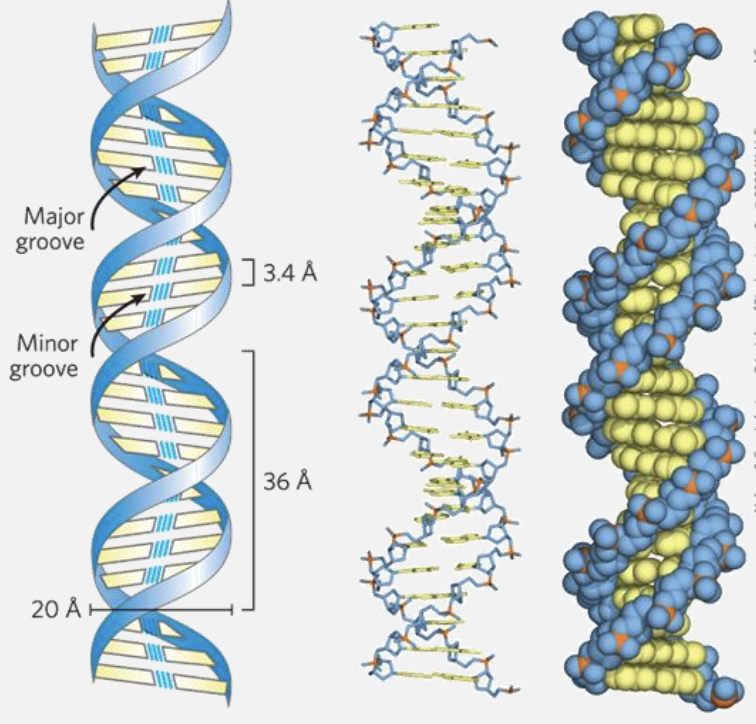

In the DNA double helix, **hydrogen bonding** and **base structure** determine the pairing strength between the bases:

- **Base Pairing**

  - **Adenine (A)** pairs with **Thymine (T)**, forming **2 hydrogen bonds**.
  - **Guanine (G)** pairs with **Cytosine (C)**, forming **3 hydrogen bonds**.

- **Reason for Bonding Differences**

  - **G-C pairs** are stronger due to the third hydrogen bond, making these pairs more stable and contributing to the DNA's structural integrity, especially in high-GC regions.
  - **A-T pairs** are slightly weaker because they have only two hydrogen bonds, which is sufficient for stable pairing but results in a slightly lower melting temperature in A-T-rich regions.

- **Groove Formation**
  - The **offset pairing** of the DNA strands creates the **major and minor grooves**. These grooves are essential as they allow protein interactions, enabling DNA replication, transcription, and other cellular processes.
  - the groove structure allows DNA to make some information highly accessible (major groove) for regulatory purposes, while other interactions are more generalized or protective (minor groove). This arrangement is crucial for efficient cellular function and precise control over genetic processes.

### Secondary structure of RNA

In the secondary structure of RNA, the overall shape and stability arise from A-form double helix regions and loops or bulges due to mismatches or unpaired bases.

- **Bulges and Internal Loops**:

  - **Bulges** occur when there are extra, unpaired bases on one strand, causing a bump in the structure.
  - **Internal Loops** form between unpaired bases on both strands, often in **palindromic sequences** where the RNA folds back on itself, creating gaps or "loops."

- **Functional Role**: These irregularities (bulges and loops) are crucial for RNA's interactions and functions, exposing bases for binding with proteins, other RNAs, or small molecules, enabling RNA's diverse cellular roles.

In essence, these "zipped and unzipped" sections give RNA flexibility and unique functional sites.

    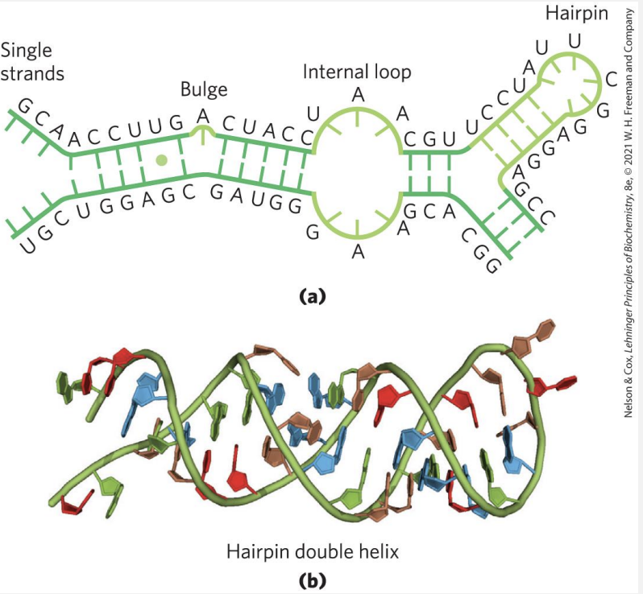

### What does RNA do?

There are some different classes of **RNA**

- **ribosomal RNAs** (rRNAs) $\rightarrow$ components of ribosomes.
- **messenger RNAs** (mRNAs) $\rightarrow$ intermediates in protein synthesis
- **transfer RNAs** (tRNAs) $\rightarrow$ adapter molecules that translate the information in mRNA into a specific amino acid sequence
  - literally the type of RNA that puts the mRNA into practice
- **noncoding RNAs** (ncRNAs) $\rightarrow$ wide variety of functions.
  - most of these are found involved in translation processes
    - translation is the the process in a living organism by which proteins are produced via RNA.

    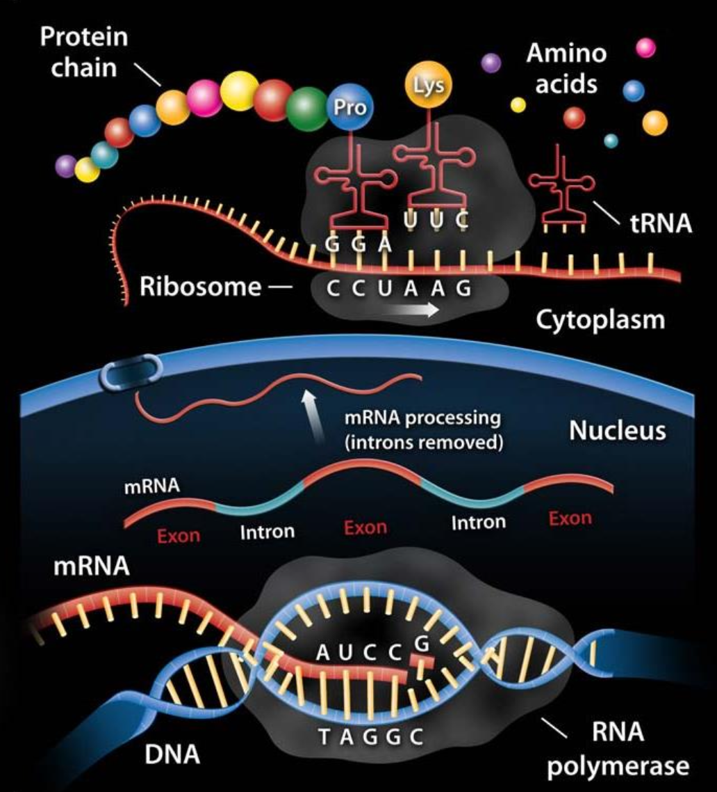

> 🔗 Resources
> yourgenome: from DNA to Protein: https://www.youtube.com/watch?v=gG7uCskUOrA

Ribonucleoprotein (RNP) particles called ribosomes are the 'factories' where translation takes place in the cell.

$\alpha\text{-amino acids} $ are the amino acids in which amino and carboxyl groups are bound to the same carbon atom

    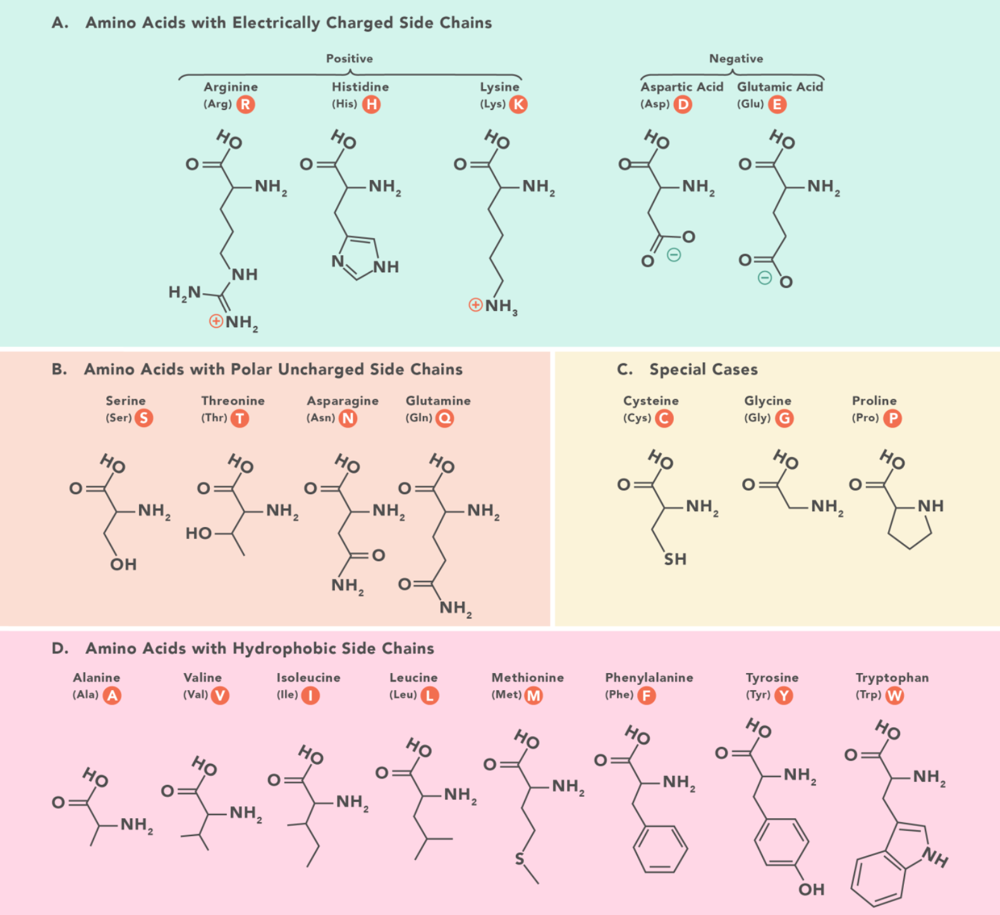

### Types of protein structures

Each level of protein structure (primary, secondary, tertiary, and quaternary) contributes to the overall shape and function of the protein.

    

#### Primary structure

The first structure defines the unique order in which amino acids are linked together to form a protein. Proteins are constructed from a set of 20 amino acids that are represented in the image above.

Structure for amino acids is generally like follows:

- A carbon, the $\alpha$ carbon bonded to the four groups:
  - A $\ce{H}$ atom
  - A Carboxyl group $\ce{-COOH}$
  - An amino group $\ce{NH2}$
  - A "variable" group or "R" group, that could really be anything

The "R" group varies among amino acids and determines the differences between these protein monomers.

**NOTE**: The order of amino acids in a polypeptide chain is unique and specific to a particular protein. Altering a single amino acid causes a gene mutation, which most often results in a non-functioning protein.

#### Secondary structure

Secondary structure refers to the coiling or folding of a polypeptide chain that gives the protein its 3D shape.

- $\alpha \space helix \rightarrow$ coiled spring and is secured by hydrogen bonding
- $\beta \space pleated \space sheet\rightarrow$ held together by hydrogen bonding between polypeptide units of the folded chain that lie adjacent to one another.

#### Tertiary structure

This structure refers to the comprehensive 3D structure of the polypeptide chain of a protein. There are several bonds and forces holding a protein together

- **Hydrophobic interactions**, probably the most relevant. The "R" group of the amino acid is either hydrophobic or hydrophilic. Hydrophilic "R" groups will seek contact with their aqueous environment, while hydrophobic "R" groups will avoid water and position towards the center.
- **Hydrogen bonding** as reinforcement of the structure given by the latter.
- Due to **protein folding**, ionic bonding can occur between the oppositely charged "R" groups that could form further bonds.

Folding can also result in covalent bonding between the "R" groups of cysteine amino acids. This type of bonding forms what is called a **disulfide bridge**... _van der Waals forces also assist in the stabilization of protein structure._

#### Quaternary Structure

Quaternary Structure refers to the structure of a protein macromolecule formed by interactions between multiple polypeptide chains (forming dimers, trimers, tetramers, etc.)
 
Each polypeptide chain is referred to as a subunit. Proteins with quaternary structure may consist of more than one of the same type of protein subunit. Such proteins can be dynamic, allowing conformational changes essential for function.

- Allows complex formations like ion channels and receptors.
- Facilitates regulation via allosteric effects, where binding at one site affects another.

- **Example**:
  - **Hemoglobin**: found in the blood, is an iron-containing protein that binds oxygen molecules. It contains four subunits: two alpha subunits and two beta subunits.
  - Hemoglobin shows cooperative behavior, where oxygen binding to one subunit affects others.

### Lipids

These are not considered polymeers as they are not build from smaller subunits similar in composition/structure. As such, they have highly variable chemical structure, poor solubility in water. Used as energy stored and they're the structural foundation of membranes.

**NOTE**: lipids are classified according to their level of complexity: simple, complex and derivative

### Fatty acids

Fatty acids are water-insoluble hydrocarbons user for cellular energy storage.

**How come they store energy?** 
Fatty acids have a high energy density because their long hydrocarbon chains contain numerous $\ce{C-H}$ (carbon-hydrogen) bonds. These bonds are rich in energy because they are non-polar and relatively weak, making them easily broken down to release energy.

- When oxidized during metabolism, these bonds release a significant amount of energy, more than carbohydrates and proteins per gram.

Fatty acids can either be:

- Saturated
  - All carbons along the chain have the maximum amount of $\ce{H}$ atoms bonded to them, leading to no $\ce{C=C}$ double bonds.
- Insaturated
  - $\ce{C=C}$ double bonds are present

Packing is the feature of fatty acids that allow them to "pack" together into increasingly steady structural form depending on the degree of the unsaturation.

- Fully saturated fats $\rightarrow$ quasi perfect packing $\Rightarrow$ waxy at room temp.
- Increasingly insaturated fats $\rightarrow$ more messy packing $\Rightarrow$ liquid tendency at room temp.

    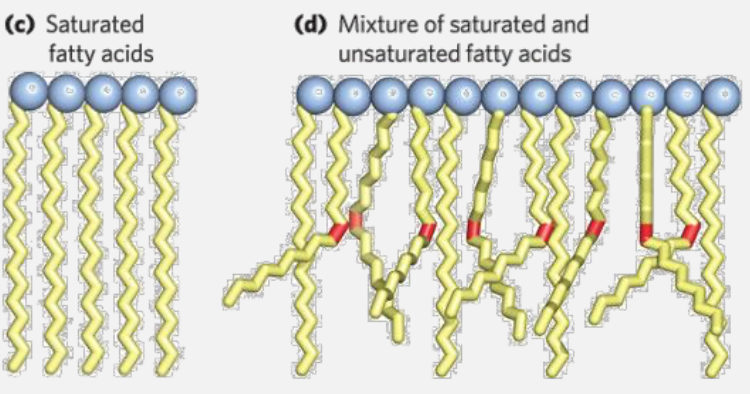

### Glycerophospholipids

The main component of membranes in bacteria, plants and animals. **glycerophospholipids** (aka phosphoglycerides) are membrane lipids in which two fatty acids are attached in ester linkage to the first and seconds carbons of glycerol, and a highly polar or charged group is attached through a phosphodiester linkage to the third carbon.

    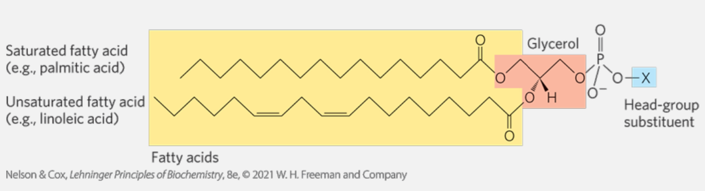

- **Glycerol** shown in red.
- Carbons numbering in glycerol goes left to right.
- **Blue** represent the group bonded to the glycerol via the *phosphodiester linkage*.

### Micelle formations

Spherical structures containing amphipathic molecules arranged with hydrophobic regions in the interior and hydrophilic head groups on the exterior.

    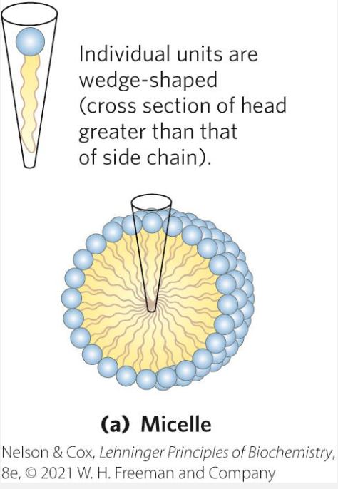

This formation is favoured when the cross sectional are of the head group is greater than that of the acyl side chain(s), leading to a sort of code shape if you will.

### The hydrophobic effect
 
**What does it lead to in lipids?** The hydrophobic effect drives glycerophospholipids to form bilayers in water, where hydrophobic tails minimize contact with water by clustering inward while hydrophilic heads face outward. This self-organization creates an enclosed membrane structure (formed as a bilayer, where tails can be seen aggregating in the middle of the two head layers), essential for forming cellular compartments, facilitating communication, and regulating substance movement in and out of the cell.

    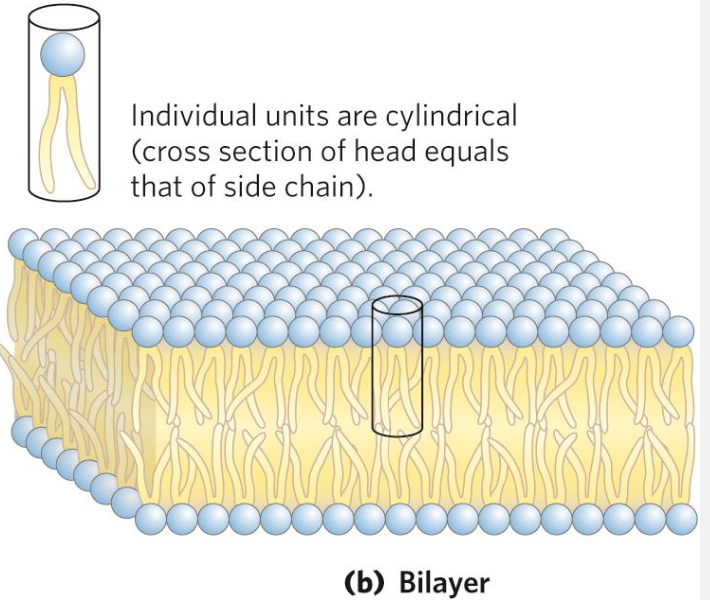

The bilayer formation is favoured in cases where the cross-sectional area of the head group is similar to the one of the acyl side chains.

    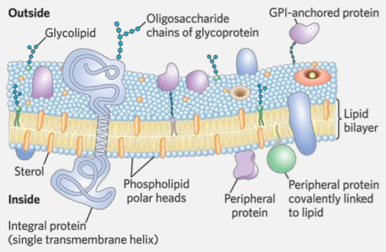

Proteins are interspersed within this lipid bilayer, either embedded within the membrane (**integral proteins**) or attached to its surface (**peripheral proteins**). These proteins can move laterally within the membrane, contributing to its fluidity and functionality.

- The overall pattern results in a dynamic and flexible structure that supports various cellular functions, such as transport, signaling, and communication.

### Triacylglycerols, storage of energy and insulation

Triacyglycerols are the simplest lipids constructed from fatty acids
- They are composed of three fatty acids, each in ester linkage with a single glycerol (esters of glycerol)

**REMIND**
- **An ester linkage** is a bond formed between an alcohol and a carboxylic acid, resulting in the release of water (a condensation reaction). In this bond, the hydroxyl group $\ce{-OH}$ of the carboxylic acid reacts with the hydroxyl group of the alcohol, leading to the formation of an ester functional group $\ce{-COO-}$. In the context of lipids, ester linkages are significant because they link fatty acids to glycerol in triglycerides and glycerophospholipids.
- **An alcohol** is an organic compound that contains one or more hydroxyl groups $\ce{-OH}$ attached to a carbon atom.

    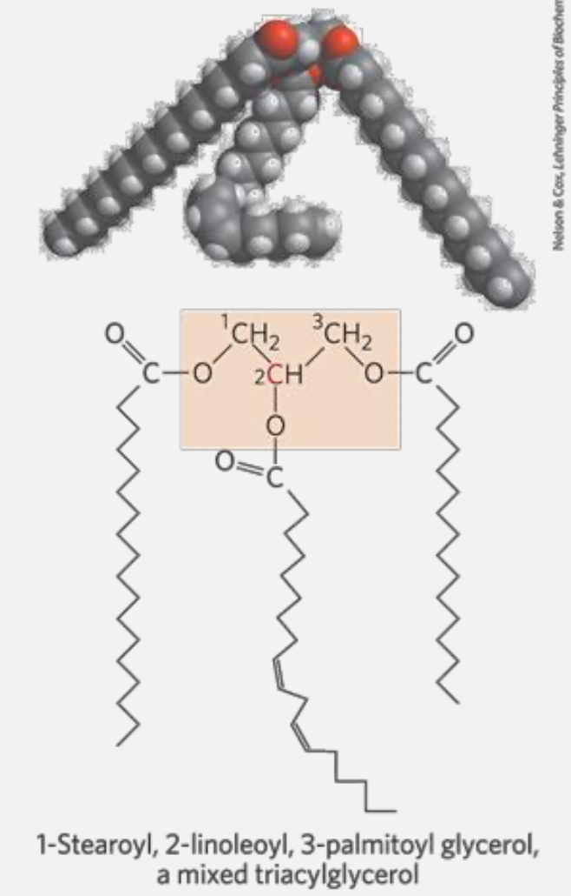
    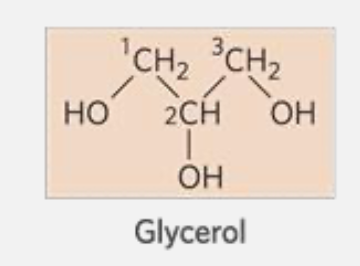

### Quick overview on carbs

**Carbohydrates** are organic compounds made of carbon, hydrogen, and oxygen, typically in a 1:2:1 ratio. They are classified into three categories:

1. **Monosaccharides**: Simple sugars like glucose and fructose, which serve as energy sources.
2. **Disaccharides**: Composed of two monosaccharides, such as sucrose (table sugar) and lactose (milk sugar).
3. **Polysaccharides**: Long chains of monosaccharides, including starch (energy storage in plants) and cellulose (structural support in plant cell walls).

Carbohydrates are the most abundant biomolecules on Earth, crucial for energy storage and metabolism, and are produced in plants via photosynthesis, where carbon dioxide and water are converted into sugars using sunlight.
