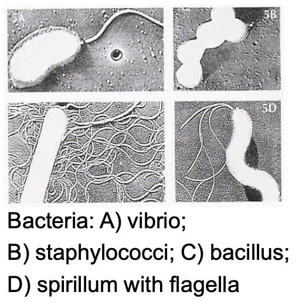
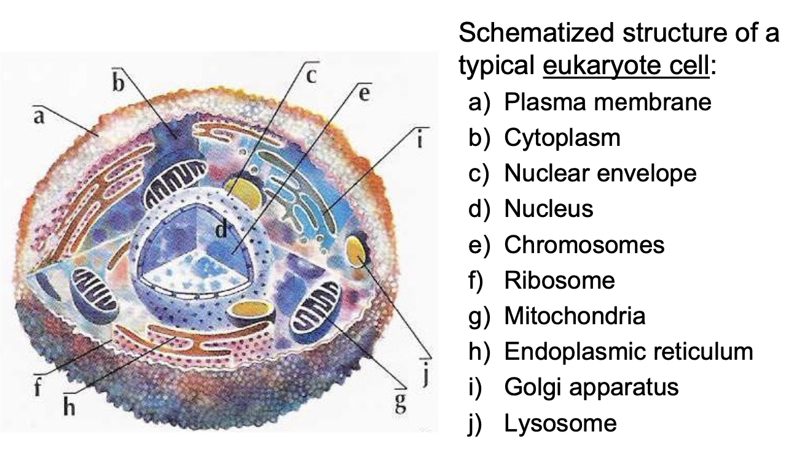
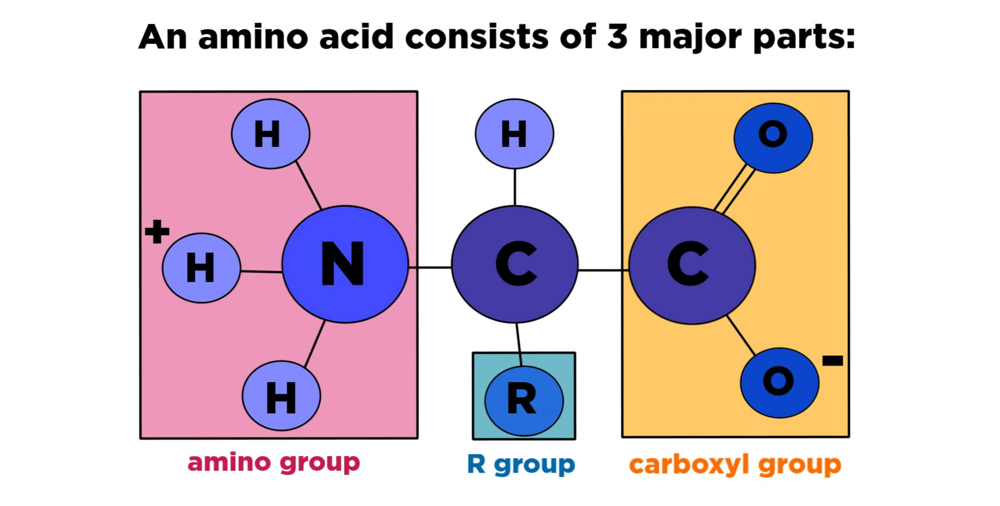

# Concepts of Genetics and Molecular Biology

[TOC]

## Definitions

- **Genetics**: The branch of biology that explores heredity, focusing on how traits are passed from one generation to the next. These traits are governed by **genes**.
- **Biology**: The science that studies the structure, function, and interactions of living organisms, as well as the conditions necessary for life.

- **Molecular Biology**: A field of biology that investigates living organisms at the molecular level, particularly focusing on the interactions of macromolecules like proteins, **DNA**, and **RNA**, which underlie biological processes.

## Characteristics of Living Beings

All living organisms share **seven key characteristics** that distinguish them from non-living matter:

- **Structural Complexity**: Organisms possess intricate structures at multiple levels, from the macroscopic (whole organisms) to the cellular and intracellular levels.

- **Organization**: Living beings exhibit highly ordered and functional structures.

  - **Macroscopic level**: such as animals and plants.
  - **Microscopic level**: including cellular and intracellular organization.

- **Energy Utilization**: Organisms derive energy from their environment (e.g., solar energy, chemical energy from food) to perform work, build, and maintain their structure.

- **Reproduction**: Organisms have the ability to reproduce, ensuring the continuation of their species by passing down essential characteristics.

- **Development**: In more complex organisms, a single cell can differentiate into multiple cell types, forming specialized tissues.

- **Response to Stimuli**: Living organisms react to environmental cues to maximize their survival with minimal energy expenditure. For example:

  - Movement in response to predators or light (in plants).
  - Adjustments to changing climates.

- **Evolution**: According to the majority of biologists, organisms undergo evolutionary changes over time, allowing them to adapt and transform in response to their environment.

## The cell

The biological unit of all living beings is the cell

- Organisms:
  - unicellular (made up of only one cell)
  - multi-cellular (made up of a variable number of cells);

> on average, human being have about 37.2 trillions cells

- Depending on their structure the cells can be divided into:
  - **Prokaryotes**: have a nucleus not clearly separated from the rest of cellular matter
  - **Eukaryotes**: cells having a well defined structure

### Prokaryotes

- **Prokaryotes** are **unicellular organisms**, meaning they consist of only one cell. They are considered the most **simple and ancient** life forms on Earth. Unlike more complex cells (eukaryotes), prokaryotes lack a nucleus and membrane-bound organelles.

- **Bacteria**, a major group of prokaryotes, are the most **numerous living organisms** on the planet. They come in different **shapes**, which can be used to classify them:

  - **Coccus (plural: cocci)**: These bacteria are **spherical** or round-shaped (a).
  - **Bacillus (plural: bacilli)**: These bacteria are **rod-shaped** or stick-like (b).
  - **Spirillum (plural: spirilla)**: These bacteria have a **spiral or corkscrew shape** (c).

  

- The diversity in bacterial shapes is related to their **function and movement**:
  - **Cocci**: These tend to be non-motile or move in simple ways and often form clusters or chains.
  - **Bacilli**: These rod-shaped bacteria can have flagella for movement and are commonly involved in nutrient cycling.
  - **Spirilla**: These bacteria are more **mobile**, often moving using **flagella** (whip-like structures) to propel themselves, typically found in aquatic environments.

**Examples of Bacteria**

- **Vibrio**: A comma-shaped bacterium (related to cholera).
- **Staphylococci**: A cluster-forming spherical bacterium (related to infections like staph).
- **Bacillus**: A rod-shaped bacterium, often involved in decomposing organic matter.
- **Spirillum with flagella**: A spiral-shaped bacterium that uses flagella to move, often found in stagnant water.

These structural variations in bacteria help them adapt to different environments, aiding in their survival and interaction with other organisms, including humans.

### Eukaryotes

**Eukaryotic cells** are more complex than prokaryotic cells and have a well-defined internal structure. They are found in all multicellular organisms (like animals, plants, fungi, and humans) as well as some unicellular organisms (like certain protists).

- **Plasma membrane**:
  - Eukaryotic cells are **enclosed by a plasma membrane**, which acts as a barrier controlling what enters and exits the cell. The membrane also maintains the cell's integrity and supports communication between the cell and its environment.
- **Cytoplasm**:

  - Inside the plasma membrane, there is **cytoplasm**, which consists of a **gel-like substance** that fills the cell. This cytoplasm contains all the **cellular components** and allows for the movement of materials within the cell.

- **Nucleus**:

  - Unlike prokaryotes, eukaryotic cells have a **well-defined nucleus** that contains the cell's genetic material (DNA). The nucleus is enclosed by a **nuclear envelope**, a double membrane that separates the genetic material from the rest of the cell and controls the exchange of materials between the nucleus and the cytoplasm.
  - The nucleus is the **control center** of the cell, regulating cell growth, division, and function by directing protein synthesis.

- **Chromosomes**:

  - Thread-like structures made of DNA and proteins found in the nucleus. They contain the cell’s genetic information and are crucial during cell division, ensuring DNA is accurately replicated and distributed.

- **Ribosomes**:

  - Small structures either **floating freely in the cytoplasm or attached to the rough endoplasmic reticulum**. Ribosomes are responsible for **protein synthesis** by translating genetic instructions into polypeptides (protein chains).

- **Organelles**:

  - In the cytoplasm, eukaryotic cells contain **membrane-bound organelles**, which perform **specific vital functions** necessary for the cell’s survival and operation. Some key organelles include:

  - **Mitochondria**:

    - Often referred to as the "powerhouses" of the cell, mitochondria generate energy in the form of **ATP (adenosine triphosphate)** through a process called **cellular respiration**. Mitochondria play a crucial role in energy metabolism and are essential for powering various cellular activities.

  - **Endoplasmic reticulum (ER)**:

    - The **endoplasmic reticulum** is a network of membranes that helps in the **production and transport of proteins and lipids**. There are two types:
      - **Rough ER** (studded with ribosomes): Involved in the synthesis of proteins that are either secreted from the cell or sent to the cell membrane.
      - **Smooth ER** (lacks ribosomes): Responsible for lipid synthesis and detoxification of harmful substances.

  - **Golgi apparatus**:
    - The **Golgi apparatus** functions like the cell's "post office." It **modifies, sorts, and packages proteins** and lipids made in the ER before they are sent to their final destination within or outside the cell. It plays a critical role in the secretion of proteins and in forming lysosomes.

- **Lysosome**:
  - These are **small vesicles** containing digestive enzymes. They break down waste materials, old cell parts, and foreign invaders, helping to maintain cellular health through waste disposal and recycling.

## The four main types of biological macromolecules

1. Proteins

- **Function**: Proteins are the **workhorses of the cell**, performing a wide range of functions. They are involved in almost every cellular process, including **enzymatic reactions** (as enzymes), **structural support** (e.g., collagen), **transport** (e.g., hemoglobin), **signaling** (e.g., hormones like insulin), and **immune responses** (e.g., antibodies).
- **Structure**: Proteins are composed of long chains of **amino acids**, which are folded into specific shapes. The shape of a protein determines its function.
- **Importance**: Without proteins, cells wouldn't be able to carry out vital tasks, such as metabolizing nutrients, moving molecules across membranes, or communicating with other cells.

2. Polysaccharides

- **Function**: Polysaccharides are **complex carbohydrates** made up of long chains of sugar molecules. They play crucial roles in **energy storage** (e.g., glycogen in animals, starch in plants) and as **structural components** (e.g., cellulose in plant cell walls).
- **Structure**: These molecules are polymers of simple sugars (monosaccharides), such as glucose. When many of these sugar units are linked together, they form polysaccharides.
- **Importance**: Polysaccharides are important for providing cells with **energy** and **structure**. For example, plants use cellulose to maintain their rigidity, and animals store glycogen as a quick energy source.

3. Lipids

- **Function**: Lipids, including **fats, oils, and phospholipids**, are essential for **energy storage**, **cell membrane structure**, and acting as signaling molecules (e.g., hormones).
- **Structure**: Lipids are not polymers like proteins or polysaccharides. They are made up of **fatty acids and glycerol**. In cell membranes, they form a **bilayer** that acts as a barrier, protecting the cell and controlling what enters and exits.
- **Importance**: Lipids play a vital role in maintaining the integrity of the cell membrane, enabling cells to keep their shape and protect their contents. They also serve as **long-term energy storage** and are involved in **cell signaling**.

4. Nucleic acids

- **Function**: Nucleic acids, including **DNA** (deoxyribonucleic acid) and **RNA** (ribonucleic acid), are responsible for **storing and transmitting genetic information**. DNA holds the instructions for building proteins, while RNA translates these instructions into action during protein synthesis.
- **Structure**: Nucleic acids are composed of **nucleotides**, which consist of a sugar, a phosphate group, and a nitrogenous base. In DNA, these bases are adenine (A), thymine (T), cytosine (C), and guanine (G). In RNA, thymine is replaced by uracil (U).
- **Importance**: DNA is essential for **heredity** and provides the blueprint for all cellular functions. RNA plays a key role in **protein synthesis** by reading and translating DNA's instructions.

### Proteins

Proteins are polymers constituted by chains of **amino acids** (monomers). There are **20 different amino acids** that make up proteins:

- **Alanine** (Ala, A)
- **Cysteine** (Cys, C)
- **Aspartic acid** (Asp, D)
- **Glutamic acid** (Glu, E)
- **Phenylalanine** (Phe, F)
- **Glycine** (Gly, G)
- **Histidine** (His, H)
- **Isoleucine** (Ile, I)
- **Lysine** (Lys, K)
- **Leucine** (Leu, L)
- **Methionine** (Met, M)
- **Asparagine** (Asn, N)
- **Proline** (Pro, P)
- **Glutamine** (Gln, Q)
- **Arginine** (Arg, R)
- **Serine** (Ser, S)
- **Threonine** (Thr, T)
- **Valine** (Val, V)
- **Tryptophan** (Trp, W)
- **Tyrosine** (Tyr, Y)

**Amino acids** are molecules composed of the following components:

- 1 **central atom of carbon** (C), linked to:
  - 1 atom of **hydrogen** (H)
  - 1 **amino group** (-NH₂)
  - 1 **carboxylate group** (-COOH)
  - 1 **side chain** (R), which varies for each amino acid (e.g., Ala, Cys, Asp, etc.)

The side chain (R-group) is what differentiates each amino acid and influences how they interact in protein folding and function. Amino acids (proteins) can have different functions:

- Structural (they constitute the cell’s frame)
- Enzymatic (catalyze (allow) the majority of cellular reactions)
- Hormonal (execute regulative functions)
- Immunity (defense from other entities, mediated by the Immunoglobulines)

### Polysaccharides

Polysaccharides are **polymers** made up of long chains of **monosaccharides** (simple sugars like glucose). They serve various functions, including **energy storage** and **structural support** in living organisms.

- **Glycogen**:
  - Glycogen is the primary **energy storage** polysaccharide in **animals**. It is highly branched and is stored mainly in the **liver** and **muscles**. When the body needs energy, glycogen is quickly broken down into glucose, which cells use for energy production (ATP). This makes it a crucial **instant energy reservoir**.
- **Starch (Amid)**:

  - Starch is the most important energy storage polysaccharide in **plants**. It consists of two components:
    - **Amylose**: A linear chain of glucose molecules.
    - **Amylopectin**: A branched form of glucose.
  - Plants store starch in structures like **chloroplasts** or **amyloplasts**, and it serves as a long-term **energy reserve** that can be broken down into glucose when needed for growth or energy.

- **Cellulose**:
  - Cellulose is another polysaccharide found in **plants**, but unlike starch, it plays a **structural role**. It forms the **cell wall** of plant cells, providing rigidity and strength to the plant structure. Unlike starch and glycogen, cellulose is made of **beta-glucose** units, which humans cannot digest, but it’s a critical fiber source in the diet.

In summary, polysaccharides are essential for:

- **Energy storage** (glycogen in animals, starch in plants).
- **Structural support** (cellulose in plants).

### Lipids (Fats)

Lipids, also known as fats, are **hydrophobic molecules** that play key roles in energy storage, structural components of membranes, and signaling.

- **Cellular membrane constituents**:

  - Lipids, especially **phospholipids**, are the main components of the **cell membrane**. The membrane is made up of a **phospholipid bilayer**, which creates a barrier that protects the cell from the external environment and regulates what enters and exits the cell. The hydrophobic tails of phospholipids ensure that the membrane remains selectively permeable.

- **Energy reservoir**:
  - Lipids also act as a **long-term energy storage**. They store more energy per gram compared to carbohydrates like glycogen. When the body runs low on carbohydrates, it breaks down lipids into fatty acids and glycerol, which can be used to generate ATP. This makes them an important **energy source** when carbohydrates are scarce.
  - **Triglycerides**, a type of lipid, are stored in **adipose tissue** in animals and are used as an energy reserve during fasting or periods of intense activity.