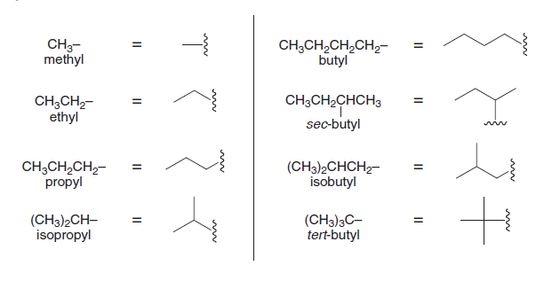
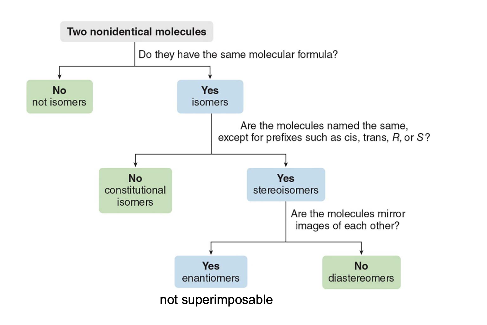
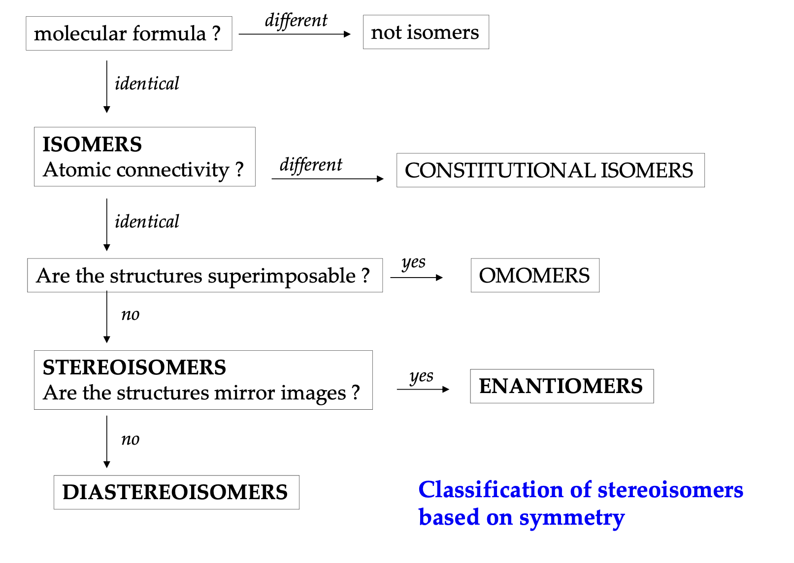

# Organic Chemistry

## Lessons

1. [Introduction](./lesson-1_17-09-2024-introduction.md)
2. [Atomic structure and chemical bonding](./lesson-2_19-09-2024.md)
3. [Brønsted-Lowry Acids and Bases, Lewis Acids and Bases](./lesson-3_20-09-2024.md)
4. [Functional groups, intermolecular forces and physical properties](./lesson-4_24-09-2024.md)
5. [Alkanes and cycloalkanes, structures, conformations and newma projections](./lesson-5_27-09-2024.md)
6. [Fundamentals of Stereochemistry: Chirality, Stereogenic Centers, Descriptors, Isomerism, and Optical Activity](./lesson-6_1-10-2024.md)

## Chaatsheet and notes

### Alkyl groups

| **Number of Carbons** | **Alkyl Group** | **Formula**       | **Structure Example**         |
|-----------------------|-----------------|-------------------|-------------------------------|
| 1                     | Methyl          | $\ce{CH3-}$      | $\ce{-CH3}$                   |
| 2                     | Ethyl           | $\ce{C2H5-}$     | $\ce{-CH2CH3}$                |
| 3                     | Propyl          | $\ce{C3H7-}$     | $\ce{-CH2CH2CH3}$             |
| 3                     | Isopropyl       | $\ce{C3H7-}$     | $\ce{-CH(CH3)2}$              |
| 4                     | Butyl           | $\ce{C4H9-}$     | $\ce{-CH2CH2CH2CH3}$          |
| 4                     | Isobutyl        | $\ce{C4H9-}$     | $\ce{-CH2CH(CH3)2}$           |
| 4                     | Sec-butyl       | $\ce{C4H9-}$     | $\ce{-CH(CH3)CH2CH3}$         |
| 4                     | Tert-butyl      | $\ce{C4H9-}$     | $\ce{-C(CH3)3}$               |
| 5                     | Pentyl          | $\ce{C5H11-}$    | $\ce{-CH2CH2CH2CH2CH3}$       |
| 5                     | Isopentyl (or Isoamyl) | $\ce{C5H11-}$ | $\ce{-CH2CH2CH(CH3)2}$   |
| 5                     | Neopentyl       | $\ce{C5H11-}$    | $\ce{-CH2C(CH3)3}$            |
| 6                     | Hexyl           | $\ce{C6H13-}$    | $\ce{-CH2(CH2)4CH3}$          |
| 7                     | Heptyl          | $\ce{C7H15-}$    | $\ce{-CH2(CH2)5CH3}$          |
| 8                     | Octyl           | $\ce{C8H17-}$    | $\ce{-CH2(CH2)6CH3}$          |
| 9                     | Nonyl           | $\ce{C9H19-}$    | $\ce{-CH2(CH2)7CH3}$          |
| 10                    | Decyl           | $\ce{C10H21-}$   | $\ce{-CH2(CH2)8CH3}$          |

#### Skeletal structures

    

### Straight-chain alkanes

| **Number of Carbons** | **Alkane Name** | **Formula**       |
|-----------------------|-----------------|-------------------|
| 1                     | Methane         | $\ce{CH4}$       |
| 2                     | Ethane          | $\ce{C2H6}$      |
| 3                     | Propane         | $\ce{C3H8}$      |
| 4                     | Butane          | $\ce{C4H10}$     |
| 5                     | Pentane         | $\ce{C5H12}$     |
| 6                     | Hexane          | $\ce{C6H14}$     |
| 7                     | Heptane         | $\ce{C7H16}$     |
| 8                     | Octane          | $\ce{C8H18}$     |
| 9                     | Nonane          | $\ce{C9H20}$     |
| 10                    | Decane          | $\ce{C10H22}$    |
| 11                    | Undecane        | $\ce{C11H24}$    |
| 12                    | Dodecane        | $\ce{C12H26}$    |
| 13                    | Tridecane       | $\ce{C13H28}$    |
| 14                    | Tetradecane     | $\ce{C14H30}$    |
| 15                    | Pentadecane     | $\ce{C15H32}$    |
| 16                    | Hexadecane      | $\ce{C16H34}$    |
| 17                    | Heptadecane     | $\ce{C17H36}$    |
| 18                    | Octadecane      | $\ce{C18H38}$    |
| 19                    | Nonadecane      | $\ce{C19H40}$    |
| 20                    | Icosane         | $\ce{C20H42}$    |

### Types of stereoisomers

| Type                     | Mirror Image?              | Examples                                                      |
|--------------------------|----------------------------|---------------------------------------------------------------|
| **Enantiomers**          | Yes, non-superimposable    | L-alanine and D-alanine                                       |
| **Diastereoisomers**     | No                         | Cis-trans isomers, epimers (D-glucose vs. D-galactose), anomers (α-D-glucose vs. β-D-glucose) |
| **Conformational Isomers** | No                      | Chair and boat forms of cyclohexane, gauche and anti in butane |
| **Atropisomers**         | No                         | Restricted rotation biaryls (substituted biphenyls)           |
| **Configurational Isomers** | Depends               | Encompasses both enantiomers and diastereoisomers             |
| **Homomers**             | Identical                  | Two ethanol molecules                                         |

### Stereochemistry defs cheatsheet

| **Category**             | **Term**               | **Definition**                                                                                                    | **Key Characteristics**                                                                                                                                                                                                                     |
|--------------------------|------------------------|--------------------------------------------------------------------------------------------------------------------|--------------------------------------------------------------------------------------------------------------------------------------------------------------------------------------------------------------------------------------------|
| **Molecular Symmetry**   | **Chiral**             | Molecule that cannot be superimposed on its mirror image.                                                         | - Has at least one stereogenic center  - No plane of symmetry  - Exists as two enantiomers (R and S forms)                                                                                                                           |
|                          | **Achiral**            | Molecule that can be superimposed on its mirror image.                                                            | - Often has a plane of symmetry  - No stereogenic centers in most cases  - No enantiomers                                                                                                                                            |
|                          | **Meso Compound**      | Achiral molecule with stereogenic centers, has internal symmetry.                                                 | - Contains stereogenic centers  - Plane of symmetry makes it superimposable on its mirror image  - Optically inactive                                                                                                                |
| **Types of Isomers**     | **Structural Isomers** | Molecules with the same molecular formula but different connectivity.                                             | - Different physical and chemical properties  - Examples: chain isomers, positional isomers                                                                                                                                            |
|                          | **Stereoisomers**      | Molecules with the same molecular formula and connectivity but different spatial arrangements.                    | - Includes enantiomers and diastereomers                                                                                                                                                                                                  |
|                          | **Conformational Isomers** | Isomers that differ by rotation around single bonds.                                                         | - Examples: staggered and eclipsed ethane  - Same connectivity, flexible arrangement                                                                                                             |
|                          | **Configurational Isomers** | Isomers that cannot be interconverted without breaking bonds.                                                    | - Includes enantiomers and diastereomers  - Require bond breaking to interconvert                                                                                                                |
| **Types of Stereoisomers** | **Enantiomers**        | Non-superimposable mirror-image molecules.                                                                        | - Opposite configurations at all stereogenic centers  - Same physical properties (except optical rotation direction)                                                                                                                   |
|                          | **Diastereomers**      | Stereoisomers that are not mirror images of each other.                                                           | - Different configurations at one or more (but not all) stereogenic centers  - Different physical and chemical properties                                                                                                             |
| **Enantiomeric Properties** | **Optical Activity**  | Ability of chiral molecules to rotate plane-polarized light.                                                       | - Clockwise rotation: (+) or dextrorotatory  - Counterclockwise rotation: (-) or levorotatory  - Racemic mixtures are optically inactive                                                       |
|                          | **Racemic Mixture**    | 1:1 mixture of two enantiomers, optically inactive as rotations cancel.                                           | - Forms

 racemate crystal structure in solids  - Often requires chiral resolution techniques to separate                                                                                          |
| **Stereochemical Rules** | **Cahn-Ingold-Prelog (CIP)** | System to assign priority to substituents on a stereocenter for R/S configurations.                         | - Priority based on atomic number, bond multiplicity, and connectivity  - Used to determine R (clockwise) or S (counterclockwise) configurations at stereogenic centers                         |
|                          | **R/S Configuration**  | Labels to specify the absolute configuration of a chiral center.                                                  | - Assign priorities, arrange so the lowest priority is away, and trace from highest to lowest to determine R or S                                                                                   |
|                          | **E/Z Configuration**  | Used to designate the configuration of double bonds (geometric isomerism).                                        | - **E**: higher priority groups on opposite sides  - **Z**: higher priority groups on the same side                                                                                              |
| **Stereogenic Centers**  | **Stereogenic Center** | Atom, usually carbon, with four different substituents, giving rise to chirality.                                 | - Necessary for chirality  - Each stereogenic center can have R or S configuration                                                                                                              |
|                          | **Prochiral Center**   | Atom that can become chiral by changing one substituent.                                                          | - Important in reactions that introduce chirality  - Example: carbonyl carbon in prochiral ketones                                                                                               |
| **Stereochemistry in Reactions** | **Enantioselective** | Reaction that selectively produces one enantiomer over the other.                                                     | - Common in synthesis of chiral drugs  - Requires chiral catalysts or reagents                                                                                                                   |
|                          | **Diastereoselective** | Reaction that favors the formation of one diastereomer over others.                                               | - Involves chiral centers but doesn’t create mirror images  - Used in complex molecule synthesis                                                                                                 |
|                          | **Stereospecific**     | Reaction where a specific stereoisomer of the reactant leads to a specific stereoisomer of the product.           | - Examples: SN2 reactions that invert configuration  - Mechanism inherently linked to stereochemistry                                                                                           |

### $\text{pK}_a$ value trends

- **Lower pKa (< 0)**: Very strong acids, very weak conjugate bases.
- **pKa 0 to 5**: Strong to moderate acids, weak conjugate bases.
- **pKa 5 to 14**: Weak acids, moderate conjugate bases.
- **pKa > 14**: Very weak acids, strong bases.

| Conjugate Acid pKa | Conjugate Base Stability | Leaving Group Quality              | Example                  |
|--------------------|--------------------------|------------------------------------|--------------------------|
| **pKa < 0**       | Very stable (weak base)  | Excellent leaving group            | $\text{I}^-$, $\text{Br}^-$, $\text{Cl}^-$ |
| **pKa 5–15**      | Moderately stable        | Moderate leaving group             | $\text{H}_2\text{O}$, alcohols         |
| **pKa > 15**      | Unstable (strong base)   | Poor leaving group                 | $\text{OH}^-$, $\text{NH}_2^-$, alkoxides   |

### Acidity and basicity trends

| Factor                          | Trend in Acidity                        | Trend in Basicity                        | Explanation                                                                                      |
|---------------------------------|-----------------------------------------|-----------------------------------------|--------------------------------------------------------------------------------------------------|
| **Down a Group (e.g., HCl to HI)**       | Acidity increases                       | Basicity decreases                      | Larger atoms down a group form weaker bonds with $\text{H}$, increasing acidity. Conjugate bases are more stable. |
| **Across a Period (e.g., CH₄ to HF)**    | Acidity increases                       | Basicity decreases                      | More electronegative atoms across a period hold onto negative charge better, making stronger acids. |
| **Electronegativity**           | Higher electronegativity = stronger acid | Lower electronegativity = stronger base | More electronegative atoms stabilize the conjugate base better, increasing acidity.              |
| **Atomic Size**                 | Larger atoms = stronger acid            | Smaller atoms = stronger base           | Larger atoms stabilize the negative charge in the conjugate base, enhancing acidity.             |
| **Inductive Effect**            | Electron-withdrawing groups increase acidity | Electron-donating groups increase basicity | Electronegative groups near acidic sites pull electron density, stabilizing the conjugate base.  |
| **Resonance**                   | Resonance stabilization increases acidity | Resonance decreases basicity            | Delocalization of negative charge stabilizes the conjugate base, favoring acidity.               |
| **Hybridization**               | More s-character = stronger acid        | Less s-character = stronger base        | $sp$ hybridized atoms hold negative charge closer, stabilizing the conjugate base.           |
| **Solvent Effects**             | Protic solvents stabilize acids         | Aprotic solvents stabilize bases        | Protic solvents can stabilize conjugate bases through hydrogen bonding, enhancing acidity.       |

### Deprotonation step, should it apply?

If you see **O or N with three bonds and a positive charge** after the nucleophilic attack, **apply deprotonation**.

| Situation                             | Apply Deprotonation?                          | Reason                                                 |
|---------------------------------------|-----------------------------------------------|--------------------------------------------------------|
| **Oxygen or nitrogen with three bonds and a positive charge** (e.g., $\text{R-OH}_2^+$ or $\text{R-NH}_3^+$) | **Yes** | Oxygen and nitrogen prefer neutral states with fewer bonds. |
| **Nitrogen with four bonds and a positive charge** (e.g., $\text{R}_4\text{N}^+$) | **No**  | Quaternary ammonium ions are stable with a positive charge. |
| **After nucleophilic attack by neutral molecule (e.g., $\text{H}_2\text{O}$ or $\text{NH}_3$)** | **Usually Yes** | The nucleophile gains a proton and needs to lose it for stability. |
| **Leaving group departure without proton gain** (e.g., direct SN1/SN2) | **No**  | No positive intermediate is formed that requires neutralization. |

### Alkyl halides, reaction type based off of class type (primary, secondary, tertiary)

| **Class of Halide**      | **Common Mechanisms**  | **Conditions Favoring Each Mechanism** | **Example Reaction**                                                   | **Product**                                      |
|--------------------------|------------------------|----------------------------------------|-------------------------------------------------------------------------|--------------------------------------------------|
| **Primary Alkyl Halide** | $\text{S}_\text{N}2$ | Strong nucleophile in aprotic solvent  | $\text{CH}_3\text{CH}_2\text{Br} + \text{OH}^- \rightarrow \text{CH}_3\text{CH}_2\text{OH} + \text{Br}^-$ | Ethanol ($\text{CH}_3\text{CH}_2\text{OH}$) |
|                          | **E2**                 | Strong base (e.g., NaOEt)              | $\text{CH}_3\text{CH}_2\text{CH}_2\text{Br} + \text{EtO}^- \rightarrow \text{CH}_2=\text{CHCH}_3 + \text{EtOH}$ | Propene ($\text{CH}_2=\text{CHCH}_3$)       |
|                          | No $\text{S}_\text{N}1$              | Primary carbocations are unstable     | -                                                                       | -                                                |
|                          | **No E1**              | Primary carbocations are unstable      | -                                                                       | -                                                |
| **Secondary Alkyl Halide** | $\text{S}_\text{N}2$ | Strong nucleophile, aprotic solvent   | $\text{CH}_3\text{CHBrCH}_3 + \text{CN}^- \rightarrow \text{CH}_3\text{CH(CN)CH}_3 + \text{Br}^-$ | Isopropyl cyanide ($\text{CH}_3\text{CH(CN)CH}_3$) |
|                          | **E2**                 | Strong base (e.g., NaOEt or NaOH)      | $\text{CH}_3\text{CHBrCH}_3 + \text{EtO}^- \rightarrow \text{CH}_3\text{CH=CH}_2 + \text{EtOH}$ | Propene ($\text{CH}_3\text{CH=CH}_2$)       |
|                          | **$\text{S}_\text{N}1$** (less common) | Weak nucleophile, polar protic solvent | $\text{CH}_3\text{CHBrCH}_3 + \text{H}_2\text{O} \rightarrow \text{CH}_3\text{CH(OH)CH}_3 + \text{HBr}$ | Isopropanol ($\text{CH}_3\text{CH(OH)CH}_3$) |
|                          | **E1**                 | Weak base, polar protic solvent        | $text{CH}_3\text{CHBrCH}_3 + \text{H}_2\text{O} \

rightarrow \text{CH}_2=\text{CHCH}_3 + \text{HBr}$ | Propene ($\text{CH}_3\text{CH=CH}_2$)       |
| **Tertiary Alkyl Halide** | No $\text{S}_\text{N}2$  due to steric hindrance | -                               | -                                                                       | -                                                |
|                          | $\text{S}_\text{N}1$ | Weak nucleophile, polar protic solvent | $\text{(CH}_3\text{)}_3\text{CBr} + \text{H}_2\text{O} \rightarrow \text{(CH}_3\text{)}_3\text{COH} + \text{HBr}$ | tert-Butyl alcohol ($\text{(CH}_3\text{)}_3\text{COH}$) |
|                          | **E2**                 | Strong base (e.g., NaOH, NaOEt)        | $\text{(CH}_3\text{)}_3\text{CBr} + \text{OH}^- \rightarrow \text{(CH}_3\text{)}_2\text{C=CH}_2 + \text{H}_2\text{O} + \text{Br}^-$ | Isobutene ($\text{(CH}_3\text{)}_2\text{C=CH}_2$) |
|                          | **E1**                 | Weak base, polar protic solvent        | $\text{(CH}_3\text{)}_3\text{CBr} + \text{H}_2\text{O} \rightarrow \text{(CH}_3\text{)}_2\text{C=CH}_2 + \text{HBr}$ | Isobutene ($\text{(CH}_3\text{)}_2\text{C=CH}_2$) |

### Determining the relationships between molecules

    

    

