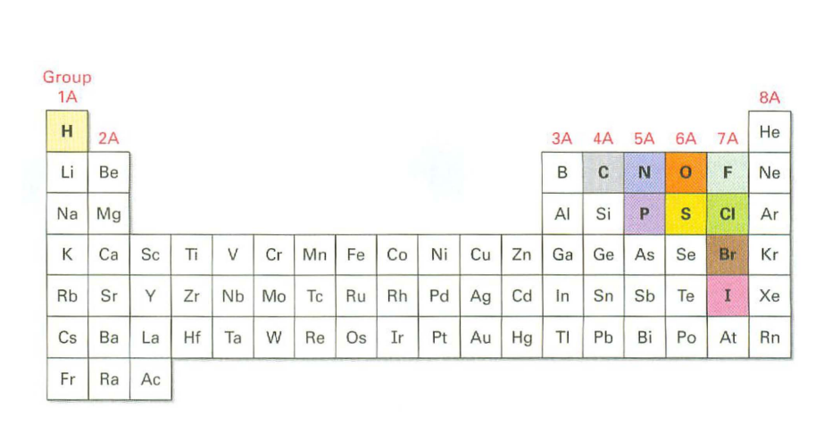

# Organic Chemistry, Academic Year 2024/2025

**References**:
    - laura.belvisi@unimi.it
    - daniele.passarella@unimi.it

## Program of the Course

- Fundamentals of general chemistry
- Organic molecules and functional groups
- Stereochemistry
- Structure and properties of:
  - Alkanes and cycloalkanes
  - Alkyl halides
  - Alkenes
  - Aromatic compounds
  - Alcohols, ethers, and related compounds
  - Amines
  - Carbonyl compounds
  - Carboxylic acids and their derivatives
  - Heteroaromatic compounds
  - Small biomolecules (carbohydrates, amino acids, lipids, nucleotides)
- Basic organic reactions

## Suggested Reference Textbooks / Teaching Materials

**Any good Organic Chemistry textbook covering the topics in detail.**
### Recommendations:
- John McMurry, *Fundamentals of Organic Chemistry*, 7th Edition, Cengage Learning.
- Janice Gorzynski Smith, *Organic Chemistry*, 6th Edition, McGraw-Hill Education.

## Course Web Page
Access the course website on MyAriel: [Organic Chemistry Course](https://myariel.unimi.it/course/view.php?id=4257).

## What is Organic Chemistry?

- Organic chemistry is the study of chemistry compounds that contain the element carbon, many of which are found in living organisms.

- It is one branch in the entire field chemistry, which encompasses many subdisciplines.
- There are far more organic compounds than any other type.
  - Medicines
  - Food
  - Clothing
  - Gasoline
  - Soaps
  - Refrigerants

### Features of organic compounds

- All organic compounds contain carbon atoms **C** and most hydrogen atoms **H**.
- All the carbon atoms have 4 bonds, a stable carbon atom is said to be tetravalent.
- Any other atom that is not a carbon or a hydrogen is called "heteroatom".
  - Common heteroatoms includes **N**, **O**, **S**, **P** and the **halogens**.
    - The halogens are a group of elements found in Group 17 of the periodic table.
- Some compunds have chains of atoms while other have rings.
  - A chain structure consists of carbon atoms connected in a straight or branched sequence.
  - A ring structure occurs when the carbon atoms are connected in a loop or circle.

### The periodic table

Russian chemist Dmitri Mendeleev published the first recognizable periodic table in 1869, developed mainly to illustrate periodic trends of the then-known elements Mendeleev's idea has been slowly
expanded and refined leading to the new and modern [periodic table](https://en.wikipedia.org/wiki/Periodic_table) as we know it to this day.

A periodic table is made up of rows (periods) and columuns (groups):
  - Period:
    - A period on the periodic table is a row of chemical elements.
    - All elements in a row have the **same number** of electron shells.
    - Each next element in a period has **one more proton** and is **less metallic** than its **predecessor**.

  - Group:
    - A group refers to a vertical column in the periodic table.
    - Elements in the same group have the same number of electrons in their outermost shell (valence electrons).
      - Electrons in this regions determine the chemical properties that elements in the same group have in common.
      - Group 1 elements (like sodium **Na** and potassium **K**) have one valence electron, making them highly reactive metals. The reactivity is driven by their desire to lose this one electron to become more stable. This reactivity of Group 1 elements is due to their strong tendency to lose that one valence electron, which is indeed the fastest way for them to achieve a more stable configuration. This eagerness to lose the electron makes them highly reactive, especially with substances like water or oxygen.
    - Groups contribute to the idea of **periodic trends**
      Wikipedia states:
      > <i> In chemistry, periodic trends are specific patterns that are present in the periodic table that illustrate different aspects of certain elements when grouped by period and/or group. </i>
      

  - Electron Shell:
    - Regions arond the nucleus of an atom where elecrons are likely to be found
    - Each shell can hold a certain max number of electrons and represents a specific energy level.

> What is the maximum number of shells an atom can have?
> <i>"There is no theoretical limit to the number of electron shells an atom can have; however, in practice, elements currently known on the periodic table have up to 7 electron shells."</i>

### Charactestics of a metal

Metals are good conductors of electricity and heat because of the free movement of their electrons. They are malleable, meaning they can be shaped or bent without breaking, and they have a shiny, reflective surface, known as luster. Metals can also be drawn into thin wires, a property called ductility. Generally, metals are dense and solid at room temperature, except for mercury, which is liquid. Lastly, metals tend to be reactive, often losing electrons easily during chemical reactions, forming positive ions (cations).
