# Organic Chemistry, Academic Year 2024/2025

[TOC]

## Lesson 2 outline

1. Atomic structure
2. Atomic orbitals
3. Chemical bonding
4. Lewis structures
5. Resonance structures
6. 3D structures
7. Hybrid orbitals
8. Bond polarity

## Atomic Structure

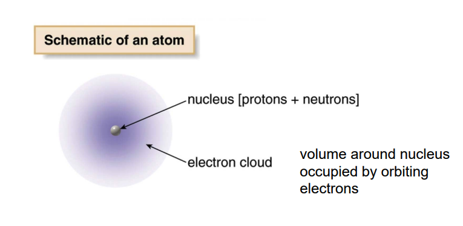

An atom consists of a nucleus at its center, which contains protons (positively charged) and neutrons (neutral).

Surrounding the nucleus are electrons (negatively charged), which move in regions called electron shells or orbitals. These shells represent different energy levels, with the electrons **closest to the nucleus having lower energy** and those **further away having higher energy**.

**Identity and behavior**:
The number of protons defines the element, while the arrangement of electrons influences the atom's chemical behavior.

- Atomic number

  - The atomic number of an element is the number of protons in the nucleus of an atom of that element

- Mass number
  - The mass number is the number of protons plus neutrons in the nucleus
    

The atomic weight of a particular element is the weighted average of the mass of all its isotopes reported in atomic
mass unit (amu).

- This difference in neutron count causes the isotopes to have different atomic masses (mass number = protons + neutrons), while still being the same element.

For this particular reason the atomic mass of a given element is calculated as a weighted average.

💡 What is an isotope of a given element?

> - _An isotope of an element refers to atoms of the same element that have the same number of protons but different numbers of neutrons. This means that isotopes of an element have the same atomic number (same number of protons) but different mass numbers (total number of protons and neutrons). For example, carbon has two common isotopes: Carbon-12 (6 protons and 6 neutrons) and Carbon-14 (6 protons and 8 neutrons)._

### Charged ions

An ion is an atom that has gained or lost one or more electrons, resulting in a net charge

- Cations
  - Ions with a positive because they have **lost** electons.
- Anions
  - Ions with a negative charge because they have **gained** an electron.

## Atomic Orbitals

Atomic orbitals are regions around an atom's nucleus where there is a high probability of finding an electron. Orbitals are described by quantum mechanics and represent the wave-like behavior of electrons around the nucleus. Each orbital has a specific shape and energy level.

### S Orbital

**s orbitals** are spherical because the probability distribution of finding an electron is the same in every direction around the nucleus. This spherical symmetry results from the mathematical solutions to the Schrödinger equation for an electron in a hydrogen atom.

### P Orbitals

**p orbitals** are a type of atomic orbital with a dumbbell or figure-eight shape, and they are more complex than s orbitals

An element presenting p orbitals arrangements is comprised of 3 p orbital, one for each 3-Dimensional axis repectively: Px, Py and Pz.

- Each p orbital has two lobes extending outwards starting from the nucleus, resembling a dumbbell shape.
- These lobes represent regions where the probability of finding an electron is highest.
- Between the two lobes, at the nucleus, there is a node, where the probability of finding an electron is zero.
- Each p orbital can hold a maximum of two electrons with opposite spins.
  - This has something to do with the _Pauli Exclusion Principle_ which is stuff coming from Quantum Mechanics. The priciple states that:
    > _"No two electrons in the same orbital can have the same quantum numbers"_ for whatever this means...

You can literally imagine the shape as dictating where there's a high probability of finding an electron.

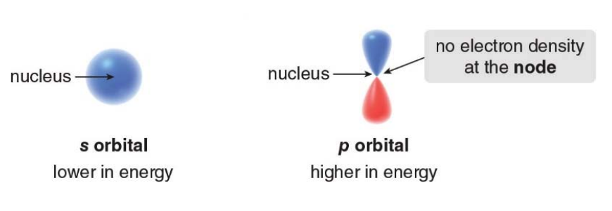

### Shells, subshells and energy levels

- Energy levels are labeled by the pricipal quantum number _n_ (1, 2, 3 and so on...).
- As you go up in energy levels the energy increases and so does the capacity to hold more electrons.
- The total number of electrons in an energy level is given by 2n^2

  - First shell can hold 2(1\*\*2) = 2 electrons
  - Second shell can hold 2(2\*\*2) = 8 electrons
  - Third shell can hold 2(3\*\*2) = 18 electrons

- Each energy level contains one or more subshells (s, p, d and f). These subshells are represented in the diagram:

  - 1st shell: 1s (can hold 2 electrons).
  - 2nd shell: 2s and 2p (together can hold 8 electrons: 2 in 2s and 6 in 2p).
  - 3rd shell: 3s, 3p, and 3d (together can hold 18 electrons: 2 in 3s, 6 in 3p, and 10 in 3d).
  - ...

- Each subshell has a certain amount of orbitals and each orbital can hold two electrons

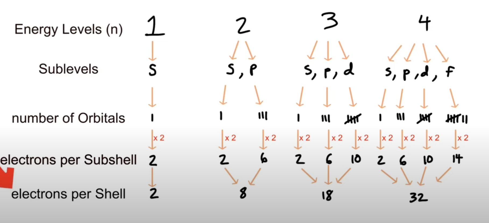

> 💡 Videos and resources
>
> - [Gumball Degree: Shells, Subshells, and Orbitals](https://www.youtube.com/watch?v=UDmrRWeFWwU): simple video on bohr's model
> - [Some guy rendering p type subshells](https://www.youtube.com/watch?v=igEGO8h3N-A)
> - [Three Twentysix: What ARE atomic orbitals?](https://www.youtube.com/watch?v=23bNW4G9DZk): great video explaining the concept of electron density and why subshells are represented as shapes, which aren't really electron containers but rather a density plot of the places where an electron is most likely to be found around it's atom.
> - [minutephysics: A Better Way To Picture Atoms](https://www.youtube.com/watch?v=W2Xb2GFK2yc)
> - [Sci Pills: Atomic orbitals 3D](https://www.youtube.com/watch?v=Nr40fnfHccQ): Shows realistic 3D pictures of the simplest atomic orbitals of hydrogen
> - [Atom wave functions (animation)](https://www.youtube.com/watch?v=IlkY-HtjrkA)

### BOHR's Atomic model

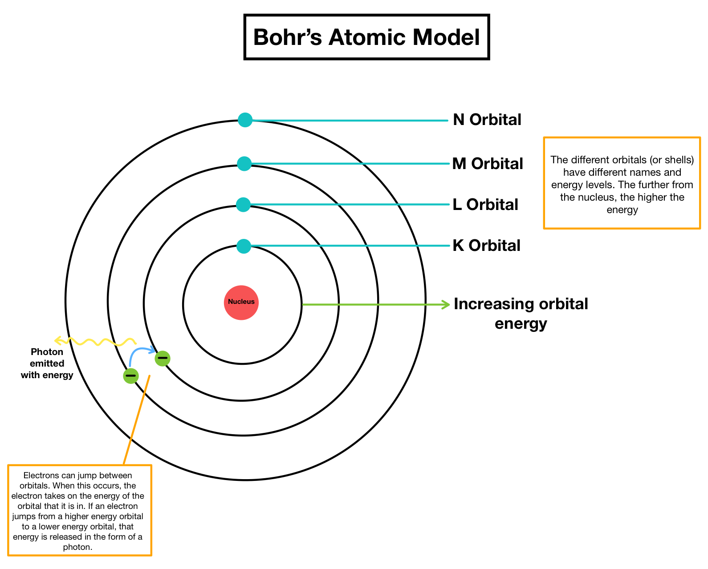

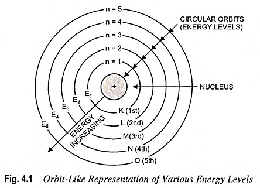

### Subshells shapes

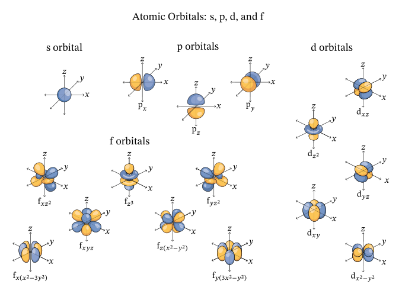

### Orbitals and sub-orbitals (or shells and subshells) of Bound Electrons

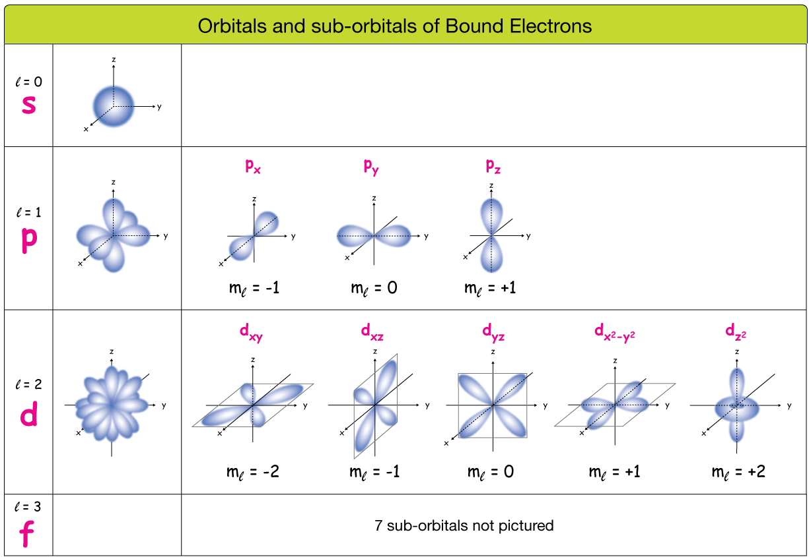

u/BayGO said on [reddit](https://www.reddit.com/r/explainlikeimfive/comments/amxfba/comment/efrxjai):

> _"A Suborbital_ simply refers to the "type" (shape) of the orbital that the electron is orbiting around."\*

### Notes on the periodic table

- First row
  - There is only one orbital in the first shell
  - Each orbital can hold a maximum of two electrons
  - There are two elements in the first row
    1. **H** (Hydrogen 1s^1)
    2. **He** (Helium 12^2)
- Second row
  - Each element in the second row of the periodic table also has four orbitals available to accept additional electrons:
    - one 2s orbital.
    - and three 2p orbitals.
  - There is a maximum capacity of eight valence electrons for elements in the second row.

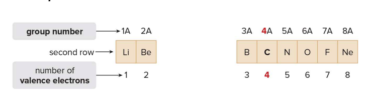

From the slides:

> In orbitals at the same energy, electrons are distributed one per orbital, then the second is added

This really means that electrons prefering falling into an empty orbital at the same energy level rather that pairing up in an already occupied orbital. This is due to reduced electron-electron repulsion.

Going deeper:
<i>

> When electrons are placed singly in different orbitals of the same subshell, they will all have the same spin direction (either all up or all down).
>
> Electrons have a property called spin, which is like a small magnetic field. It can be thought of as spinning in one of two possible directions, often represented as:
>
> - Up spin (denoted as ↑)
> - Down spin (denoted as ↓)
>   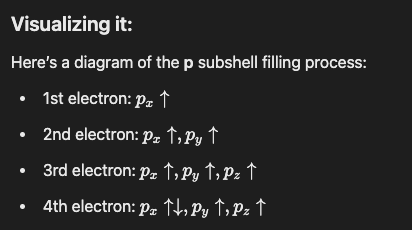 > </i>

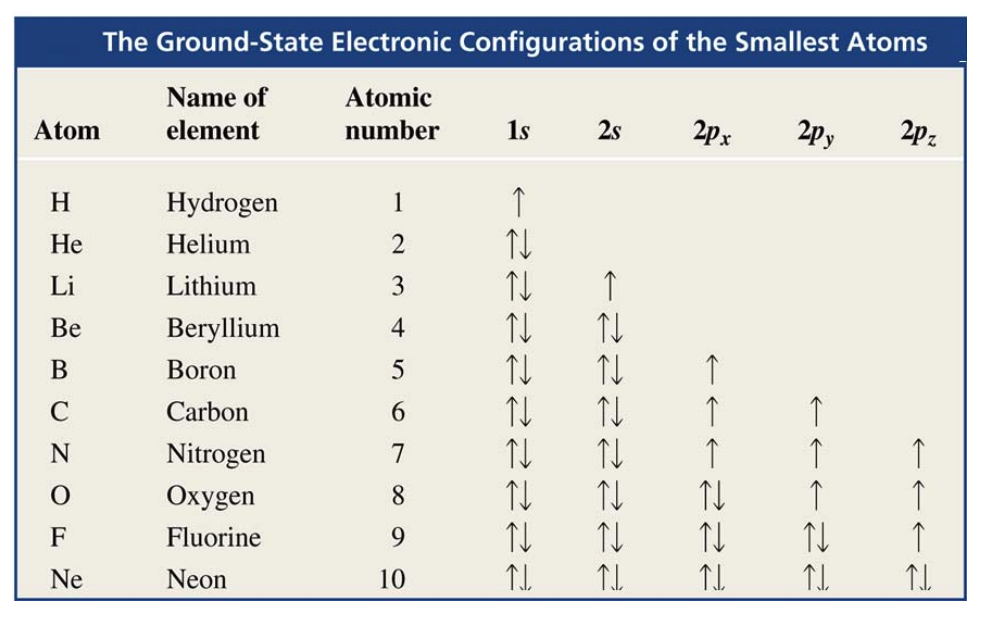

## Chemical bonding

In this context, **bonding** refers to the joining of two atoms in a stable arrangement. Through bonding, atoms gain, lose or share electrons to attain the electronic configuration of the noble gas closest to them in the periodic table.

> 💡 What is a noble gas?
> _A noble gas is an element whose outermost energy level (also called "valence shell") is completely filled with electrons._

Atoms can either form ionic or covalent bonds to attain a complete outershell, e.g. seeking stability.

- **Ionic bonds** result from the transfer of an electron from one atom to another.
- **Covalent bonds** result from the sharing of electrons between two nuclei.

### Ionic bonds

These generally occur when elements from the far left side of the periodic table combine with elements from the far right side, ignoring noble gases.

A positively charged cation formed from the element on the left side attracts a negatively charged anion from the element right on side

> 💡 Why do **Na** and **Cl** keep staying close together after the ionic bonds (the electron was transferred), aren't they supposed to be stable and thus not needing to stay close?
>
> > Great question! Let’s clarify why sodium (\( \text{Na} \)) and chlorine (\( \text{Cl} \)) still have opposite charges **after** the electron transfer. The key here lies in understanding how the electron transfer affects the **total number of protons and electrons** in each atom, and how this creates the charges.
>
> ### Before the Transfer:
>
> - **Sodium (Na)**:
>   - Atomic number = 11 (11 protons, which are positively charged).
>   - It also has 11 electrons (negatively charged) in a neutral state.
>   - In this state, sodium has **no net charge** because the **positive protons** and **negative electrons** cancel each other out.
> - **Chlorine (Cl)**:
>   - Atomic number = 17 (17 protons).
>   - It also has 17 electrons in a neutral state.
>   - Similarly, chlorine has **no net charge** because its positive and negative charges balance out.
>
> ### After the Electron Transfer:
>
> 1. **Sodium (Na)** **loses** 1 electron:
>
>    - Now sodium has **11 protons** (still positively charged) but **only 10 electrons** (since it lost one electron).
>    - This means sodium has **1 more proton** than it has electrons. Since protons are positive, sodium becomes a **positively charged ion** (\( \text{Na}^+ \)) because it now has an **excess positive charge**.
>
> 2. **Chlorine (Cl)** **gains** 1 electron:
>    - Chlorine has **17 protons** but now **18 electrons** (since it gained an electron from sodium).
>    - This means chlorine has **1 more electron** than it has protons. Since electrons are negative, chlorine becomes a **negatively charged ion** (\( \text{Cl}^- \)) because it now has an **excess negative charge**.
>
> ### Why Do They Have Opposite Charges?
>
> - **Sodium (\( \text{Na}^+ \))** becomes **positively charged** because it has **more protons than electrons** after losing one electron.
> - **Chlorine (\( \text{Cl}^- \))** becomes **negatively charged** because it has **more electrons than protons** after gaining that electron.
>
> Thus, the loss or gain of electrons directly results in an imbalance between protons (positive) and electrons (negative), creating these charges. Sodium is positive because it lost a negative electron, and chlorine is negative because it gained that electron.
>
> ### Summary of the Charge Creation:
>
> - **Sodium (Na)** loses 1 electron, leaving it with **more protons than electrons**, giving it a **positive charge** (\( \text{Na}^+ \)).
> - **Chlorine (Cl)** gains 1 electron, leaving it with **more electrons than protons**, giving it a **negative charge** (\( \text{Cl}^- \)).
>
> These opposite charges result in a **strong electrostatic attraction** between the \( \text{Na}^+ \) and \( \text{Cl}^- \) ions, which forms the ionic bond.

### Covalent bonding

Covalent bonding occurs with elements like carbon in the middle of the table with elements that have similar electronegativity.

- In a covalent bond, atoms share one or more pairs of electrons. Each atom contributes at least one electron to the bond and these electrons are shared **equally** or **unequally**, depending on the atoms involved.

  - **Equally**
    - Electrons are shared **equally** between atoms with similar or identical electronegativities, resulting in no significant charge difference.  
      **Example**: **Hydrogen molecule \( \text{H}_2 \)** – Both hydrogen atoms share electrons equally because they have the same electronegativity.
  - **Unequally**
    - Electrons are shared **unequally** between atoms with different electronegativities, causing partial charges on the atoms (δ− and δ+).  
      **Example**: **Water \( \text{H}_2\text{O} \)** – Oxygen is more electronegative than hydrogen, leading to unequal sharing of electrons, with oxygen gaining a partial negative charge and hydrogen a partial positive charge.

- A covalent bond is a two-electron bond and a compound with covalent bonds is called a **Molecule**.

### Concept of Polarity:

**Polarity** refers to the unequal sharing of electrons in a bond, leading to regions of slight positive and negative charge, creating a dipole. A bond or molecule is **polar** if it has such charge separation, while it is **nonpolar** if the electrons are evenly distributed.

1. **Polar Bonds**:

   - In a **polar covalent bond**, one atom attracts the shared electrons more strongly than the other. This creates a **dipole moment**, where:
     - The atom that attracts electrons more strongly becomes slightly **negative** (partial negative charge, δ−).
     - The other atom becomes slightly **positive** (partial positive charge, δ+).
   - The bond is said to be **polar** because there is a separation of charge, creating "poles" (one positive, one negative).

   **Example**: In water \( \text{H}_2\text{O} \), oxygen is more electronegative than hydrogen, so the electrons are pulled closer to oxygen, making oxygen δ− and hydrogen δ+.

2. **Nonpolar Bonds**:

   - In a **nonpolar covalent bond**, the electrons are shared **equally** between the atoms, so there is **no charge separation** and no dipole moment.
   - These bonds occur between atoms with the same or very similar electronegativity.

   **Example**: In a molecule of oxygen \( \text{O}_2 \), both oxygen atoms share electrons equally, so the bond is nonpolar.

### Polarity in Molecules:

- **Polar molecules**: Molecules with an overall charge separation due to polar bonds and an asymmetrical shape. Water \( \text{H}_2\text{O} \) is polar because of its bent shape and polar bonds.
- **Nonpolar molecules**: Molecules where the bonds are either nonpolar, or polar bonds cancel out due to a symmetrical arrangement. \( \text{CO}_2 \) (carbon dioxide) is nonpolar because its linear shape causes the polar bonds to cancel each other out.

> 💡 Videos and resources
>
> - [Creative Learning: Mastering Chemical Bonding: Explained with 3D Animation](https://www.youtube.com/watch?v=g-tE6MN-wrE)
> - [IslandSchoolHongKong: covalent bond animation](https://www.youtube.com/watch?v=_sUIhpULamM)
> - [AtomicSchool: Chemical Bonding Introduction: Hydrogen Molecule, Covalent Bond & Noble Gases](https://www.youtube.com/watch?v=qc1TGwedSIc)
> - [AtomicSchool: Oxygen, Nitrogen & Carbon and Covalent Chemical Bonds](https://www.youtube.com/watch?v=G9K6PMGt4LM)
> - [Hydrogenic Orbitals visualizer](https://al2me6.github.io/evanescence/)
> - [Molecular Orbital visualizer](https://www.falstad.com/qmmo/)

Hydrogen forms one covalent bond, when two hydrogen atoms are joined in a bond, each has a filled valence shell of two electrons.

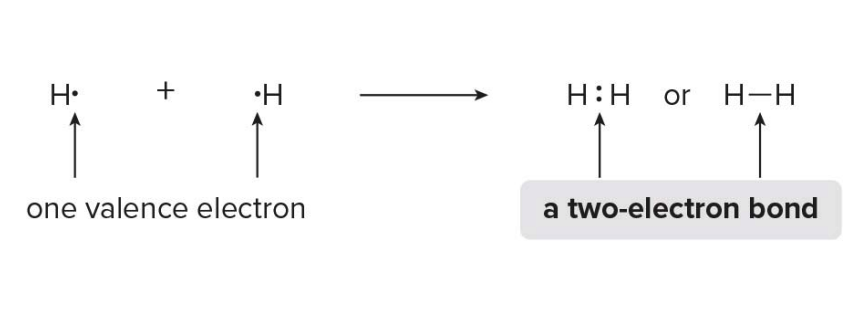

### Valence electrons

- **Octet Rule**
  The octet rule states that atoms tend to form bonds in such a way that they achieve a total of 8 electrons in their outermost (valence) shell, which makes them chemically stable. This configuration mimics the electron arrangement of noble gases, which are naturally stable due to having a full outer shell.

- Second row elements can have no more that eight electrons around them. For neutral molecules, this has two consequences:

  - **Atoms with one, two, three or four valence electrons** form one, two, three or four bonds, respectively in neutral molecules (e.g. \( \text{BF}_3 \), \( \text{CH}_4 \))

    - In boron trifluoride \( \text{BF}_3 \), each fluorine atom shares 1 electron with boron, completing fluorine’s octet and giving boron 3 shared electrons in its valence shell.
    - Fluorine has an atomic number of 9, meaning it has 9 electrons: 2 in the first energy level and 7 in the second (valence) shell.
    - The second shell can hold a maximum of 8 electrons, so fluorine is 1 electron short of completing its octet.
    - Boron is one of the exceptions to the octet rule, meaning it can form stable compounds with fewer than 8 electrons in its valence shell. In \( \text{BF}_3 \), boron doesn't need a full octet to be chemically stable.
    - Atoms with 1–4 valence electrons form as many bonds as they have valence electrons because **they only have that many electrons available to share**. These atoms are "sharing" their valence electrons with other atoms to reach the octet rule, or 8 electrons in their outer shell.
      - **The number of bonds they can form is directly tied to the number of valence electrons they have to offer.**

  - **Atoms with five or more valence electrons** form enough bonds to give an octet (e.g. \( \text{NH}_3 \))
    - In this case, the predicted number of bonds is given by = 8 - #{valence electrons}
    - These atoms (like nitrogen, oxygen, and fluorine) are already close to 8 electrons in their valence shell.
    - Since they already have most of the electrons they need (5, 6, or 7), they are more reactive and eager to form bonds with other atoms to quickly complete their octet.
    - Oxygen, with **6 valence electrons**, needs **2 more electrons** to complete its octet. It easily achieves this by forming **two covalent bonds**, where each bond involves sharing one pair of electrons with another atom, allowing oxygen to reach the stable 8-electron configuration.
      - It is always possible for an element having >= 5 valence electrons to reach the octet via covalent bonding.

## Lewis structures

Lewis structures are dot representations for molocules

- **General rules for drawing Lewis structures**:

  1. Draw only the valence electrons
  2. Give every second-row element no more than eight electrons
  3. Give each hydrogen two electrons

- Each atom is represented by its chemical symbol
  - C for Carbon, H for hydrogen, O for Oxygen
- Dots around the atomic symbol represent the valence electrons
- Covalent bonds (shared pairs of electrons) are represented by lines between atoms, where each line represents a pair of shared electrons.
  - A single bond is one pair (one line)
  - A double bond is two pairs (two lines)
  - A triple bond is three pairs (three lines)
- Unshared pairs of electrons that are not involved in bonding are shown as pairs of dots next to the atomic symbol (**lone pairs**)

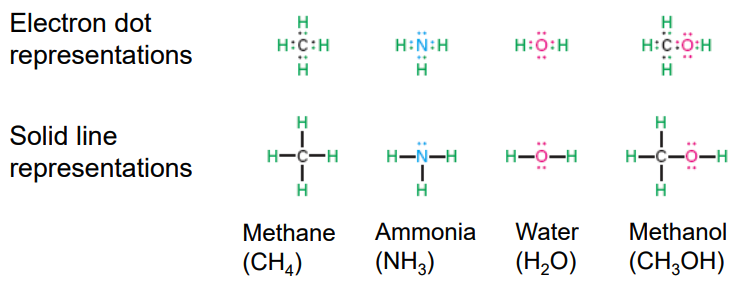

### How to draw lewis structures

- **Step 1**: Arrange atoms next to each other that you think are bonded together.

  - Always place Hydrogen and halogens on the periphery because they only form one bond each.
    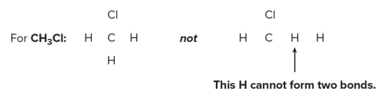
  - Place no more atoms around an atom than the number of bonds it usually forms.
    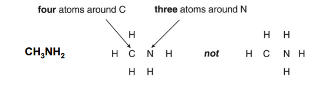

- **Step 2**: Count the electrons

  - Count the number of valence electrons from all atoms
  - Add one electron for each negative charge
    - e.g. For \( \text{NO}_3^- \) (nitrate ion) there is a -1 charge, so you add one additional electron to the total count.
  - Subtract one electron for each positive charge
    - e.g. For \( \text{NH}_4^+ \) (ammonium ion) there is a +1 charge, so you subtract one electron from the total count.
  - This gives the total number of electrons that must be used in drawing the Lewis structure.

- **Step 3**: Arrange the electrons around the atoms.
  - Place a bond between every two atoms, giving two electrons to each H and no more than eight to any second row atom.
    - For each bond between atoms, place a single line (representing a pair of shared electrons).
    - Each hydrogen (H) should receive two electrons (a single bond), while atoms in the second row of the periodic table (like carbon, nitrogen, or oxygen) should not exceed eight electrons (the octet rule).
  - Use all remaining electrons to fill octets with lone pairs.
    - After placing bonds, assign any remaining electrons as lone pairs on the atoms to complete their octet.
    - Hydrogen atoms already have their 2 electrons from the single bond, so focus on completing the octets for the other atoms.
  - If all valence electrons are used and atoms do not have an octet, form multiple bonds.

**Ethylene structure** \( \text{C}_2\text{H}_4 \)

```
    H   H
    |   |
H — C = C — H
    |   |
    H   H
```

- **Step 4**: Assign formal charges to all atoms
  - **Formal Charge** is the charge assigned to individual atoms in a Lewis structure
  - Formal charge is calculated as follows:
    - `formal charge = #{valence electrons} - #{electrons owned by the atom}`
      or
    - `formal charge = #{valence electrons} - (#{non-bonding electrons + #{bonding electrons}/2 })`
  - The number of electrons **owned** by an atom is determined by its number of bonds and lone pairs.

The number of electrons **owned** by different atoms is indicated in the following examples

- **C** with four bonds
  - C **shares** eight electrons
  - C **owns** four electrons

```
  |
— C —
  |
```

- **C** molecule with double bond and sided single bonds
  - Each C **shares** eight electrons
  - Each C **owns** four electrons

```
\     /
 C = C
/     \
```

- **C** with three bonds and a lone pair
  - C has six shared electrons
  - C has two unshared electrons (lone pair)
  - C **owns** five electrons

```
  |
— C :
  |
```

This arrangement creates a `formal charge` of value `-1`.

### Exceptions to the octet rule

1. **Incomplete octet**

Some atoms are stable with fewer than 8 electrons in their valence shell. This is common for elements that have only a few valence electrons and are unable to to form enought bonds to react the octet.

- **B** (Boron): this element often forms compounds like \( \text{BF}_3 \) (boron trifluoride), where it only has 6 electrons in its valence shell, not 8. Boron is stable in this electron-deficient state.
- **Be** (Beryllium): this other element forms compounds like \( \text{BeCl}_2 \) where it has only 4 electrons in its valence shell.

2. **Expanded octet**
   Seen in elements like phosphorus, sulfur, and xenon, where they can have more than 8 electrons by using d-orbitals.

   > ⚠️ Not covered here as out of scope.

3. **Odd number of electrons**

Some molecules have an odd number of electrons, meaning it's impossible for every atom to have 8 electrons. These molecules are called **radicals** and are stable despite having unpaired electrons.

- $ \text{NO}_2 $ (Nitrogen dioxide): Within this molecule, **nitrogen** has 5 valence electrons, and the molecule has a total of 17 electrons. This leaves on electron unpaired, making it radical.
  - Nitrogen does not have 8 electrons in its valence shell.
- \( \text{NO} \) (Nitric Oxide): A molecule with has 11 electrons and does not follow the octet rule due to the odd number of electrons.

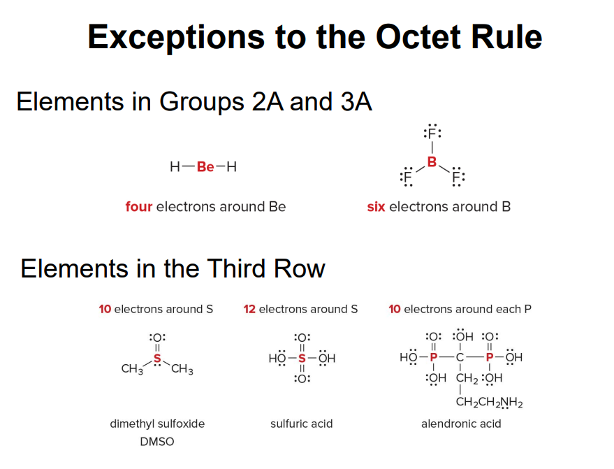

## Resonance structures

Some molecules cannot be adequately represented by a single Lewis structure

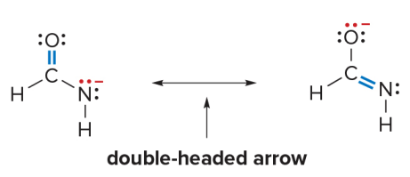

- These structures are called **resonance structures** or **resonance forms**.
- A double headed arrow is used to separate the two resonance structures.

**Resonance structures** are two Lewis structures having the same atoms placement but a different arrangement of electrons.

> _Resonance structures are different possible Lewis structures for the same molecule that have the same arrangement of atoms but different distributions of electrons, particularly the location of double bonds or lone pairs._

### Principles of resonance theory

- **Resonance structures are not real**: An individual resonance structure does not accurately represent the structure of a molecule or ion. Only the hybrid does.
- Resonance structures are not in equilibrium with each other.
- Resonance structures are not isomers: Two isomers differ in the arrangement of both atoms and electrons, whereas resonance structures differ only in the arrangement of electrons.

**What really is resonance?**
Resonance is the phenomenon where the true electronic structure of a molecule cannot be represented by just one Lewis structure. Instead, the real structure is a weighted average (or blend) of all possible resonance structures.

- Resonance helps stabilize molecules by allowing the electron density to be distributed over a larger area.

**What is a resonance hybrid?**
The resonance hybrid is the actual structure of the molecule that results from averaging all the possible resonance structures. It represents the delocalized electron distribution across the molecule.

[See how to visualize it](https://www.youtube.com/watch?v=9B5FGPDwX_E)

- Neither of the resonance structures is an accurate representation for \( \text{(NCONH)}^- \)
  - The true structure is actually a composite of the two structures represented above and is called a **resonance hybrid**
  - The hybrid shows characteristics of both structures.
  - Resonance allows certain electron pairs to be delocalized over two or more atoms, and this delocalization adds stability.
  - A molecule with two or more resonance forms is said to be **resonance stabilized**.

### Curved arrow notation

- Curved arrow notation is a convention that shows how electron position differs between two resonance forms
- Curved arrow notation shows the movement of an electron pair.
  - The tail of the arrow always begins at the electron pair, either in a bond or lone pair.
  - The head points to where the electron pair moves.

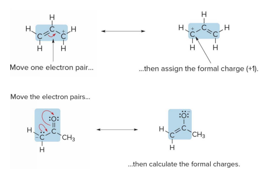

- Two different resonance structures can be drawn when a lone pair is located on an atom directly bonded to a double bond.
  - If an atom having a lone pair in single bonded to another atom having a some double bond.
    - That double bond is lost into a in single bond.
    - The doubly bonded end gains a lone pair.
    - The bofore singly bonded atom now gains another bond, making it effectively a double bond.

Two different resonance structures can be drawn when a lone pair is located on an atom directly bonded to a double bond.

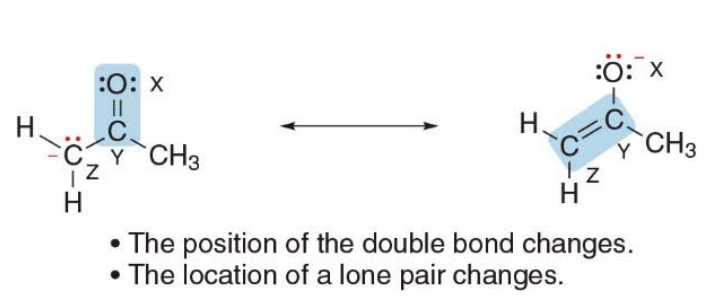

### Atoms without octets

Resonance structures can have an atom with fewer than 8 electrons

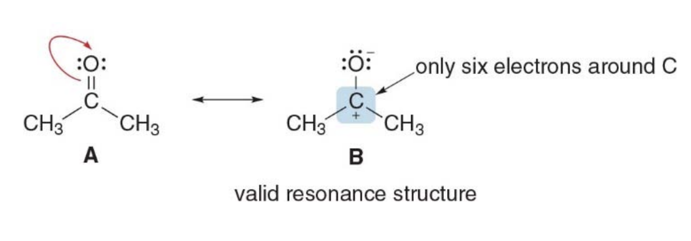

But they cannot have a second row element with more than 8 electrons

> Second-row elements (like carbon, nitrogen, oxygen, etc.) cannot have more than 8 electrons in resonance structures because they follow the octet rule, which states that these elements can accommodate a maximum of 8 electrons in their valence shell. This is due to the fact that second-row elements have only the 2s and 2p orbitals, which can hold a total of 8 electrons (2 in the s orbital and 6 in the p orbitals).

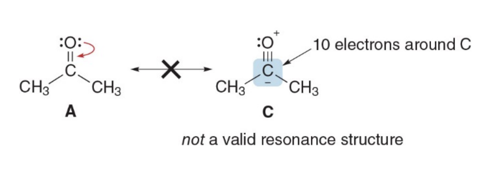

### Isomers

Sometimes, more than one than one arrangement of atoms (Lewis structure) is possible for a given molecular formula

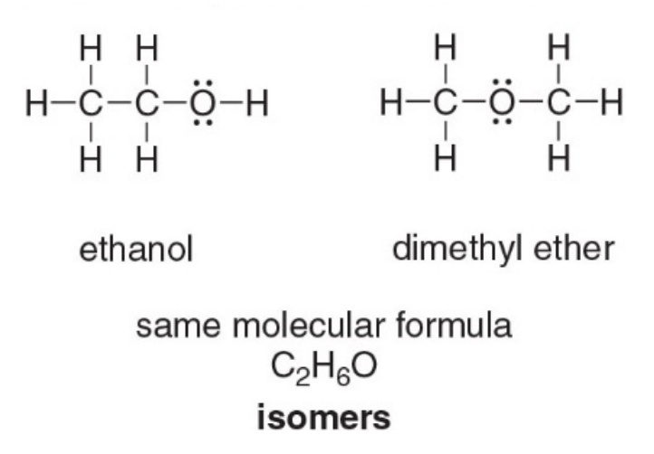

Isomers are basically different molecules having the same molecular formula. Ethanol and dimethyl ether are constitutional isomers.

### Drawing organic molecules, condensed structures

All atoms are drawn in, but the two-electron bond lines are generally omitted

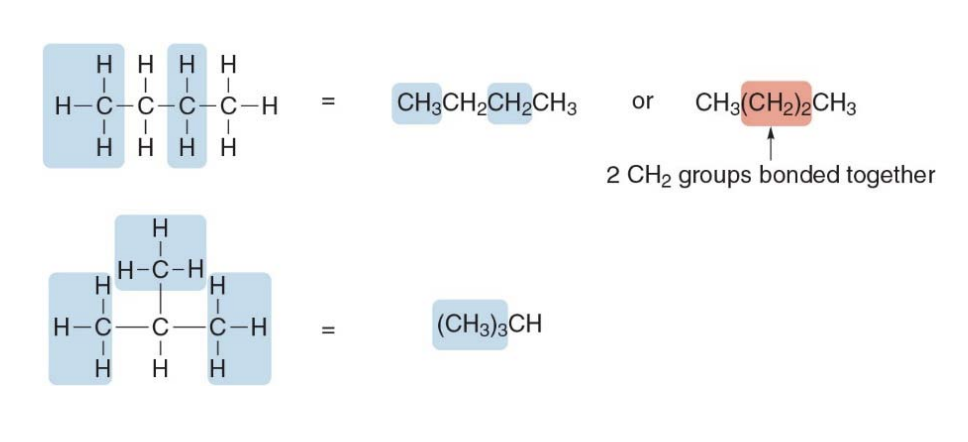

Instead of writing \( \text{CH}_3 \text{CH}_3 \text{CH}_3 \text{CH}\) we can simply group the methyl groups as \( \text{(} \text{CH}_3 \text{)}_3 \)

finally getting to \( \text{(} \text{CH}_3 \text{)}_3 \text{CH} \), which simpler and easier to understand.

Condensed structures simplify molecules by omitting bond lines and lone pairs, while showing atoms next to those they are bonded to. Key points:

1. **Atoms next to their bonded partners**: E.g., **\( \text{CH}_3 \text{CH}_2 \text{CH}_3 \)** for propane.
2. **Parentheses for groups**: E.g., **\( \text{(CH}_3 \text{)}_2 \text{CHOH}\)** for isopropanol.
3. **No lone pairs shown**, but implied for atoms like O and N.

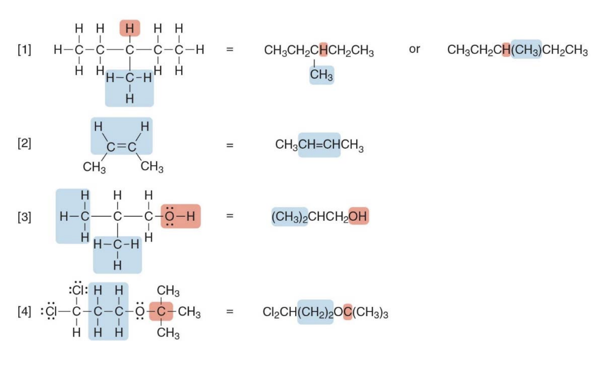

### Drawing skeletal structures

- Assume there is a carbon atom at the junction of any two lines or at the end of any line.
- Assume there are enough hydrogens around each carbon to make it tetravalent.

  - > What does tetravalent mean?
    > **Tetravalent** means that an atom can form four chemical bonds. In this case, a carbon atom, being tetravalent, will always have four bonds, which can be with other carbon atoms, hydrogens, or other elements. In skeletal structures, when you assume there is a carbon atom at a junction or end of a line, it means you don't draw the carbon explicitly but assume it has enough bonds to other atoms or hydrogens to satisfy its tetravalency.

- Draw in all heteroatoms and the hydrogens directly bonded to them.

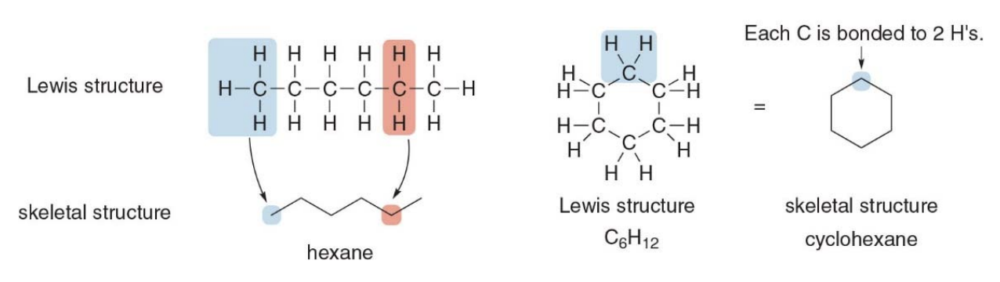

### Interpreting skeletal structures

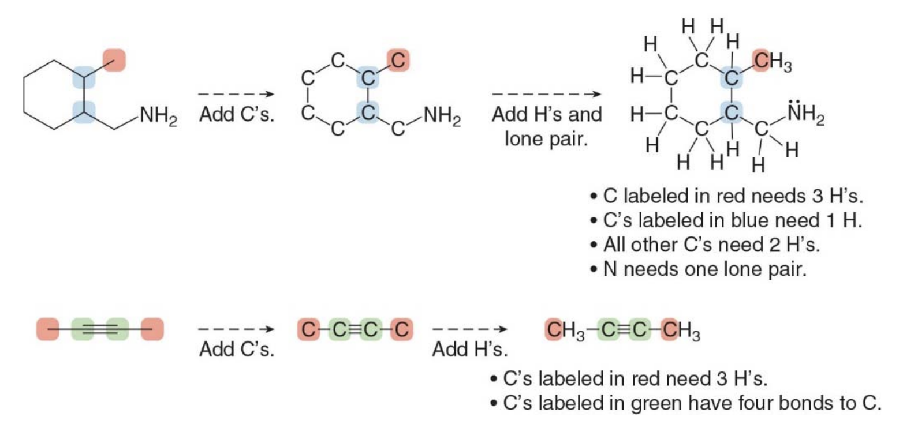

### Skeletal structures with charged carbon atoms

- A charge on a carbon atom takes the place of one hydrogen atom
- The charge determines the number of lone pairs. Negatively charged carbon atoms have one **lone pair** and positively charged atoms have none
  > A lone pair forms when an atom has valence electrons that are not involved in bonding with other atoms. These electrons remain localized on the atom, paired due to their opposite spins.

In this image, two different scenarios are illustrated, one involving a **positively charged carbon atom (carbocation)** and the other involving a **negatively charged carbon atom (carbanion)**. The main point being shown is how adding a hydrogen atom affects the lone pair of electrons on these charged carbon atoms.

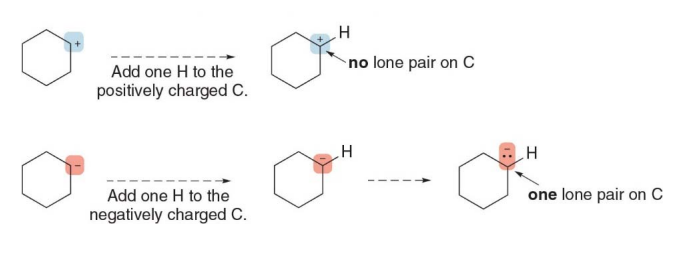

### Top Scenario (positively charged carbon, carbocation):

1. **Carbocation**: The carbon atom initially has a **positive charge**, meaning it has lost an electron, leaving it with only **three bonds** and no lone pair.
2. **Adding One Hydrogen Atom**: When a hydrogen atom is added to the positively charged carbon, it forms a **new bond** between the carbon and hydrogen. However, since the carbon already had three bonds and no extra electrons (due to the positive charge), adding this bond **does not create a lone pair** on the carbon.
   - Result: **No lone pair** on the carbon, and it has a full valence of bonds.

### Bottom Scenario (negatively charged carbon, carbanion):

1. **Carbanion**: In this case, the carbon atom has a **negative charge**, meaning it has an extra electron (in addition to its usual four valence electrons). This extra electron sits as a **lone pair** on the carbon.
2. **Adding One Hydrogen Atom**: When a hydrogen atom is added to the negatively charged carbon, a new bond forms between the carbon and the hydrogen. Now, the carbon still has one **lone pair of electrons** left after the bond forms because it originally had five valence electrons (four from carbon and one from the negative charge).
   - Result: **One lone pair** remains on the carbon, as shown by the two dots.

#### Electron Count in Carbon

- A neutral carbon atom has **4 valence electrons**.
- In the methyl anion \( \text{CH}_3^- \), the carbon atom gains **one additional electron** due to the negative charge, bringing the total number of valence electrons on carbon to **5**.
- The additional electron in the methyl anion comes from outside the molecule, typically provided by a reducing agent or from the surrounding environment in a chemical reaction.
  - This is how anions generally form: **_by gaining an extra electron_**

#### Bonding with Hydrogens

- The carbon in \( \text{CH}_3^- \) forms **three single bonds** with three hydrogen atoms. Each of these bonds involves sharing one electron from carbon and one electron from hydrogen.
- After forming these bonds, **3 of the 5 valence electrons** from carbon are involved in bonding.

#### Remaining Electrons (Lone Pair)

- Carbon now has **2 remaining electrons** after forming the three bonds.
- These 2 remaining electrons are not involved in any bonding, so they form a **lone pair** of electrons.

### Why not just one electron?

- If there were only **one** non-bonding electron left, the molecule would be a **radical**, not an anion. But in the case of \(\text{CH}_3^-\), we have a complete **pair** of non-bonding electrons (2 electrons), which gives the carbon atom its negative charge.
- A lone pair always consists of **two electrons** because electrons pair up due to their spin, and these two non-bonding electrons stay together as a lone pair.

### Lone pairs on heteroatoms

- Skeletal structures often leave out lone pairs on heteroatoms, **_don't forget about them_**
- Use formal charge to determine the number of lone pairs.

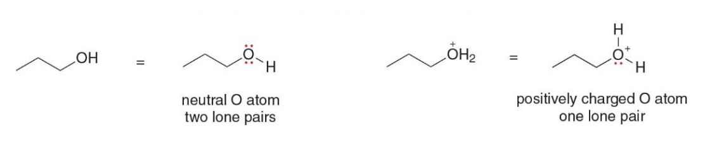

### Determining molecular shape

#### Bonds length decreases accross a row of the periodic table as the size of the atom decreases

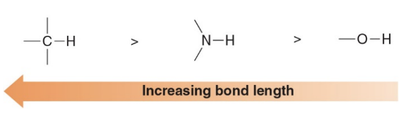

- Bond lengths decrease across a row of the periodic table as the size of the atom decreases. This trend occurs because **atoms get smaller as you move from left to right** across a period due to an increase in the effective nuclear charge.
- As **more protons** are added to the nucleus, the **electrons are pulled closer**, resulting in a smaller atomic radius.
- When atoms are **smaller**, their nuclei are **closer together** in a bond, leading to a shorter bond length. Additionally, as atomic size decreases, the bond strength tends to increase because the overlapping atomic orbitals are more **tightly bound** due to the **smaller size** and **greater effective nuclear charge**, further contributing to a shorter bond length.
- For example, in a period, the bond length of carbon-carbon bonds is shorter than that of boron-boron bonds because carbon is to the right of boron and has a smaller atomic radius.

#### Bond length increases down a column of the periodic table as the size of an atom increases

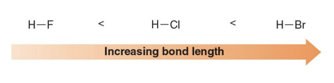

- As you move down a group in the periodic table, **atoms have more electron shells**, and the **outermost electrons are farther from the nucleus**. This results in a **larger atomic radius**. When atoms are larger, the nuclei are farther apart in a bond, leading to a longer bond length.

- Because the electrons in the outermost shells experience more **shielding** from inner electrons, the effective nuclear charge is lower, further contributing to the increase in atomic size.

- For example, in Group 17 (the halogens), the bond length of a hydrogen-fluorine (H-F) bond is shorter than that of a hydrogen-iodine (H-I) bond. This is because iodine is much larger than fluorine, and thus, the bond length increases as the size of the iodine atom increases.

> 💡 **What is the shielding effect?**
> A fenomenon in which ih the inner electrons between the nucleus and the outer (valence) electrons act as a "shield." These inner electrons repel the outer electrons due to their negative charge, reducing the full attractive force exerted by the positively charged nucleus on the valence electrons. As a result, the outer electrons experience a weaker effective nuclear charge (the net positive charge felt by the electrons) than they would if the inner electrons were not present.

**Average bond length**
| Bond | Length (pm) | Bond | Length (pm) | Bond | Length (pm) |
|--------|-------------|--------|-------------|--------|-------------|
| H-H | 74 | H-F | 92 | C-F | 133 |
| C-H | 109 | H-Cl | 127 | C-Cl | 177 |
| N-H | 101 | H-Br | 141 | C-Br | 194 |
| O-H | 96 | H-I | 161 | C-I | 213 |

### Molecular geometry

- The number of groups surrounding a particular atom determines its geometry. A group is either an atom or a lone pair of electrons
- The most stable arrangement keeps these groups as far away from each other as possible. This is exemplified by Valence Shell Electron Pair Repulsion (VSEPR) theory.

| Number of Groups | Geometry        | Bond Angle |
| ---------------- | --------------- | ---------- |
| 2                | Linear          | 180°       |
| 3                | Trigonal Planar | 120°       |
| 4                | Tetrahedral     | 109.5°     |

The **geometry of a molecule** is determined by the number of "groups" around a central atom. A **group** can be:

- An **atom** bonded to the central atom
- A **lone pair of electrons** that the central atom possesses

The arrangement of these groups around the central atom aims to **minimize repulsion** between them, which leads to a stable geometry. This concept is the foundation of **Valence Shell Electron Pair Repulsion (VSEPR) theory**.

1. **Valence Shell Electron Pair Repulsion (VSEPR) Theory**:

   - The theory states that the electron pairs (bonding pairs and lone pairs) surrounding an atom will position themselves as far apart as possible to minimize repulsion.
   - This helps determine the shape (geometry) of the molecule.

2. **Types of Geometries**:

   - **Linear** (180° bond angle):

     - Occurs when there are **two groups** around the central atom.
     - Example: Carbon dioxide (\( \ce{CO2} \)) has two oxygen atoms bonded to the carbon atom, resulting in a linear shape.

   - **Trigonal Planar** (120° bond angle):

     - Happens when there are **three groups** around the central atom.
     - Example: Boron trifluoride ( \( \ce{BF3} \) ), where three fluorine atoms are bonded to boron in a flat triangle.

   - **Tetrahedral** (109.5° bond angle):
     - This shape forms when there are **four groups** around the central atom.
     - Example: Methane (\( \ce{CH4} \)), where four hydrogen atoms are arranged symmetrically around a carbon atom.

3. **Effect of Lone Pairs:**
   - Lone pairs take up more space than bonding pairs because they are closer to the nucleus. As a result, the presence of lone pairs slightly reduces bond angles.
   - For example, water (\( \ce{H2O} \)) has a tetrahedral electron geometry, but because of two lone pairs on the oxygen atom, the bond angle is reduced from 109.5° to around 104.5°, giving the molecule a bent shape.

> 🔗 Resources
> [Hannah Nandor: VESPR Theory](https://www.youtube.com/watch?v=5uwcTOSyMDI)

#### Two groups around an atom

- Two groups
- Linear carbons connected via triple bond


#### Three groups around an atom

- Three groups
- Trigonal planar carbons, connected via double bond

**Ethylene**

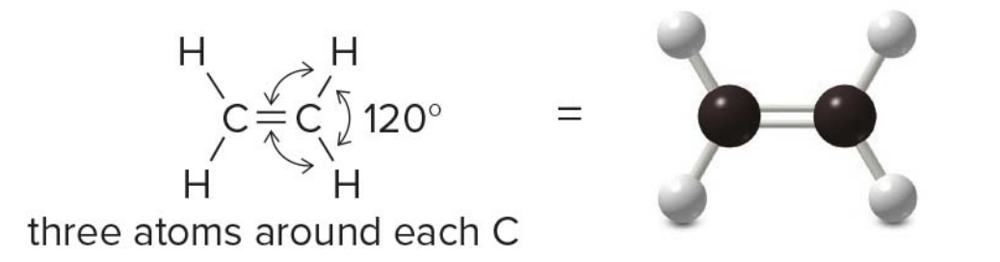

#### Four groups around an atom

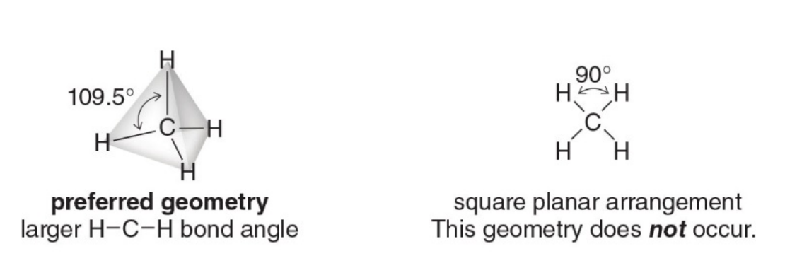

The image on the left shows the **tetrahedral geometry** of methane ( \( \ce{CH4} \)) with bond angles of **109.5°**, which is the preferred arrangement for four groups around a central atom like carbon.

- The tetrahedral geometry is predicted by **Valence Shell Electron Pair Repulsion (VSEPR) theory**, which states that electron pairs (bonding and lone pairs) will arrange themselves as far apart as possible to minimize repulsion.

The image on the right shows a **square planar arrangement** with bond angles of **90°**, which does not occur in methane or similar molecules with four groups around the central atom. This is because:

1. **Electron Repulsion**: A square planar arrangement forces the bonding groups (hydrogen atoms) closer together, resulting in bond angles of 90°. This creates much more repulsion between the bonding pairs of electrons, as they are not as far apart as they could be. VSEPR theory predicts that atoms and electron pairs will arrange themselves in a way that minimizes this repulsion.

2. **Tetrahedral Geometry**: In a tetrahedral geometry (left), the bond angles of 109.5° are much larger than 90°, allowing for less repulsion between the bonding groups. The tetrahedral arrangement is the most stable configuration for four groups around a central atom like carbon because it maximizes the distance between the groups.

The square planar arrangement in the right-hand image is not observed because it would lead to significantly greater electron repulsion, making the molecule less stable.

<p align="center">
  
</p>

### Drawing 3D Molecular structures

- A **solid line** is used for a bond in the plane.
- A wedge is used for a bond in front of the plane.
- A dashed line is used for a bond behind the plane

<p align="center">
  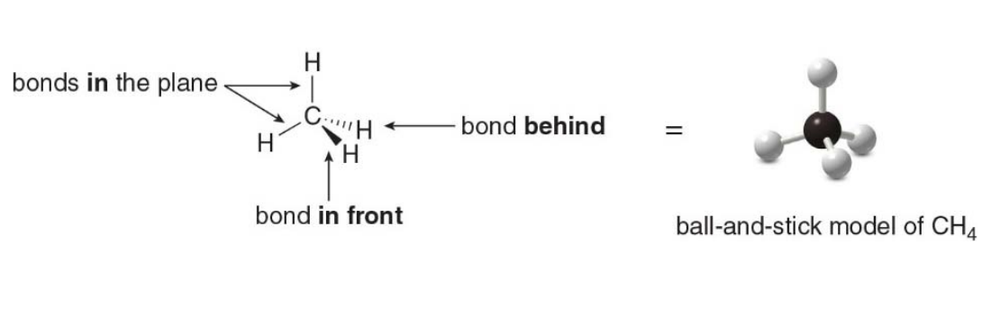
</p>

#### Equivalent reprensations for methane

- The molecule can be turned in many different ways, generating equivalent representations.
  - It is a 3d structure, not matter the orientation

The following drawing all represent the same thing, a methane molecule

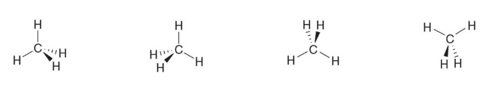

Wedges and dashed wedges are used to denote groups that are really aligned one behind another, order does not matter

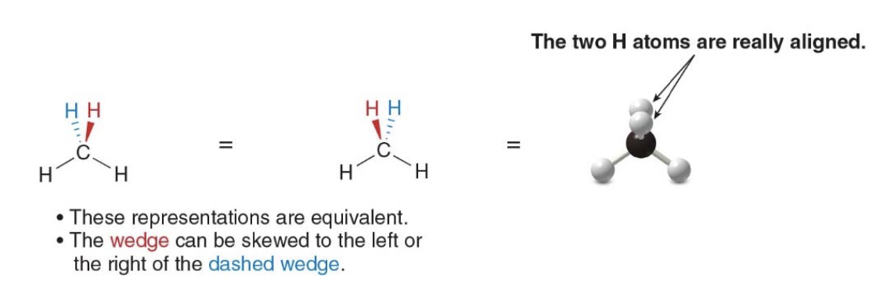

#### Non bonded pairs of electrons are counted as groups

- In ammonia \( \ce{NH3} \) one of the four groups attached to the central N atom is a lone pair.
- The group geometry is a tetrahedron
- The molecular shape is referred to as **trigonal pyramidal**

### The 3D structure of water

- In water, \( \ce{H2O} \) two four groups are attached to the central O atom lone pairs.
- The group geometry is a tetrahedron
- The molecular shape is referred as **bent**
  - In water, the oxygen \( \ce{O} \) has two bonding pairs and two lone pairs of electrons. According to VESPR theory, electron pairs around the central atom repel each other and try to maximize the distance between themselves to minimize repulsion.
  - The oxygen atom is surrounded by four electron groups
    - Two single bonds
    - Two lone pairs
  - Lone pairs exert a greater force than single bonds can do
  - Shape is a actually **bent**, because the lone pairs occupy more space thus forcing the \( \ce{H} \) atoms to get closer. Bringing the angle between them from an expected `109.5°` to `104.5°°`

As a general note, many structures having lone pairs the bonded atoms are compressed into a smaller space with a smaller bond angle.

> 🏞️ Visualizing
>
> - Imagine the oxygen atom at the center of a tetrahedron.
> - Two of the tetrahedral positions are taken by lone pairs of electrons.
> - The other two positions are taken by the two hydrogen atoms.
>   This gives a bent shape because the lone pairs occupy more space than the bonding pairs, causing the hydrogen atoms to be closer together.

### Orbitals and bonding

#### Hydrogen

When the \( \text{1s} \) orbital of one H atom overlaps with the \( \text{1s} \) orbital of another \( \ce{H} \) atom, a sigma $\sigma$ bond concentrating e-density between the two nuclei is formed. All single bonds are also referred to as $\sigma$ bonds.

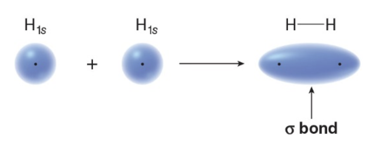

The bonding is cylindrically symmetrical because the electrons forming the bond are distributed symmetrically about an imaginary line connecting the two nuclei.

#### Methane and divalent carbon

> NOTE: The lowest energy arrangement of electrons for an atom is called its ground state

To account for the bonding patterns observed in more complext molecules, we must take a closer look at how the second ring orbitals of atoms in the second row are being used.

- In addition to its two core electrons, carbon has 4 valence electrons.
- In its **ground state**, carbon places it's valence electrons in the following manner:
  - 2 electrons in the 2s orbital
  - **one electron each** in the 2p orbital

According to these observations, carbon should form only two bonds because it has only two unpaired valence electrons. However, the resulting species \( \ce{CH2} \) is very unstable (it wants more electrons so bad) and cannot be isolated under typical lab conditions. (\( \ce{CH2} \) would not have an octet of electrons)

> The term **_"isolated"_** refers to the ability to separate and maintain a chemical species in a pure, stable form under standard laboratory conditions. When a molecule or compound is said to be "isolated," it means that it can exist on its own without rapidly reacting or decomposing, and it can be studied independently. Isolating \( \ce{CH2} \) would mean that this molecule (methylene) can be separated, kept stable, and observed in a lab without breaking down or reacting with other substances.
> However, \( \ce{CH2} \) is highly reactive because **it lacks a full octet**, making it very unstable. As a result, it cannot be isolated under typical conditions as it **reacts almost immediately with other molecules or atoms in an attempt to achieve stability** (e.g. forming more bonds to complete its octet). This inability to be isolated means that the \( \ce{CH2} \) species can't be bottled or handled easily as a stable, stand-alone molecule in the lab.

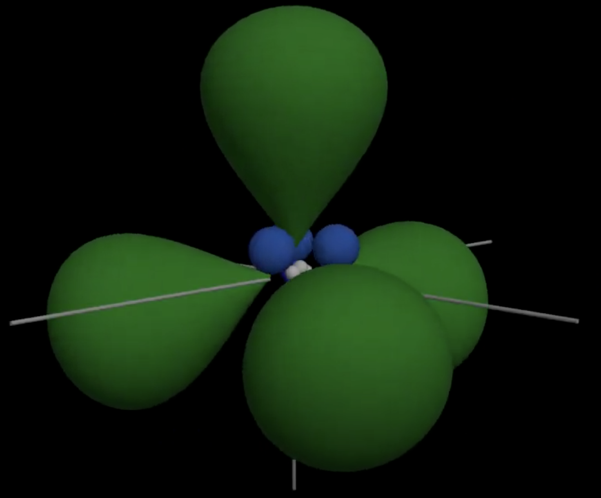
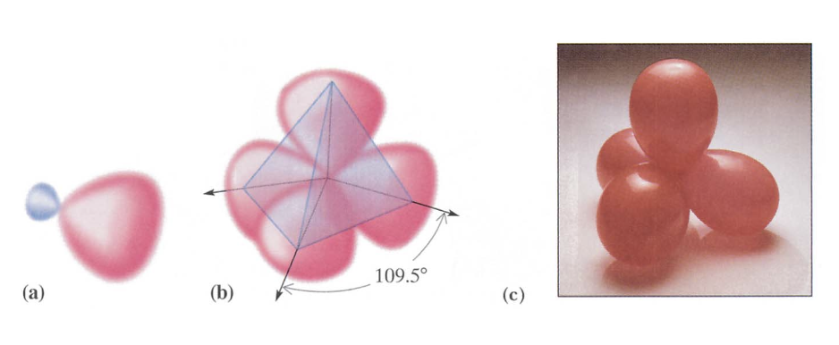

Seeking electrons, \( \ce{CH2} \) wants to become stable by staisfying the octet rule. It does so by \( \text{sp}^3 \) hybridization a process in which one $\text{s}$ and 3 $\text{p}$ orbitals combine to form up a new hybrid orbital.

- One 2s orbital and three 2p orbitals from the same atom mix together to form four new, identical hybrid orbitals. These four hybrid orbitals are arranged in a **tetrahedral geometry** around the central atom, with bond angles of approximately 109.5° between them.
- These hybrid orbitals overlap with the 1s orbitals of hydrogen atoms to form four strong $\sigma\ bonds$, resulting in a stable tetrahedral structure.

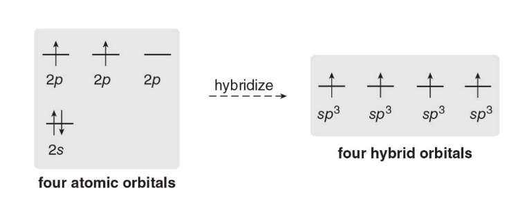

**_Hybridization_** is the combination of two or more atomic orbitals to form the same number of hybrid orbitals, each having the same shape and energy.

> Videos
>
> - [Doctor Klioze: Ammonia, ammonium and sp3 orbital hybridization](https://www.youtube.com/watch?v=_fYR5iWrzrw)
> - [Ibridazione degli orbitali atomici - Legami Sigma e Pi - Sp Sp2 Sp3](https://www.youtube.com/watch?v=pdJeQUd2g_4)

> ### $\sigma$ and $\pi$ bonds
>
> - $\sigma$: Formed by **end-to-end overlap** of orbitals along the bond axis. It is the strongest type of covalent bond and is present in **all single, double, and triple bonds**.
> - $\pi$: Formed by **side-to-side overlap** of unhybridized p orbitals, only found in **double and triple bonds**, and adds to the bond strength and rigidity.
>
> ### Bond types in single, double, and triple bonds:
>
> 1. **Single Bond**:
>
>    - **Composition**: One $\sigma$ bond.
>    - **Geometry**: Allows **free rotation** around the bond axis (e.g., ethane, \(\ce{C2H6}\)).
>
> 2. **Double Bond**:
>
>    - **Composition**: One $\sigma$ bond + one $\pi$ bond.
>    - **Geometry**: **Planar structure** with restricted rotation (e.g., ethene, \(\ce{C2H4}\)).
>
> 3. **Triple Bond**:
>    - **Composition**: One $\sigma$ bond + two $\pi$ bonds.
>    - **Geometry**: **Linear structure** with no rotation (e.g., acetylene, \(\ce{C2H2}\)).
>
> 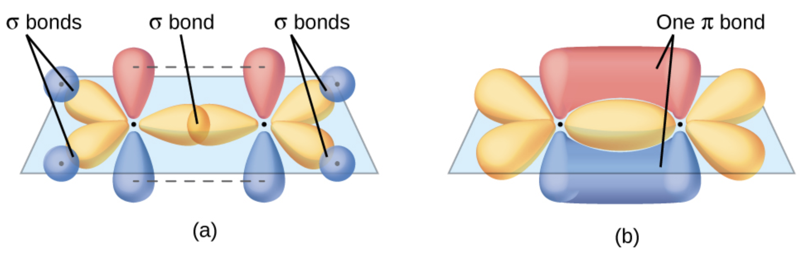
>
> **Sigma bonds** form the basic framework, while **pi bonds** add rigidity and prevent rotation in double and triple bonds.

#### Bonding via $\text{sp}^3$ hybrid oribitals

- Each bond in $\ce{CH4}$ is formed by overlap of an $\text{sp}^3$ hybrid orbital of carbon with a $\text{1s}$ orbital from hydrogen.
- These four bonds point to the corners of a tetrahedron.

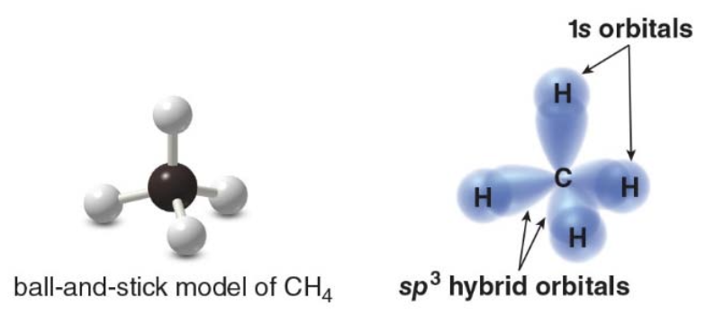

#### How to determine hybridization?

- Count the number of groups, which are atoms and non-bonded electron pairs, around the atom.
- The number of groups directly corresponds to the number of atomic orbitals that must be hybridized to form the hybrid orbital.

### Three types of Hybrid Orbitals

| Number of groups | Number of orbitals | Type of hybrid orbital         |
| ---------------- | ------------------ | ------------------------------ |
| 2                | 2                  | two sp hybrid orbitals         |
| 3                | 3                  | three sp\(^2\) hybrid orbitals |
| 4                | 4                  | four sp\(^3\) hybrid orbitals  |

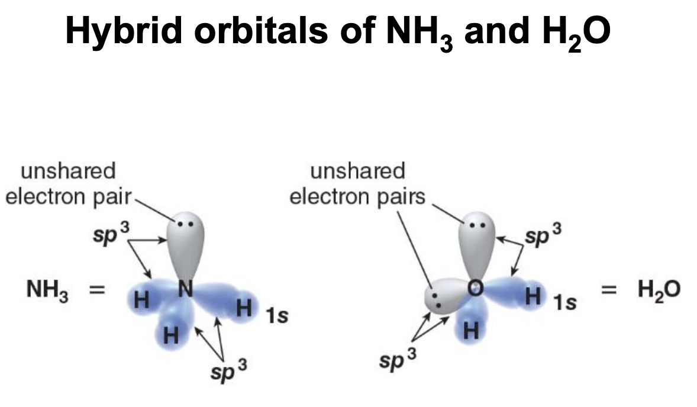

### Hybridization in ethane, ethylene and acetylene

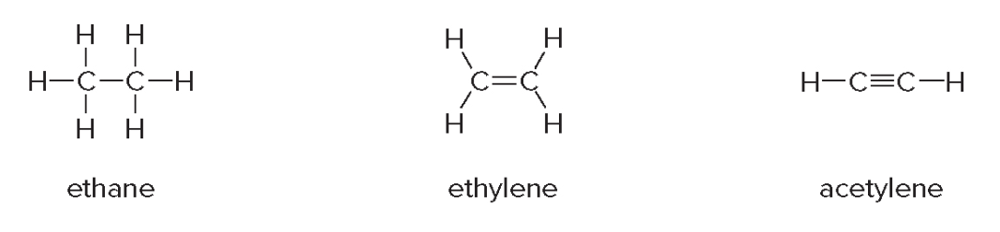
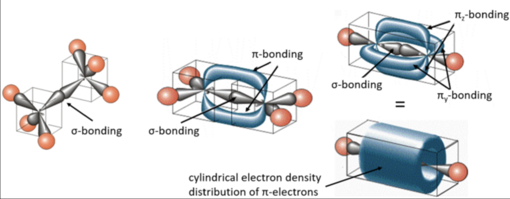

#### Ethane $\ce{CH3CH3}$

[3D structure](https://pubchem.ncbi.nlm.nih.gov/compound/6324#section=3D-Conformer)

- The two $\text{sp}^3$ orbitals overlap, forming a single bond $\ce{C-C}$ 
- Each $\ce{C-H}$ is formed by overlap of an $\ce{sp}^3$ hybrid on $\ce{C}$ with a $\ce{1s}$ orbital on $\ce{H}$

Making a model of ethane illustrates one additional
feature about its structure. Rotation occurs around the central $\ce{C-C}$ $\sigma$ bond.

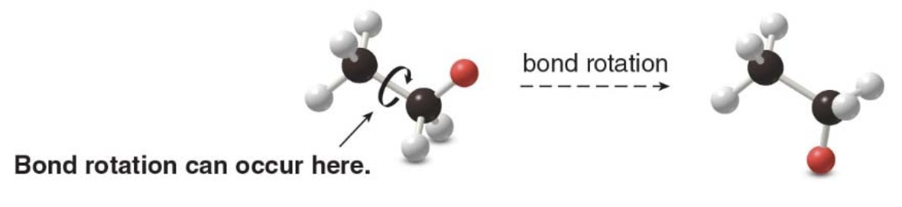

#### Ethylene $\ce{CH2CH2}$

[3D structure](https://pubchem.ncbi.nlm.nih.gov/compound/6325#section=3D-Conformer)

1. **Hybridization in ethylene**:
   - Each carbon in ethylene $\ce{C2H4}$ is $\text{sp}^2$ hybridized, forming three $\text{sp}^2 $hybrid orbitals.
   - These orbitals participate in forming $\sigma$ bonds with hydrogen atoms and between the two carbon atoms.

2. **$\sigma$ and $\pi$ bonds in ethylene**:
   - The double bond in ethylene consists of one $\sigma$ bond and one $\pi$ bond.
   - The sigma bond results from the overlap of sp² hybrid orbitals, while the pi bond forms from the lateral overlap of unhybridized p orbitals.

3. **No free rotation in ethylene**:
   - Rotation around the $\ce{C=C}$ double bond is restricted due to the $\pi$ bond.
   - Rotation can only happen if the pi bond is broken, which requires significant energy.

#### $\text{sp}$ hybrid orbitals

Here is a brief outline of the content from the image on **sp Hybrid Orbitals**:

1. **sp Hybridization in Acetylene (HC≡CH)**:
   - In acetylene, each carbon atom is **sp hybridized**.
   - This means that each carbon has two sp hybrid orbitals and two unhybridized **p** orbitals (one along the **py** axis and one along the **pz** axis).

2. **Linear Geometry**:
   - The two sp hybrid orbitals are arranged linearly, resulting in a bond angle of **180°**.
   - These orbitals form sigma (σ) bonds with hydrogen atoms and between the two carbon atoms.

3. **Unhybridized p Orbitals**:
   - The two unhybridized p orbitals on each carbon atom are oriented perpendicular to the sp orbitals.
   - These p orbitals participate in forming two pi (π) bonds, resulting in the triple bond between the carbon atoms.

This configuration explains the linear structure and bond characteristics of molecules like acetylene.

#### Acetylene $\ce{C2H2}$

[3D structure](https://pubchem.ncbi.nlm.nih.gov/compound/6325#section=3D-Conformer)

In acetylene (\(\ce{HC#CH}\)), each carbon atom undergoes **sp hybridization**. This means that one **s orbital** and one **p orbital** from each carbon atom combine to form two sp hybrid orbitals. These sp orbitals are oriented linearly, giving a bond angle of **180°**, which explains the linear geometry of the molecule.

Each carbon atom in acetylene also retains two unhybridized **2p orbitals**. These orbitals are oriented **perpendicular to each other** and to the sp hybrid orbitals. The sp hybrid orbitals are used to form **sigma (σ) bonds**: one between each carbon atom and a hydrogen atom and one between the two carbon atoms.

### Triple Bonds
The **triple bond** between the two carbon atoms in acetylene consists of:
- **One $\sigma$ bond**: This bond is formed by the head-on overlap of two sp hybrid orbitals, one from each carbon atom.
- **Two $\pi$ bonds**: The two unhybridized 2p orbitals on each carbon atom overlap **side-by-side** with the corresponding 2p orbitals on the other carbon atom. These side-by-side overlaps create two pi bonds. One pi bond is formed from the overlap of the p orbitals along the **y-axis**, and the other from the overlap of the p orbitals along the **z-axis**.

The result is a strong triple bond that consists of:
1. **One $\sigma$ bond** that aligns along the internuclear axis.
2. **Two $\pi$ bonds** that are perpendicular to the sigma bond and each other, giving the molecule its rigidity and preventing free rotation around the triple bond.

#### Properties of Triple Bonds
1. **Strength**: Triple bonds are stronger and shorter than double or single bonds because they involve more overlapping electron density between the bonded atoms.
2. **Bond Length**: The bond length in acetylene is shorter than in compounds with double or single bonds due to the increased overlap from the $\pi$ bonds.
3. **Rigidity**: The presence of two $\pi$ bonds in a triple bond restricts rotation around the bond axis, making the molecule more rigid than alkenes (with double bonds) or alkanes (with single bonds).

#### Bonds and hybdrization overview table

| Number of groups bonded to C | Hybridization | Bond angle | Example        | Observed bonding                      |
|------------------------------|---------------|-------------|----------------|---------------------------------------|
| 4                            | $\ce{sp}^3$           | 109.5°      | $\ce{CH3CH3}$ (ethane) | one σ bond \(C_{sp^3} - C_{sp^3}\)            |
| 3                            | $\ce{sp}^2$           | 120°        | $\ce{CH2=CH2}$ (ethylene) | one σ bond + one π bond \(C_{sp^2} - C_{sp^2}, C_{2p} - C_{2p}\) |
| 2                            | $\ce{sp}$            | 180°        | $\ce{HC#CH}$ (acetylene) | one σ bond + two π bonds \(C_{sp} - C_{sp}, C_{2p} - C_{2p}\)  |

### Bond length and bond strength

- As the number of electrons between two nuclei increases, the bonds connecting them becomes shorter and stronger.
- Triple bonds are shorter and stronger that single bonds.

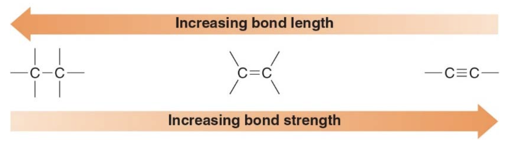

#### Carbon-Hydrogen bonds

- The length and strength of $\ce{C—H}$ bonds vary depending on the hybridization of the carbon atom.

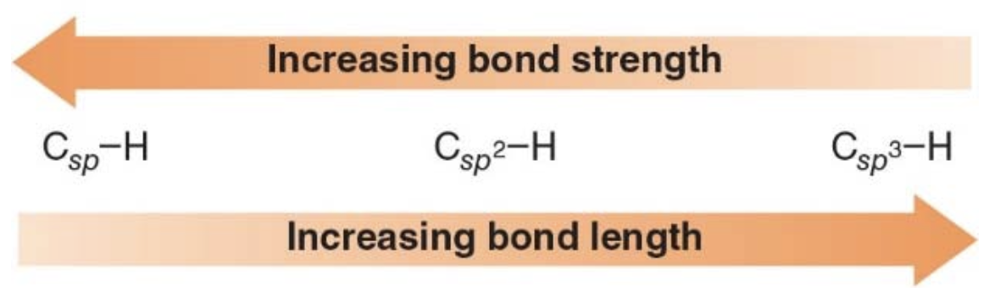

| Compound              | C–C bond length (pm) | Bond strength kJ/mol (kcal/mol) |
|-----------------------|----------------------|----------------------------------|
| $\ce{CH3-CH3}$        | 153                  | 368 (88)                         |
| $\ce{CH2=CH2}$        | 134                  | 635 (152)                        |
| $\ce{HC#CH}$          | 121                  | 837 (200)                        |
| $\ce{CH3CH2-H}$       | 111                  | 410 (98)                         |
| $\ce{CH2=CH-H}$       | 110                  | 435 (104)                        |
| $\ce{HC#C-H}$         | 109                  | 523 (125)                        |

**NOTE**: Going down the rows, length decreases and the bonds strength decreases just a promised before.

#### Percent s-character

- **sp hybrid**:
  \[
  \frac{\text{one 2s orbital}}{\text{two hybrid orbitals}} = 50\% \, \text{s-character}
  \]

- **sp² hybrid**:
  \[
  \frac{\text{one 2s orbital}}{\text{three hybrid orbitals}} = 33\% \, \text{s-character}
  \]

- **sp³ hybrid**:
  \[
  \frac{\text{one 2s orbital}}{\text{four hybrid orbitals}} = 25\% \, \text{s-character}
  \]

**NOTE**: increased percent **s-character** \( \Rightarrow \) Increased bond strength \( \Rightarrow \) Decreased bond length

### Electronegativity

Electronegativity is a measure of an atom's attraction for electrons in a bond. 

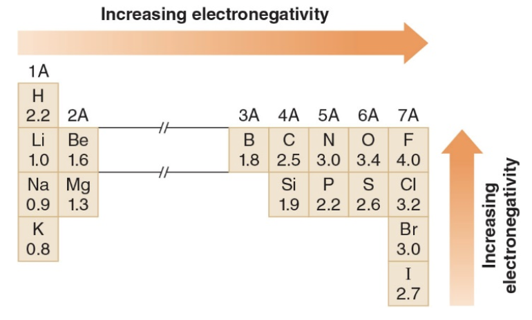


### Bond polarity

Electronegativity values are used to indicate wether the electrons in a bond are equally shared or unequally shared between two atoms. When electrons are equally shared, the bond is **nonpolar**

#### Nonpolar bonds

- A $\ce{C-C}$ bond is **nonpolar**.
- $\ce{C-H}$ bonds are considered to be nonpolar because the electronegativity difference between $\ce{C}$ and $\ce{H}$ is small.
- Whenever two different atoms having similar electronegativities are bonded together, the bond is **nonpolar**.

#### Polar bonds

- Bonding between atoms of different electronegativity values results in unequal sharing of electrons.
- The $\ce{C-O}$ bond
  - In this bond electrons are pulled away from $\ce{C}$ toward $\ce{O}$ which is the element having higher electronegativity (see table above).
  - The bond is polar, or polar covalent. The bond is said to have dipole; that is, partial separation of charge.

> 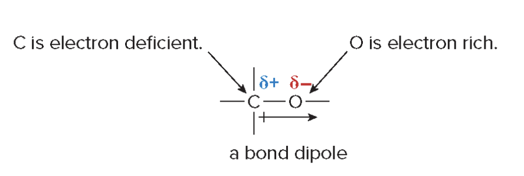
> - The $\delta^+$  means the indicated atom is electron deficient.
> - The $\delta^-$ means the indicated atom is electron rich.
> - The direction of polarity in a bond is indicated by an arrow with the head of the arrow pointing towards the more electronegative element.
> - The tail of the arrow is drawn at the less electronegative element.

### Polar molecules

A polar molecule has either one polar bond, or two or more bond dipoles that reinforce each other.

Example of water polarity:
- It is a bent molecule
- Two dipoles reinforce
- It has a net dipole, making it a polar molecule

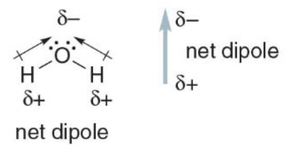

### Nonpolar molecules

A nonpolar molecule has either no polar bonds, or two or more bond dipoles that cancel

A nonpolar molecule has either no polar bonds, or two or more cancelling bond dipoles.

Example of carbon dioxyde nonpolarity
  - It is a linear molecule
  - Two dipoles are equal and opposite
  - Two dipoles cancel out
  - It is a nonpolar molecule with no net dipole

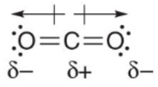

### Essential polarity rules

### Rules:
1. If the electronegativity difference (\(\Delta EN\)) is less than 0.5, the bond is **nonpolar covalent**.
2. If the \(\Delta EN\) is between 0.5 and 1.6, the bond is considered **polar covalent**.
3. If the \(\Delta EN\) is greater than 2.0, the bond is **ionic**.
4. If the \(\Delta EN\) is between 1.6 and 2.0:
   - **If a metal is involved**, the bond is considered **ionic**.
   - **If only nonmetals are involved**, the bond is considered **polar covalent**.

### Example:

- **Sodium bromide** (\(\ce{NaBr}\); \(\ce{EN_{Na}} = 0.9\), \(\ce{EN_{Br}} = 2.8\)): \(\Delta EN = 1.9\)
- **Hydrogen fluoride** (\(\ce{HF}\); \(\ce{EN_{H}} = 2.1\), \(\ce{EN_{F}} = 4.0\)): \(\Delta EN = 1.9\)

**Rule 4** applies: 
- \(\ce{NaBr}\) has **ionic bonds** because it involves a metal (Na).
- \(\ce{HF}\) has a **polar covalent bond** because both atoms are nonmetals.

These two compounds are quite different:
- \(\ce{NaBr}\) exhibits the classic **lattice structure** typical of ionic substances.
- \(\ce{HF}\) is a **gas** at room temperature, reflecting the nature of polar covalent bonds.
