# Organic Chemistry, Academic Year 2024/2025

[TOC]

## Brønsted-Lowry Acids and Bases, Lewis Acids and Bases

## What is an acid?

An acid in its broad sense, is a substance that can donate proton ($\ce{H^+}$ ions) or accept electron pairs.

## What is a base?

Depending on the definition, a base contrary to an acid: is a protons acceptor or can donate electron pairs.

## Brønsted-Lowry Acids and Bases

- A hydrogen without its only electron is called a **_"proton"_**
- A Brønsted-Lowry acid is a proton donor; it must have a proton.
- A Brønsted-Lowry base is a proton acceptor; it must be able to form a bond to a proton.

### Brønsted-Lowry acids (HA)

- All Brønsted-Lowry acids contain a proton
- The net carghe may be zero, $\ce{(+)}$ or $\ce{(-)}$

Some Brønsted-Lowry acids shown here

- $\ce{HCl}$
- $\ce{H2SO4}$
- $\ce{HSO4^-}$
- $\ce{H20}$
- $\ce{H30^+}$

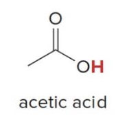

### Brønsted-Lowry bases ($\ce{B:}$)

- All Brønsted-Lowry acids contain a lone pair of electrons or a $\pi$ bond.
- The net charge may be zero

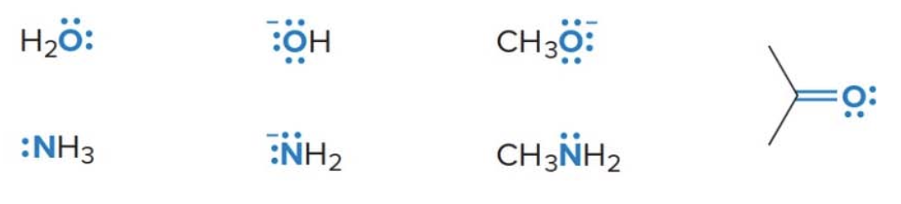

### Acidic and basic sites in morphine

Some molecules contain both hydrogen atoms and lone pairs, and thus can act either as acids or bases depending on the particular reaction

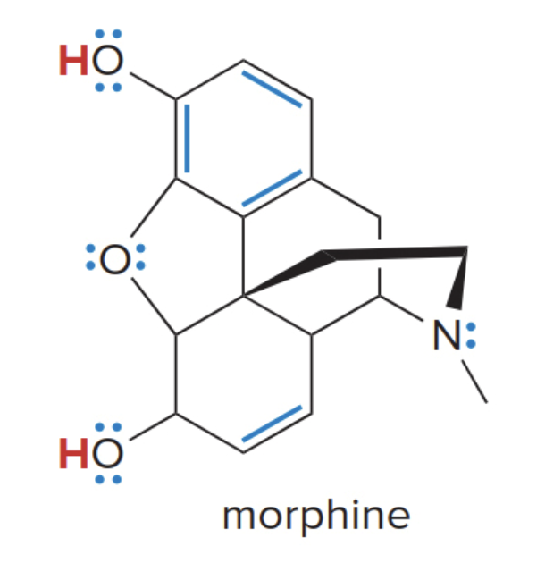

- $\ce{H}$ atoms on $\ce{O}$ make morphine an acid.
- Lone pairs and $\pi$ bonds (in blue above) make morphine a base.

The image is quite strange, so here is a 3D representation which will hopefully make this easier to visualize: [Pubmed Morphine 3D](https://pubchem.ncbi.nlm.nih.gov/compound/5288826#section=3D-Conformer)

### Reactions of Brønsted-Lowry acids and bases

- A Brønsted-Lowry acid base reaction results in the transfer of a proton from an acid to a base
- The electron pair of the base $\ce{B:}$ forms a new bond to the proton of the acid
- The acid $\ce{H-A}$ loses a proton, leaving the electron pair in the $\ce{H-A}$ bond on $\ce{A}$. This forms the conjugate base of the acid.

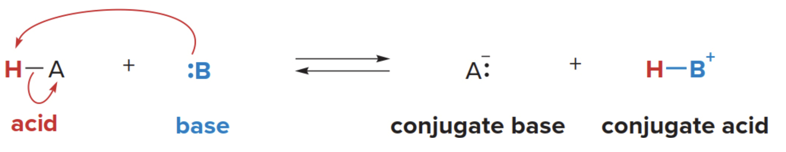

The double reaction arrow notation (equilibrium) is used between starting materials and products to indicate that the reaction can proceed in both directions.

- A **conjugate base** is what remains of the acidic part that was altered after losing it's proton
- Similalrly, a **conjugate acid** is what you obtain by bonding the lost proton the the basic compound, (simply, it is formed when the base gains a proton).

- **Acid** \( \text{HA} \) donates a proton, forming:
  \[
  \text{HA} \rightarrow \text{H}^+ + \text{A}^-
  \]

  - \( \text{HA} \) is the **acid**, and \( \text{A}^- \) is the **conjugate base**.

- **Base** \( \text{B} \) accepts a proton, forming:
  \[
  \text{B} + \text{H}^+ \rightarrow \text{BH}^+
  \]
  - \( \text{B} \) is the **base**, and \( \text{BH}^+ \) is the **conjugate acid**.

In reactions, the movement of electrons can be illustrated using **curved arrow** notation. Because two electron pairs are involved in this reaction below two arrows are needed.

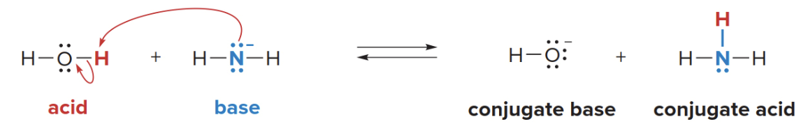

- When $\ce{NH2^-}$ reacts with $\ce{H2O}$, the amide ion will abstract a proton proton $\ce{H^+}$ from water.
- The **proton (H⁺)** from water, which is accepted by the nitrogen in ammonia.

#### What actually happens

- **The lone pair of electrons on the nitrogen** in $\ce{NH2^-}$ is used to form a bond with the proton ($\ce{H^+}$) from water.
  - The nitrogen in the amide ion ($\ce{NH2^-}$) now **shares** its lone pair with the proton ($\ce{H^+}$), resulting in the formation of a new $\ce{N-H}$ bond. This forms $\ce{NH3}$ (ammonia).
  - The lone pair of electrons from nitrogen is now **shared** with the hydrogen atom ($\ce{H^+}$) to form the new N-H bond in ammonia ($\ce{NH3}$).
- As water donates a proton, it is left as $\ce{OH^-}$ (hydroxide ion).
  - As water donates its proton ($\ce{H^+}$), it leaves behind its **electron** (which was part of the $\ce{O-H}$ bond). This electron remains on the oxygen, forming the hydroxide ion ($\ce{OH^-}$).
- The nitrogen in $\ce{NH2^-}$ becomes **neutral**, and water becomes $\ce{OH^-}$ after losing its proton.

### General rules of reactivity

- Electron-rich species react with electron-deficient species
  - Bases are electron rich
  - Acids are electron deficient; the $\ce{H}$ of an acid has a partial positive charge
  - Therefore, acids and bases react with one another

#### Acid strength and $\text{pK}_a$

Acid strength is the tendency of an acid to donate a proton. The more readily a compound donates a proton, the stronger an acid is.

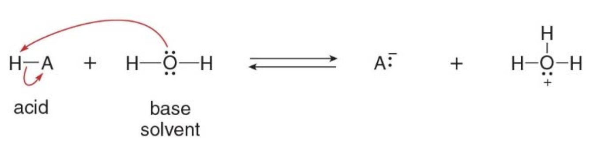

#### Why water acts as a base in this reaction

In this particular case, **H-A** is a stronger acid than water. Water, with its lone pair of electrons on oxygen, can accept a proton, acting as a base. The proton (H⁺) is transferred from **H-A** to water, forming the hydronium ion ($\ce{H3O^+}$) and the conjugate base ($\ce{A^-}$).

**NOTE**:
This ability of being both an acid or a base depending on the context is known as being **amphoteric**. In the example from the image, water is acting as a **base**, but it can also act as an acid in other situations.

#### What is a solvent?

- A solvent is a substance that dissolves other substances (called solutes) to form a solution.
- Water ($\ce{H2O}$) is a very common solvent in many chemical reactions, including acid-base reactions, due to its polarity and ability to dissolve many substances. In the reaction above between an acid ($\ce{H-A}$) and water in the image, water is acting as the solvent because it provides the medium in which the reaction occurs.

**IT DOESN’T NECESSARILY PARTICIPATE IN THE CHEMICAL REACTION AS A REACTANT (though sometimes it does, like water in this case).**

### Acid-Base equilibrium

- Acidity is measured by an equilibrium constant
- When a Brønsted-Lowry acid $\ce{H-A}$ is dissolved in water, an acid base reaction occurs and an equilibrium constant can be written for the reaction.

\[
K\_{\text{eq}} = \frac{[\text{products}]}{[\text{starting materials}]} = \frac{[\ce{H3O^+}][\ce{A^-}]}{[\ce{HA}][\ce{H2O}]}
\]

### Acidity constant

The concentration of the solvent $\ce{H2O}$ is essentially constant, so the equation can be rearranged and a new equilibrium constant, called the **acidity contant** $\text{K}_a$ is defined

\[
K*a = [\ce{H2O}] K*{\text{eq}} = \frac{[\ce{H3O^+}][\ce{A^-}]}{[\ce{HA}]}
\]

> The square brackets $\text{[ <mol> ]}$ in chemical equations represent the concentration of a substance, typically in moles per liter (M) or mol/L. This notation is used to express how much of a substance is present in a given volume of solution.

It is generally more convenient when describing acid strength to use $\text{pK}_a$ values than $\text{K}_a$ values.

\[
\text{p}K_a = -\log K_a
\]

---

|    $\text{K}_a$ of typical organic acids     | $\text{K}_a$ of typical organic acids |
| :------------------------------------------: | :-----------------------------------: |
| $\text{10}^{-5} \rightarrow \text{10}^{-50}$ |  $\text{+5} \rightarrow \text{+50}$   |
|         Larger number, stronger acid         |     Smaller number, stronger acid     |
|         Smaller number, weaker acid          |      Larger number, weaker acid       |

**The smaller the $\text{pK}_a$, the stronger the acid.**

Here is the table and the text from the image formatted in **Markdown**:

### Acidity of Some Common Compounds

**Selected pKₐ values**

| **Acid**            | **$\text{pK}_a$** | **Conjugate base**  |
| ------------------- | ----------------- | ------------------- |
| $\ce{H-Cl}$         | –7                | $\ce{Cl^-}$         |
| $\ce{CH3CO2-H}$     | 4.8               | $\ce{CH3CO2^-}$     |
| $\ce{HO-H}$         | 15.7              | $\ce{HO^-}$         |
| $\ce{CH3CH2O-H}$    | 16                | $\ce{CH3CH2O^-}$    |
| $\ce{HC \equiv CH}$ | 25                | $\ce{HC\equiv C^-}$ |
| $\ce{H-H}$          | 35                | $\ce{H^-}$          |
| $\ce{H2N-H}$        | 38                | $\ce{H2N^-}$        |
| $\ce{CH2=CH2}$      | 44                | $\ce{CH2=CH^-}$     |
| $\ce{CH3-H}$        | 50                | $\ce{CH3^-}$        |

**_NOTE_**

- **Acidity** is increasing from bottom to top
- **Basicity** is increasing from top to bottom

### Outcome of Acid-Base reactions

- The position of the equilibrium depends on the relative strengths of the acids and bases
- Equilibrium always favors formation of the weaker acid

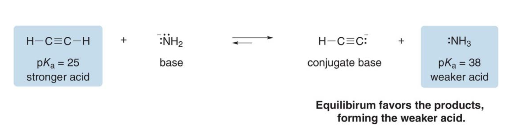

**NOTE**: because the $\text{pK}_a$ of the second acid (25) is lower than that of the conjugate acid (38), equilibrium favors the products (see half left arrow above).

### Steps into solving acid-base reactions equilibria

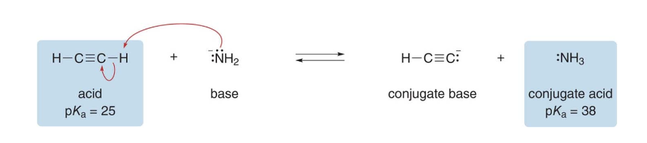

- **Step 1**: Identify the base in the starting materials. Assume $\ce{-NH2}$ the base because it bears a net negative charge. That makes $\ce{HC#CH}$ (acetylene) the acid.

- **Step 2**: Draw the products of proton transfer and identify the conjugate acid and base in the products. Acetylene gives up its proton to $\ce{-NH2}$

- **Step 3**: Compare the $\text{pK}_a$ values of the acid and the conjugate acid.Equilibrium favors the formation of the weaker acid with the higher $\text{pK}_a$ value. The $\text{pK}_a$ of $\text{NH3}$ is higher, therefore products are favored.

### Factors that determine acid strength

**NOTE**: Anything that stabilizes a conjugate base $\ce{(A:)^-}$ make the starting acid $\ce{H-A}$ more acidic.

Four factors affect the acidity of $\ce{H-A}$. These are the following:

1. **Element Effects**: The identity of the atom directly bonded to the acidic hydrogen significantly affects acidity.

   - Across a period (left to right), electronegativity increases, so a more electronegative atom stabilizes the negative charge on A⁻ better, leading to a stronger acid.
   - Down a group, the size of the atom increases, and larger atoms can better accommodate the negative charge, also making the acid stronger.

2. **Inductive Effects**: Electronegative atoms or groups attached to the molecule can withdraw electron density through sigma bonds (induction), helping to stabilize the negative charge on the conjugate base. This effect decreases with distance from the acidic site, but the presence of electronegative atoms like fluorine can still increase acidity by stabilizing the conjugate base.

3. **Resonance Effects**: If the conjugate base $\ce{A^-}$ has resonance structures that delocalize the negative charge over multiple atoms, the conjugate base is more stable, which increases the acidity of the starting acid.

   - For example, carboxylic acids are more acidic than alcohols because the conjugate base (carboxylate) is stabilized by resonance.

4. **Hybridization Effects**: The hybridization of the atom bonded to the acidic hydrogen affects acidity.
   - More s-character in the hybrid orbitals increases acidity because a higher s-character means the electrons are held closer to the nucleus, stabilizing the negative charge on the conjugate base. For example, $\text{sp}$-hybridized carbon (as in alkynes) is more acidic than $\text{sp}^2$ (alkenes) or $\text{sp}^3$ (alkanes) hybridized carbon.

> _Note on stability_
> The more stable the conjugate base, the more easily the acid can lose its proton, and therefore, the stronger the acid.

**Some keynotes includes**

- Always draw the conjugate bases
- Determine which conjugate base is more stable
- The more stable the conjugate base, the more acidic the acid

### Element effects - Trends in the periodic table

Why does H2O have a much lower pKa than CH4?

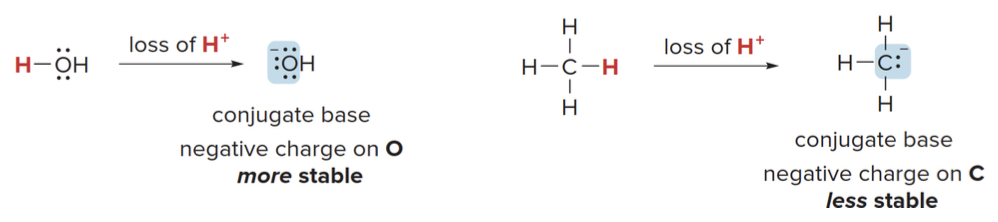

Easy $\Rightarrow$ since oxygen is much more electronegative than carbon, it more readily accepts a negative charge.

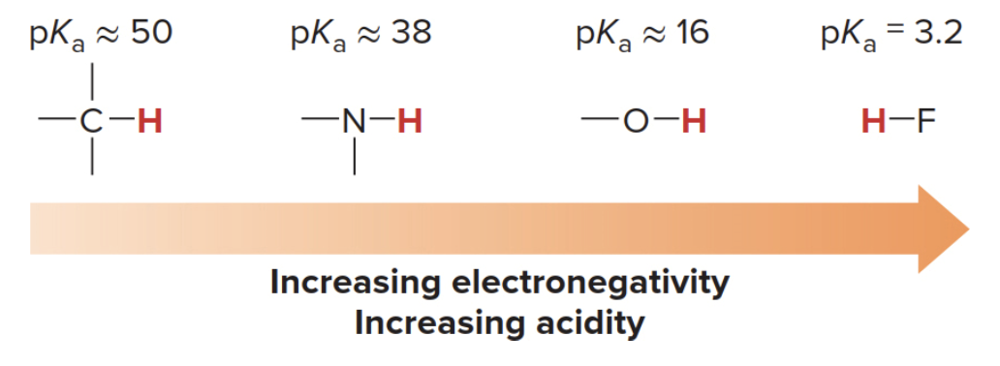

Yes, across a row of the periodic table, the acidity of H–A increases as the electronegativity of the atom **A** increases. This trend occurs because more electronegative atoms stabilize the negative charge on the conjugate base (A⁻) better after the acid (H–A) donates a proton (H⁺). A more stable conjugate base makes it easier for the acid to lose its proton, thus increasing the acidity.

#### Trend of electronegativity across a period

As you move **from left to right across a row** of the periodic table, the electronegativity of the atoms increases. This is due to the following reasons:

- **Increasing nuclear charge**: As the atomic number increases across a period, the number of protons in the nucleus also increases. This pulls the electrons more strongly towards the nucleus, increasing electronegativity.
- **Smaller atomic radius**: Moving from left to right across a period also leads to a decrease in atomic radius (since electrons are added to the same shell but the nucleus pulls them closer), which further enhances the atom's ability to attract electrons.

> ### Notes on electronegativity
>
> Electronegativity values are often reported using the **Pauling scale**, named after [Linus Pauling](https://en.wikipedia.org/wiki/Linus_Pauling).
>
> #### General electronegativity trends on the periodic table
>
> - The most electronegative elements are found at the top right of the periodic table (excluding the noble gases), with **fluorine** being the most electronegative element.
> - **Metals** on the left side of the periodic table (like sodium, potassium) have very low electronegativity because they tend to lose electrons easily.
>
> #### How electronegativity relates to acidity
>
> - As **electronegativity of A increases**, the ability of A to stabilize the negative charge on A⁻ increases after the loss of a proton. This makes the acid (H–A) stronger.
> - For example, across the period from **C** (in CH₄) to **N** (in NH₃) to **O** (in H₂O) to **F** (in HF), the acidity of H–A increases dramatically because the conjugate bases become more stabilized due to the increasing electronegativity of A.
>
> ### A little side note on calculating electronegativity
>
> - **Pauling's approach**: Pauling calculated electronegativity using bond dissociation energies between different atoms. Moreover, the difference in electronegativity between two atoms can be inferred from the bond energy difference between a heteronuclear bond (A–B) and the average of the homonuclear bonds (A–A and B–B).
>
>   \[
>   | \chi_A - \chi_B | \propto \text{(Bond energy of A–B)} - \frac{1}{2} \left( \text{Bond energy of A–A} + \text{Bond energy of B–B} \right)
>   \]
>
> **NOTE**: $\chi$ (chi) is used as the symbol for _electronegatity_

#### Trend of electronegativity down a column

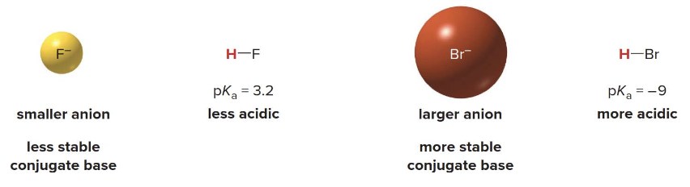

- **Down a column of the periodic table**, the **size of the atom** becomes the dominant factor in determining acidity, not electronegativity. Larger atoms can better stabilize the negative charge on the conjugate base because the charge is spread over a greater volume.
- **Charge stabilization**: Positive or negative charge is more stable when it is spread over a larger area or volume. For larger atoms, the negative charge on the conjugate base is distributed over a greater space, reducing charge density and making the conjugate base more stable.

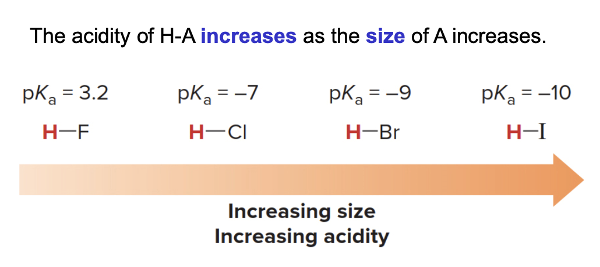

### Inductive effects

- An inductive effect is the pull of electron density through $\sigma$ bonds caused by electronegativity differences of atoms.
- More electronegative atoms stabilize regions of high electron density by an electron withdrawing inductive effect, basically pulling electrons closer to them.
- The more electronegative the atom and the closer it is to the site of the negative charge $\Rightarrow$ the greater the effect.
- The acidity of $\ce{H-A}$ increases with the presence of electron withdrawing groups in A.

#### Inductive effects on Trifluoroethanol

Note that [2,2,2-trifluoroethanol](https://pubchem.ncbi.nlm.nih.gov/compound/6409#section=3D-Conformer) is more acidic than ethanol.

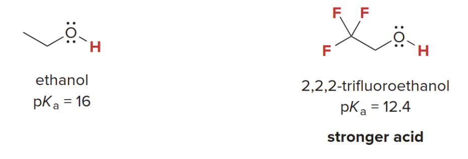

$\Rightarrow$ This is because the three electronegative fluorine atoms stabilize the negatively charged conjugate base.

**REMEMBER**: the conjugate base is what remains of the initial acid after the reaction took place

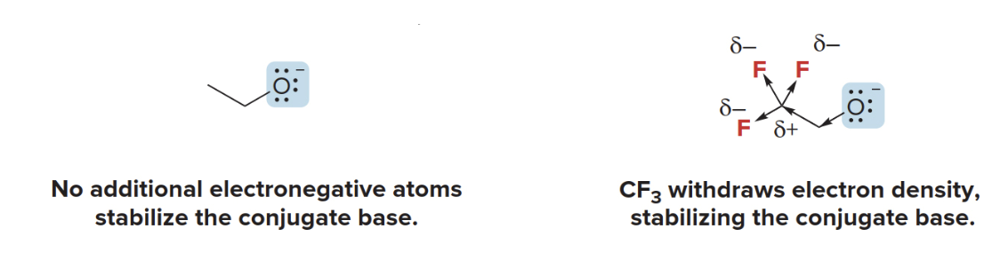

$\ce{CF3}$ is polarized creating a pulling force towards its center from the methylene group, ultimately making the alcohol tail more prone to give away it's proton. This is the reason why **trifluoroethanol** is more acidic than plain ethanol.

### Resonance effects

Delocalization of charge through resonance influences acidity. Acetic acid is more acidic than ethanol, even though both conjugate bases have the negative charge on the same element, $\ce{O}$.

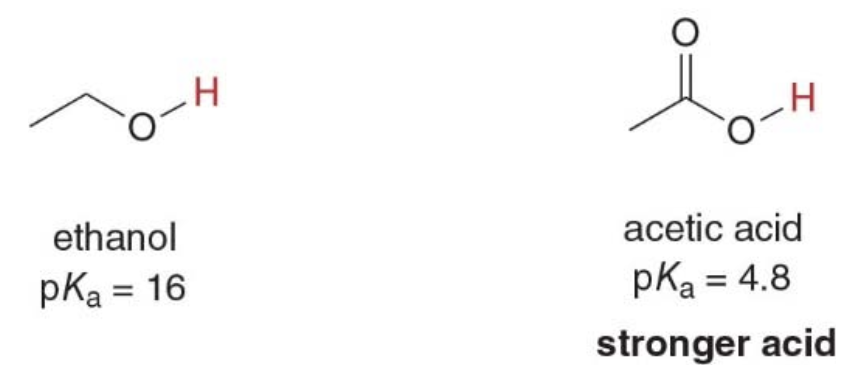

1. Acetic Acid $\ce{CH3COOH}$:

   - When acetic acid donates a proton (H⁺), it forms the acetate ion $\ce{CH3COO^-}$ as its conjugate base.
   - The negative charge on the oxygen in the acetate ion is **delocalized** through **resonance**. There are two resonance structures in which the negative charge is shared equally between the two oxygen atoms.
     \[
     \ce{CH3-C(=O)O^-} \leftrightarrow \ce{CH3-C(O^-)O}
     \]

   This **delocalization of the negative charge** over both oxygen atoms stabilizes the conjugate base (acetate ion) significantly.

   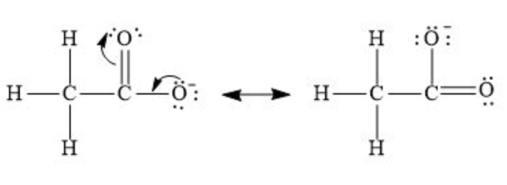

2. Ethanol $\ce{CH3CH2OH}$:

   - When ethanol loses a proton, it forms the ethoxide ion $\ce{CH3CH2O^⁻}$ as its conjugate base.
   - In this case, the negative charge is localized entirely on one oxygen atom because no resonance is possible.

   Structure of ethoxide ion:
   \[
   \ce{CH3CH2O^-}
   \]
   The negative charge is concentrated on a single oxygen atom, making the ethoxide ion less stable compared to the acetate ion.

- In **acetic acid**, the **negative charge** on the conjugate base is **delocalized** between two oxygen atoms through resonance, greatly stabilizing the conjugate base.
- In **ethanol**, the negative charge on the conjugate base is **localized** on a single oxygen atom, making the ethoxide ion less stable.

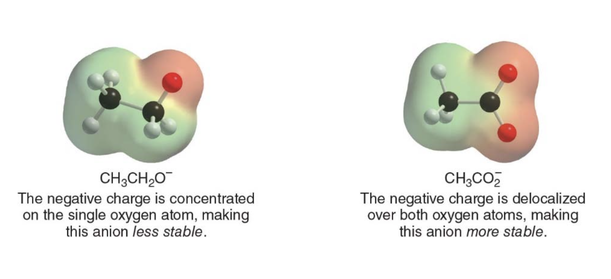

### Hybridization effects

Consider the relative acidities of three different compounds containing $\text{C-H}$ bonds

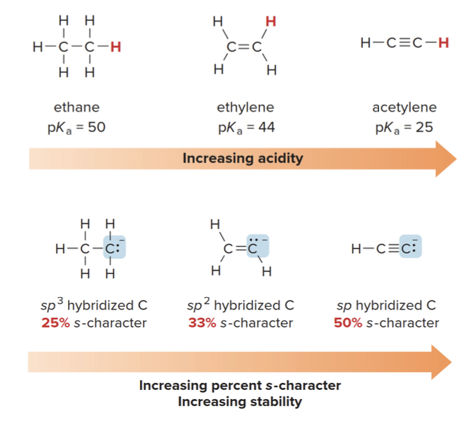

#### Why higher s-character means more stability

- The closer the electrons are to the nucleus, the less reactive they become because they are more shielded from external forces. This stabilizes the negative charge, making the conjugate base more stable.
- A more stable conjugate base (where the negative charge is well stabilized) means that the original acid can more easily donate its proton, because the resulting negative charge won't cause as much instability.

Here is the content formatted into a **Markdown table**:

---

### Summary of Factors that Determine Acid Strength

| **Factor**               | **Description**                                                                                   | **Example**                          |
|--------------------------|---------------------------------------------------------------------------------------------------|--------------------------------------|
| **Element effects**       | The acidity of HA increases both left-to-right across a row and down a column of the periodic table. | $\ce{CH4}$ and $\ce{H2O}$ (more acidic) |
| **Inductive effects**     | The acidity of HA increases with the presence of electron-withdrawing groups in A.                 | $\ce{CH3CH2O-H}$ and $\ce{CF3CH2O-H}$ (more acidic) |
| **Resonance effects**     | The acidity of HA increases when the conjugate base $\ce{A^-}$ is resonance stabilized.            | $\ce{CH3CH2O-H}$ and $\ce{CH3CO2-H}$ (more acidic)  |
| **Hybridization effects** | The acidity of HA increases as the percent s-character of $\ce{A^-}$ increases.                    | $\ce{CH2=CH2}$ and $\ce{HC \equiv CH}$ (more acidic) |

### Determining the relative acidity of protons

- **Step 1**: identify the atoms bonded to the hydrogen, and use periodic trends to assign relative acidity
    - The most common $\ce{H-A}$ bonds in organic compounds are $\ce{C-N}$, $\ce{N-H}$ and $\ce{O-H}$
    - Acidity increases left to right accross a row, the relative acidity of these bonds is $\ce{C-N < N-H < O-H}$
    - $\ce{H}$ atoms bonded to C atoms are usually less acidic than $\ce{H}$ atoms bonded to any heteroatom

- **Step 2**: if the two $\ce{H}$ atoms in question are bonded to the same element, draw the conjugate bases and look for other points of difference.
    - Do electron-withdrawing groups stabilize the conjugate base?
    - Is the conjugate base resonance stabilized?
    - How is the conjugate base hybridized?

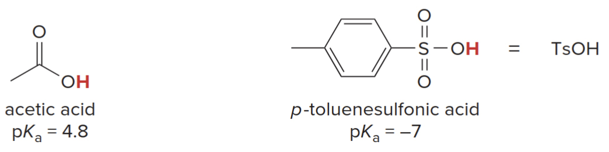

The familiar acids $\ce{HCl}$ and $\ce{H2SO4}$ are often used in organic reactions. Various organic acids are also commonly used (e.g., acetic acid and p-toluenesulfonic acid $\ce{TsOH}$).

Here also a list of commonly used bases in organic chemistry, mostly negatively charged bases.

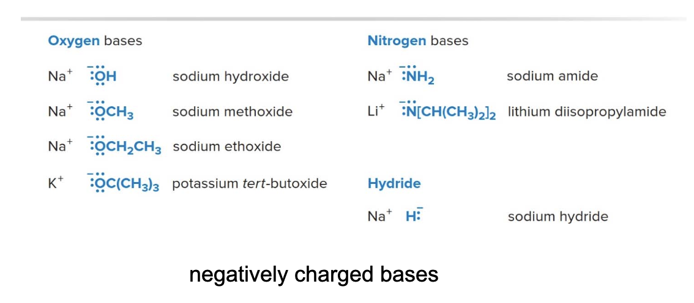

### Characteristics of strong organic bases

Strong bases have weak conjugate acids with high $\text{pKa}$ values, usually $\text{> 12}$. Strong bases have a net negative charge, but not all negatively charged species are strong bases. For example, none of the halides $\ce{Fe^-}$, $\ce{Cl^-}$, $\ce{Br^-}$ or $\ce{I^-}$ is a strong base.

Carbanions, negatively charged carbon atoms, are especially strong bases. A common example is butyllithium

\[
\ce{CH3CH2CH2{\ddot{\ C^-}}H2 Li+}
\]

