# Organic Chemistry, Academic Year 2024/2025

[TOC]

## Functional groups, intermolecular forces and physical properties

### Functional groups

- A functional group is an **atom** or a **group of atoms** with characteristic chemical and physical properties.

- Most organic molecules contain a carbon backbone, consisting of $\ce{C-C}$and$\ce{C-H}$ bonds to which functional groups are attached.

- Structural features of a functional group:
    - **Heteroatoms** $\rightarrow$atoms other than$\ce{C}$or$\ce{H}$
    - Bonds commonly occur in $\ce{C-C}$and$\ce{C-O}$ double bonds

Functional groups distinguish one organic molecule from another, they're able to determine a molecule's:
- Name
- Geometry
- Chemical and physical properties
- Reactivity

- They also pretty much create what are called as ***Classes of Organic Compounds*** $\rightarrow$ alkanes, alkenes, alkynes, alcohols and more...

#### Reactivity of functional groups

Heteratoms and bonds are responsible for the reactivity on a particular molecule
- Heteroatoms have lone pairs and create electron-deficient sites on carbon
- A bond makes a molecule base and a nuclephile, it is easily broken in chemical reactions

    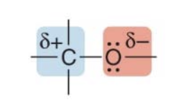

- Lone pairs make $\ce{O}$ a base and a nucleophile
- The $\ce{C}$ atom is electron deficient, making it an electrophile
    - Heteroatoms often pull electron density away from nearby carbons because they are more electronegative.
    - This creates electron-deficient sites (partial positive charge, $\delta^+$) on those carbons, making them electrophilic (prone to be attacked by nucleophiles).

    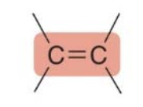

- The $\pi$ bond is easily broken.
- The $\pi$ bond makes a compound a base and a nucleophile.
    - In many chemical reactions, especially in **nucleophilic substitution** or **addition reactions**, the $\pi$bond donates its electrons to form new bonds. Since the$\pi$ bond is more loosely held, it can be broken, allowing the electrons to be used in new bond formation with other atoms or groups.

#### Why $\pi$ bonds break so easily

**Electron-rich bonds**, such as **π bonds** in **double** or **triple bonds**, are more easily broken in chemical reactions because of their **weaker nature** and **exposed electron density**.

**Weaker Bond Energy**
   - **$\pi$ bonds** are generally weaker than **$\sigma$ bonds**.
     - **$\sigma$ bonds** are formed by **head-on overlap** of orbitals, which leads to a strong bond with electrons tightly held between the nuclei.
     - **$\pi$ bonds**, on the other hand, result from the **side-by-side overlap** of **p orbitals**. The overlap is less effective compared to the head-on overlap in σ bonds, making π bonds **weaker** and **easier to break**.

**Exposed Electron Density**
   - In a **$\pi$ bond**, the electrons are located **above and below** the plane of the atoms involved in the bond (in contrast to the **$\sigma$ bond**, where the electron density is directly between the nuclei).
   - This makes the **$\pi$ electrons more exposed** and less tightly held, making them more available for reaction.

### Parts of a functional group

    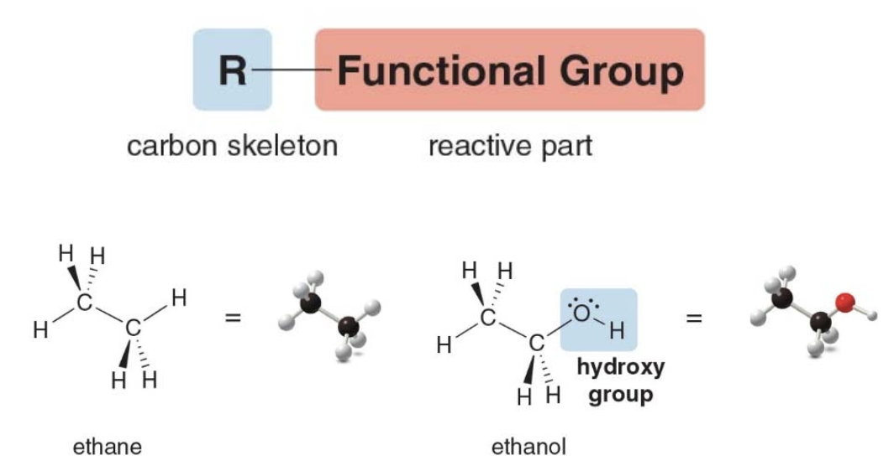

- **Ethane**
    - Has all $\ce{C-C}$and$\ce{C-H}$ $\sigma$ bonds
    - Has no functional group

- **Ethanol**
    - Polar $\ce{C-O}$and$\ce{O-H}$ bonds
    - Two lone pairs

# Ethane, a Molecule with No Functional Group

- This molecule has only C—C and C—H bonds.
- It contains no polar bonds, lone pairs, or bonds.
- Therefore, ethane has no reactive sites (functional groups).
- Consequently, ethane and other alkanes are very unreactive.

# Ethanol

- Compounds containing an $\ce{HO}$ group are called **alcohols**.
- The hydroxy group makes the properties of ethanol very different from the properties of ethane.
- Ethanol has lone pairs and polar bonds that make it reactive.
- Other molecules with hydroxy groups will have similar properties to ethanol.

**NOTE**: The term **"backbone"** is used to describe the continuous chain of atoms that provides the main structure, to which other atoms or groups can be attached, influencing the molecule’s properties.

Ethane consists of **nonpolar $\ce{C-C}$and weakly polar$\ce{C-H}$ bonds**, resulting in no significant reactive sites. It lacks functional groups and lone pairs, making it **chemically inert** under normal conditions and requiring high energy (e.g., combustion) to break its bonds. On the other hand, Ethanol has a **hydroxyl group ($\ce{-OH}$)**, making it much more reactive than ethane. The **polar $\ce{O-H}$and$\ce{C-O}$ bonds** create partial charges, making the molecule susceptible to **nucleophilic and electrophilic attacks**. The hydroxyl group also enables ethanol to undergo various reactions (e.g., **oxidation**, **dehydration**, **esterification**) and form **hydrogen bonds**, increasing its overall reactivity.

### Hydrocarbons

Hydrocarbons are compounds make up of only the elements carbon and hydrogen; they may be aliphatic or aromatic

    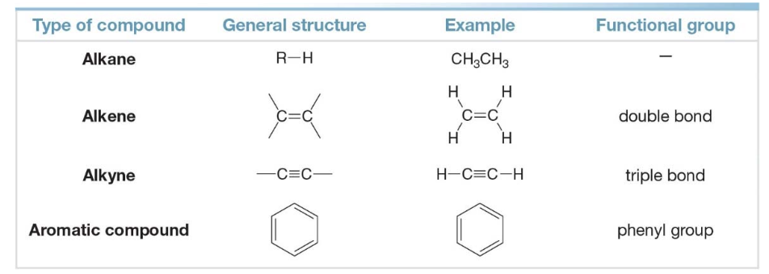

- Aliphatic hydrocarbons have three subgroups 
    - Alkanes have only $\ce{C-C}$bonds and no functional group$\rightarrow \ce{C-C}$
    - Alkenes have a $\ce{C-C}$double bond$\rightarrow \ce{C=C}$
    - Alkynes have a $\ce{C-C}$triple bond$\rightarrow \ce{C#C}$ 

### Aromatic hydrocarbons

- Aromatic hydrocarbons are so named because many of the earliest known aromatic compounds had strong, characterstic odors.
- The simplest aromatic hydrocarbon is benzene.
- The six-membered ring and three bonds of benzene comprise a single functional group, found in most aromatic compounds.
    - The **phenyl group**

    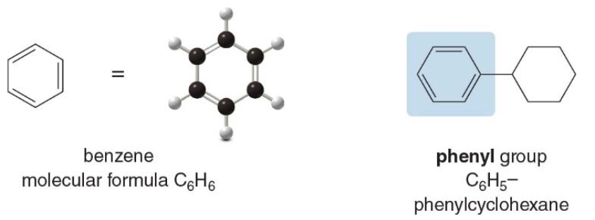

### Functional groups with carbon heteroatom $\ce{C-Z}$ $\sigma$ bonds

    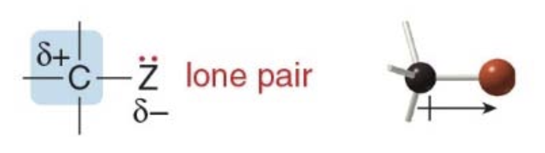

The structure on the right shows a 3D molecular model where carbon is bonded to the heteroatom $\ce{Z}$with an arrow indicating the direction of the electron density being pulled toward the more electronegative atom$\ce{Z}$.
- This type of bond is common in many functional groups like alcohols C—O, amines C—N, and halides C—Cl, C—Br, etc.

> **What's a halogen? a halide?**
> **Halogens** are highly reactive elements from Group 17 of the periodic table, including fluorine $\ce{F}$, chlorine $\ce{Cl}$, bromine $\ce{Br}$, and iodine $\ce{I}$. When a halogen forms a bond with another element, particularly carbon, the resulting compound is called a **halide**. Halides (e.g., alkyl halides) have polar carbon-halogen bonds due to the high electronegativity of halogens, making them reactive in organic chemical reactions like substitution and elimination.

    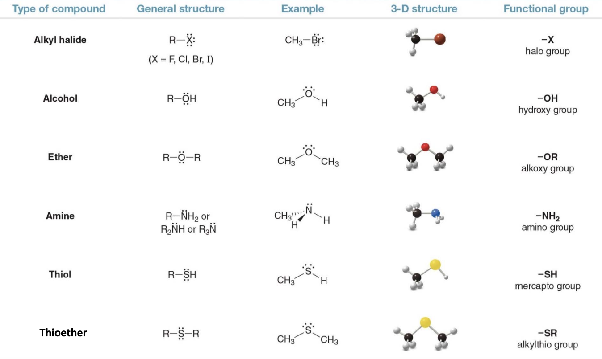

### Functional groups with $\ce{C-O}$ group 

- This group is called a "carbonyl group"
- The polar $\ce{C=O}$bond makes the carbonyl carbon an electrophile, while the lone pairs on$\ce{O}$ allow it to react as a nucleophile and base

    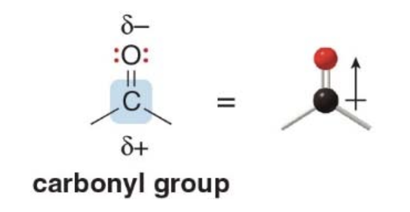

 
**NOTE**: the carbonyl group also contains a bond that is more easily broken than a $\ce{C-O}$ bond

#### Atoms classification

    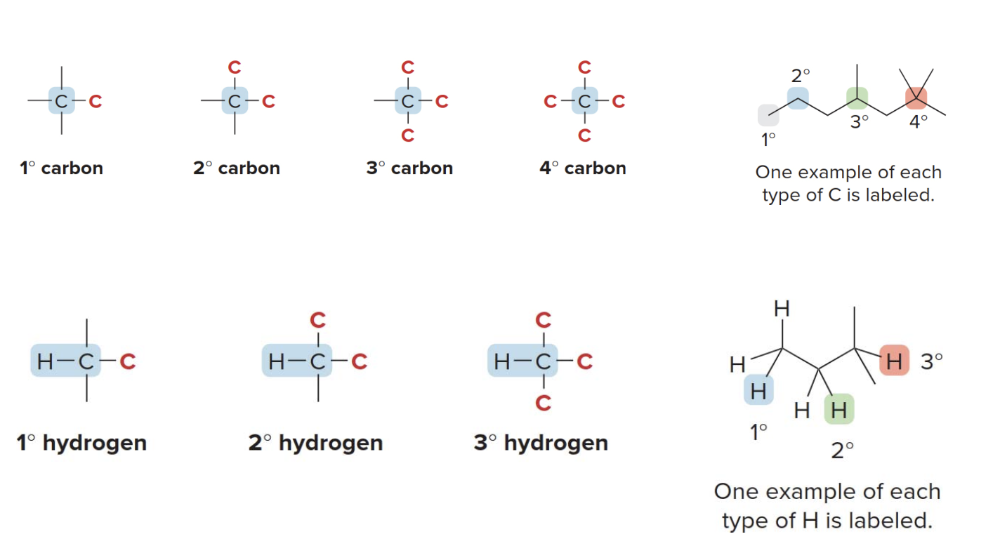

| **1. Carbon atoms** | **2. Hydrogen atoms** | **3. Alcohols and alkyl halides** | **4. Amines and amides** |
|----------------------|-----------------------|-----------------------------------|--------------------------|
|  |  |  |  |
| 6-acetylmorphine | 6-acetylmorphine | Cortisol | Motuporamine B |
| **Carbon atoms** are classified by the number of carbon atoms bonded to them; a 1° carbon is bonded to one other carbon, and so forth. | **Hydrogen atoms** are classified by the type of carbon to which they are bonded; a 1° hydrogen is bonded to a 1° carbon, and so forth. | **Alcohols and alkyl halides** are classified by the type of carbon to which they are bonded; a 1° alcohol has an OH group bonded to a 1° carbon, and so forth. | **Amines and amides** are classified by the number of carbon atoms bonded to the nitrogen atom; a 1° amine has one C–N bond, and so forth. |

    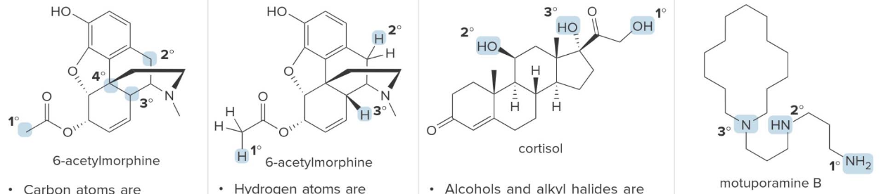

    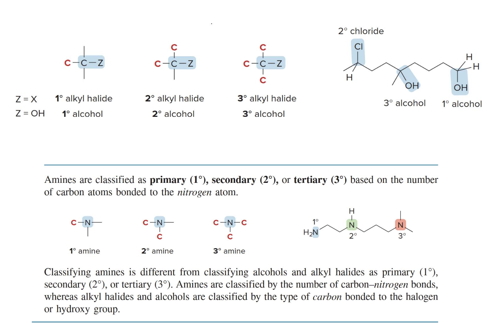

#### Why all this fuss?

*SIGH... Notations!*

Carbon atoms are classified by the number of other carbon atoms they are bonded to: primary (1°) carbons are connected to one other carbon, secondary (2°) to two, tertiary (3°) to three, and quaternary (4°) to four. This helps in understanding molecular structure and reactivity. Similarly, hydrogen atoms are classified based on the type of carbon they are attached to. Functional groups like alcohols and alkyl halides are also categorized by the carbon they are bonded to, influencing their chemical behavior. Amines and amides are classified by the number of carbon atoms attached to the nitrogen, with primary (1°), secondary (2°), and tertiary (3°) amines or amides having one, two, or three carbon-nitrogen bonds, respectively. These classifications are key to predicting structure and reactivity in organic compounds.

This type of classification is pretty much just precise notation allows that chemists to describe molecules better, predict their reactivity, and understand how different structural features influence their chemical behavior.

### Why functional groups matter

A functional group in an organic compound plays a crucial role in determining its chemical and physical behavior. These characteristics can be outlined as follows:

- **Bonding and Shape**: The functional group influences the type of bonding (such as single, double, or triple bonds) and the molecular geometry, which affects how molecules interact with one another and fit into reaction mechanisms.
  
- **Type and Strength of Intermolecular Forces**: The functional group dictates the type of intermolecular forces, such as hydrogen bonding, van der Waals forces, or dipole-dipole interactions. These forces influence properties like boiling and melting points.

- **Chemical and Physical Properties**: The presence of a functional group affects properties such as solubility, acidity or basicity, and volatility, directly shaping the compound's behavior in different environments.

- **Nomenclature**: Functional groups also determine the naming of organic compounds, as they are often used as the basis for the systematic naming (IUPAC) of molecules.

- **Chemical Reactivity**: Functional groups govern how molecules react with other substances, dictating the types of reactions they undergo, their reaction mechanisms, and their overall reactivity in organic synthesis.

These aspects help chemists predict how molecules behave and interact based on their functional groups.

### What are intermolecular forces?

Intermolecular forces are interactions that exist between molecules, functional groups determine the type and strength of these interactions. For a figurative sense, ionic and covalent compounds have very different intermolecular interactions:

#### Ion-Ion interactions

In an ionic compound, such as sodium chloride $\ce{NaCl}$, the positively charged sodium ions $\ce{Na}^+$and negatively charged chloride ions$\ce{Cl}^-$ are arranged in a repeating lattice structure. The ions are held together by the **electrostatic forces** of attraction between opposite charges.

**Sidenote**: This strong interaction is responsible for the high melting and boiling points of ionic compounds because a significant amount of energy is required to break these strong bonds.

> Ion-ion interactions are among the strongest types of attractive forces in chemistry because they involve full charges and lead to the stable, rigid structures seen in many ionic solids. This is what gives ionic compounds distinct physical properties, like hardness and high thermal stability.

    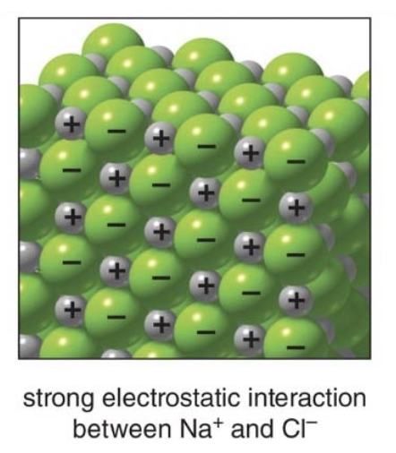

This image describes **ion-ion interactions**, which are the strong electrostatic attractions that occur between oppositely charged ions in ionic compounds. These interactions are a type of **intermolecular force** but are much stronger than the forces found between covalent molecules.

The image also highlights that **ion-ion interactions** are much stronger than the **intermolecular forces** present in covalent molecules, such as **van der Waals forces** or **hydrogen bonding**.
- In covalent compounds, the molecules themselves are neutral or only slightly polar, so the interactions between them are weaker compared to the full charges found in ionic compounds.

### Intermolecular forces in covalent molecules

Covalent compunds are composed of discrete molecules, the natures of the forces between molecules dependes on the functional group(s) present. There are generally four types of interactions, we'll list them in order of increasing strength:
- **van der Waals** or dispersive forces
- **dipole-dipole** interactions
- hydrogen bonding
- ionic interactions

#### van der Waals forces

Van der Waals forces, also known as **London dispersion forces**, are the weakest type of intermolecular forces. These forces arise due to **temporary fluctuations in electron density** within a molecule, which create **instantaneous dipoles**. Even in nonpolar molecules where there is no permanent dipole, the random movement of electrons can momentarily cause a slight imbalance in charge distribution. This temporary dipole can induce a corresponding dipole in a neighboring molecule, leading to an **induced dipole-induced dipole interaction**.

While van der Waals forces are weak, **they are significant in large numbers**. These forces are especially important in nonpolar compounds, where no permanent dipoles exist to generate stronger interactions like hydrogen bonds or dipole-dipole forces.

The strength of van der Waals forces increases with the size and surface area of the molecule because larger molecules have more electrons and a greater ability to become polarized.

**NOTE**: This is why larger nonpolar molecules like iodine $\ce{I_2}$or long-chain hydrocarbons have higher boiling and melting points compared to smaller nonpolar molecules like helium$\ce{He}$ or methane ($\ce{CH_4}$).

#### var der Waals forces in methane

- $\ce{CH_4}$ has no net dipole
- At any one instant, its electron density may not be completely symmetrical, resulting in a temporary dipole.
- This can induce a temporary dipole in another molecule.

    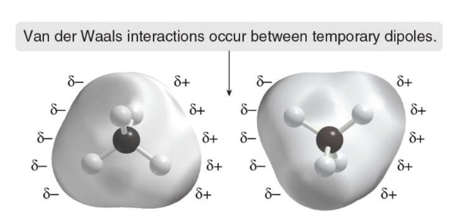

#### var der Waals forces in relation with surface area

All compunds exhibit van der Waals forces $\rightarrow$ The larger the surface area of a molcules, the larger the attractive forces between two molecules, and the stronger the intermolecular forces.

    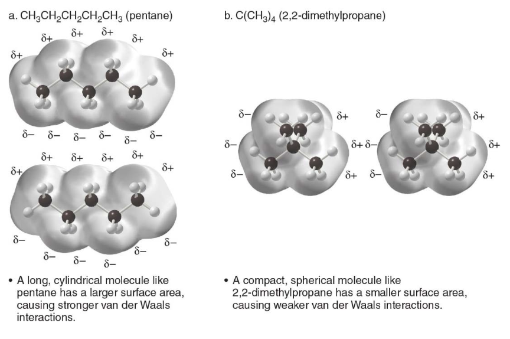

#### var der Waals forces and polarizability

**Polarizability** refers to how easily the electron cloud around an atom can be distorted by external forces. **Larger atoms, with more loosely held valence electrons**, are more polarizable than smaller atoms. This means that compounds with larger, more polarizable atoms experience stronger van der Waals forces compared to compounds with smaller, less polarizable atoms.

- Polarizability increases in larger atoms because their valence electrons are farther from the nucleus, meaning they experience a weaker attraction to the positively charged nucleus.
- This weaker attraction allows the electron cloud to be **more easily distorted or shifted when subjected to external forces**, such as the presence of a nearby dipole or temporary charge fluctuation $\rightarrow$ it is more malleable.

Instead in smaller atoms, the valence electrons are closer to the nucleus and more tightly held, making them less susceptible to such distortions.

### Dipole-Dipole interactions

Dipole-Dipole interactions are the attractive forces between the permanent dipoles of two polar molecules. The dipoles in adjacent molecules align so that the partial positive and partial negative charges are in close proximity.

**NOTE**: These attractive forces caused by permanent dipoles are much stronger than weak van der Waals forces

    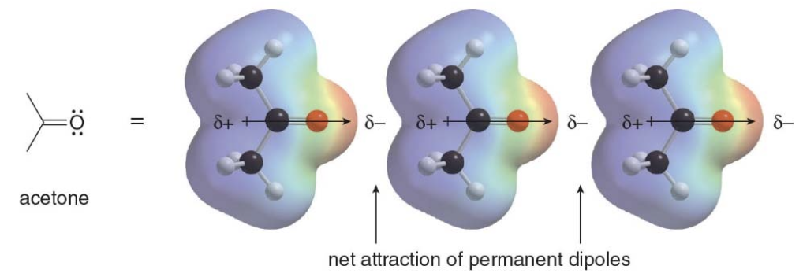

#### Intermolecular non-covalent bonding forces

Dipole-dipole interactions can occur when both the drug and the binding site have permanent dipole moments. As the drug approaches the binding site, the dipoles of the drug and the binding site align with each other. This alignment helps the drug orient itself correctly within the binding site. 

This orientation is **beneficial** if it allows other functional groups on the drug to interact with the corresponding regions of the binding site effectively, enhancing the binding strength.

    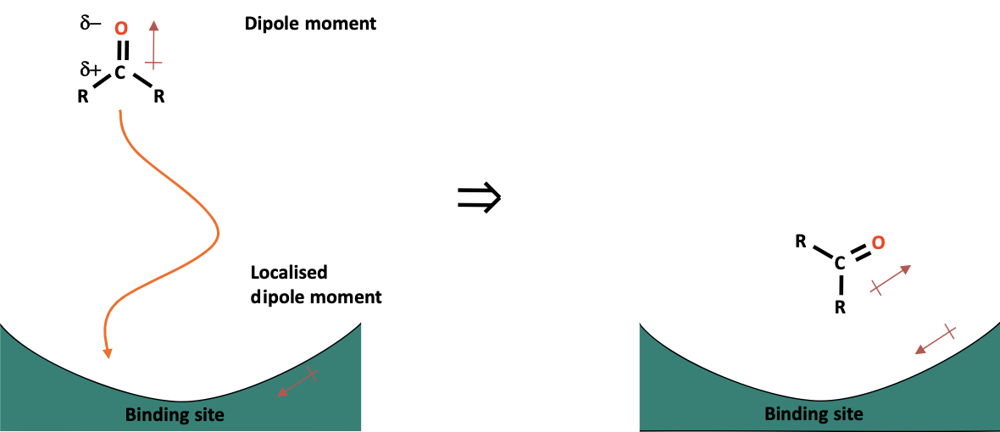

However, if the dipoles align but the other binding groups on the drug are **not positioned correctly**, this orientation can be **detrimental**, reducing the effectiveness of the interaction.

The strength of dipole-dipole interactions decreases with distance between the drug and the binding site, but it diminishes less quickly than weaker forces like van der Waals interactions. However, it still fades faster than stronger electrostatic (ionic) interactions.

> **What really is a drug this context?**
> In this context, the "drug" refers to a small molecule that is designed or naturally occurs to bind to a specific target site in the body, often a protein (such as an enzyme or receptor). The drug’s goal is to interact with this target site to produce a therapeutic effect, such as inhibiting an enzyme, activating a receptor, or blocking a signaling pathway

#### Hydrogen bonding

    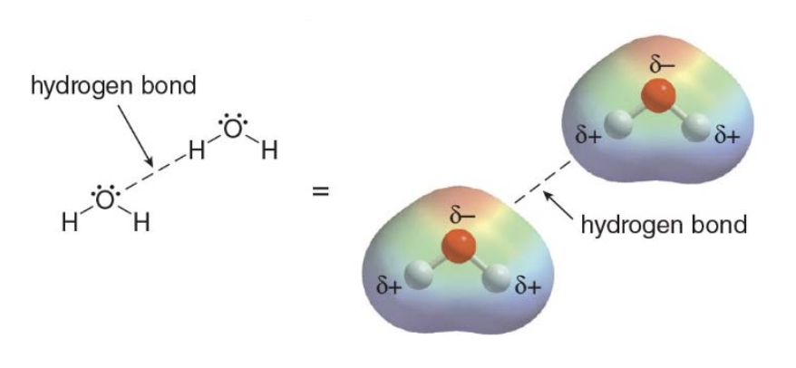

Hydrogen bonding typically occurs when a hydrogen atom bonded to O, N, or F, is electrostatically attracted to a lone pair of electrons on an O, N, or F atom in another molecule.

They vary in strength between $\text{5-25 kJ/mol}$ and are weaker than electrostatic interactions but definetely stronger than van der Waals interactions.

- Hydrogen bonds take place between an electron deficient hydrogen and an electron rich heteroatom (typically $\ce{N}$or$\ce{O}$). 

The electron deficient hydrogen is called a ***hydrogen bond donor*** $\rightarrow$**HBD**. The electron rich heteroatom on the other hand is called a ***hydrogen bond acceptor***$\rightarrow$ **HBA**.

    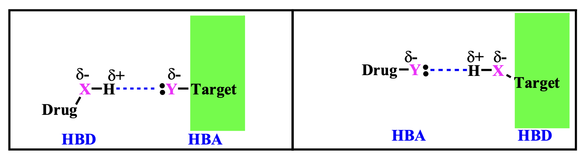

- $\ce{X-H}$is a hydrogen bond donor (HBD), with the hydrogen being$\delta^+$.
- $\ce{Y}$is a hydrogen bond acceptor (HBA), with lone pairs of electrons$\delta^-$ to form hydrogen bonds.

Typically, the acceptor is also an electronegative atom like oxygen, nitrogen, or fluorine.

In this mechanism, a drug molecule may contain such donor or acceptor groups to interact with the target via hydrogen bonding. This interaction allows the drug to bind specifically to the target, which could be a protein, enzyme, or another biological macromolecule, thereby influencing the function of the target. 

In hydrogen bonds the inteaction involves orbitals and is **directional**, optimum orientation is where the $\ce{X-H}$bond points directly to the lone pair on$\ce{Y}$such that the angle between X, H and Y is$\ce{180°}$

    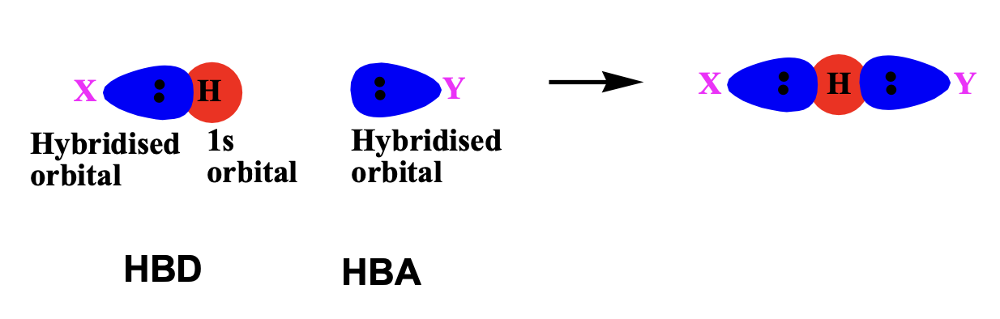

#### Typical H-Bond donors and Acceptors in eeceptor-proteins

| **Donors**               | **Shared (Both Donors and Acceptors)** | **Acceptors**               |
|--------------------------|---------------------------------------|-----------------------------|
| Peptide-NH               | Tyr (Tyrosine)                        | Peptide-CO                  |
| N-term. -NH₃⁺            | Ser (Serine)                          | C-term. -COO⁻               |
| Lys (Lysine)             | Thr (Threonine)                       | Glu (Glutamate)             |
| Arg (Arginine)           | His (Histidine)                       | Asp (Aspartate)             |
| Trp (Tryptophan)         | Cys (Cysteine)                        | Met (Methionine) (Weak)     |
|                          | Asn (Asparagine)                      | S-S Bond                    |
|                          | Gln (Glutamine)                      |                             |

> **What is a receptor protein?**
> Receptor proteins are specialized proteins located on the surface of cells (membrane receptors) or within cells (intracellular receptors) that bind to specific molecules, such as hormones, neurotransmitters, or drugs.

#### Intermolecular non-covalent bonding forces; aka Electrostatic or ionic bond

This is the strongest of the intermolecular type of bonds reaching energy levels in the range of $\text{20-40 kJ/mol}$. This kind of interaction takes place between groups of opposite charge. The strength of the interaction is inversely proprtional to the distance of the two interactants:

$$
    \text{distance between molecules} \propto \text{bond strength}
$$

where $\propto$ denotes inverse proportionality.

- Stronger interactions occur in hydrophobic environments
- The strength of interactions drops off less rapidly with distance than with other forms of intermolecular interactions

**NOTE**: Ionic bonds are the most important initial interactions as a drug enters the binding site

    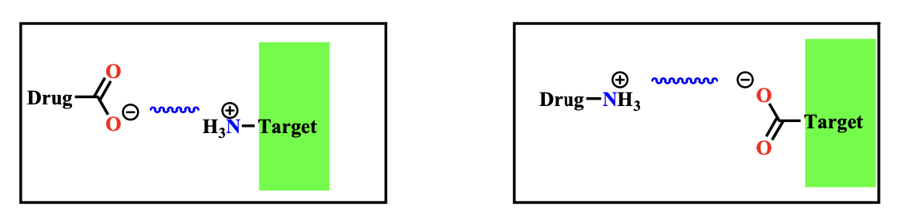

Ionic bonds are the strongest non-covalent interactions, typically ranging from $\text{20-40 kJ/mol}$, because they involve full charges. This makes them much stronger than hydrogen bonds or van der Waals forces, which rely on partial or temporary charges. Unlike other interactions, the strength of ionic bonds decreases less rapidly with distance, meaning they remain effective over larger distances. Additionally, in hydrophobic environments where water can't interfere, ionic bonds become even stronger, playing a crucial role in stabilizing interactions in biological systems.

Here is the information from the image formatted in Markdown:

#### Essence of intermolecular forces

As the polarity of an organic molecule increases, so does the strength of its intermolecular forces.

| **Type of Force**     | **Relative Strength** | **Exhibited by**                                  | **Example**              |
|-----------------------|-----------------------|---------------------------------------------------|--------------------------|
| van der Waals          | weak                  | all molecules                                      | $\ce{CH3CH2CH2CH2CH3}$   |
| dipole–dipole          | moderate              | molecules with a net dipole                        | $\ce{CH3CH2CH2CHO}$      |
| hydrogen bonding       | strong                | molecules with an O–H, N–H, or H–F bond            | $\ce{CH3CH2CH2CH2OH}$    |
| ion–ion                | very strong           | ionic compounds, groups of opposite charge in covalent molecules | $\ce{NaCl}$, $\ce{LiF}$ |

### Physical properties

#### Boiling point

The boiling point of a compund is referred to as the temperature at which liquid molecules are converted into gas. In boiling, energy is needed in order to overcome the attractive forces in the more ordered liquid state.
- The stronger the intermolecular forces, the higher the boiling point. 
    - A good example is water: it's high boiling point is due to its extensive hydrogen **bonding network**, which requires a significant amount of energy to break. This is why water boils at a much higher temperature than many other small molecules.

    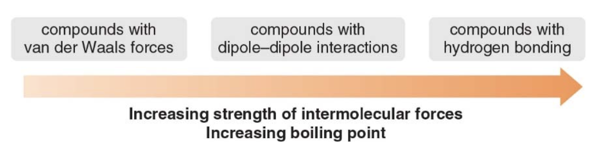

- The relative strength of the intermolecular forces increases from pentane to butanal to 1-butanol.
- The boiling points of these compounds increase in the same order.

    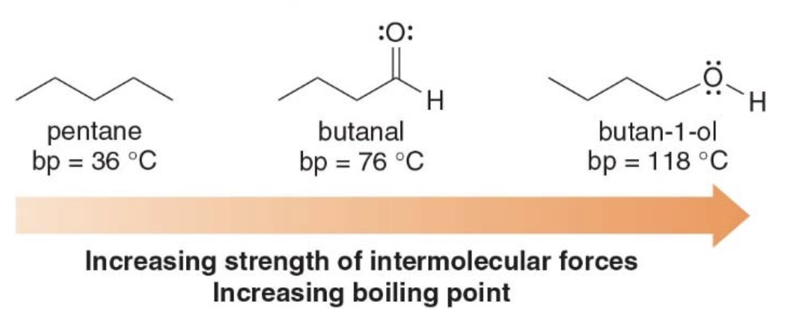

**Other factors contributing to the boiling point value**

- **Surface Area**: 
   - A larger surface area allows for **greater intermolecular contact**, which increases the strength of van der Waals forces between molecules.
   - For example, **pentan-3-one** has a larger surface area than **acetone**, which results in stronger intermolecular forces and a higher boiling point (102°C for pentan-3-one vs. 56°C for acetone).

    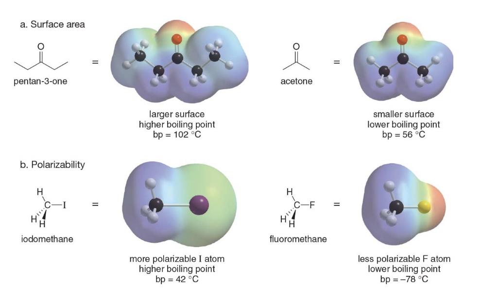

- **Polarizability**:
   - **Polarizability** refers to how easily the electron cloud around an atom can be distorted.
        - Larger atoms with more diffuse electron clouds are **more polarizable**, leading to **stronger van der Waals forces**
   - For instance, **iodomethane $\ce{CH3I}$** has a more polarizable iodine atom, resulting in a higher boiling point (42°C) compared to **fluoromethane $\ce{CH3F}$**, which has the less polarizable fluorine atom and a much lower boiling point (-78°C)

#### Melting point

The melting point is the temperature at which a solid is converted to its liquid phase. In melting, energy is needed to overcome the attractive forces in the more ordered crystalline solid.

- Just like in the b.p. the stronger the intermolecular forces the higher the melting point.

**NOTE**: given the same functional group, the more symmetrical the compund, the higher the melting point (???)

> **Symmetricity? What the F you might say...**
> Symmetry promotes efficient packing in the solid state, resulting in stronger intermolecular interactions and, thus, a **higher melting point** for more symmetrical compounds.
> - **Symmetrical molecules** pack more efficiently into a solid crystalline lattice because their shape allows them to align neatly. This tight packing leads to stronger intermolecular interactions in the solid state, which means more energy is required to disrupt these interactions during melting. Hence, a **higher melting point**.
>   
> - **Less symmetrical molecules** pack less efficiently, resulting in weaker intermolecular interactions in the solid state. These interactions are easier to overcome, leading to a **lower melting point**.

#### Melting point trends

For covalent molecules of approximately the same molecular weight, the melting point depends upon the identity of the functional group.

- The stronger the intermolecular attraction, the higher the melting points.

    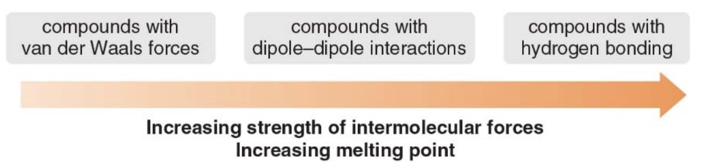

    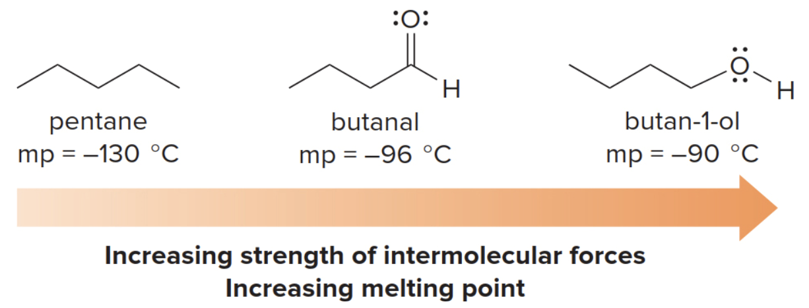

#### The effect of symmetry on melting pointso

- For compunds having the same functional group and similar molecular weights, **the more compact and symmetrical the shape, the higher the melting point**.

    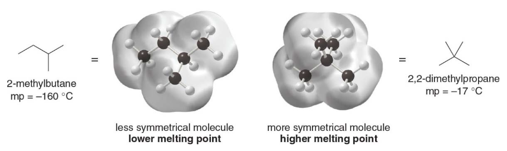

- A compact symmetrical molecule like neopentane packs well into a crystalline lattice whereas isopentane does not. It has a much higher melting point than isopentane.

**NOTE**: symmetricity is reffered to as the dregee of symm in a single molecule, not the composition of many of them although it influences it.

#### Solubility

Solubility is defined as the extend to which a compound, called a solute, dissolves in a liquid, called a solvent. The energy needed to break up the interactions between the molecules or ions of the solute comes from new interactions between the solute and the solvent.

    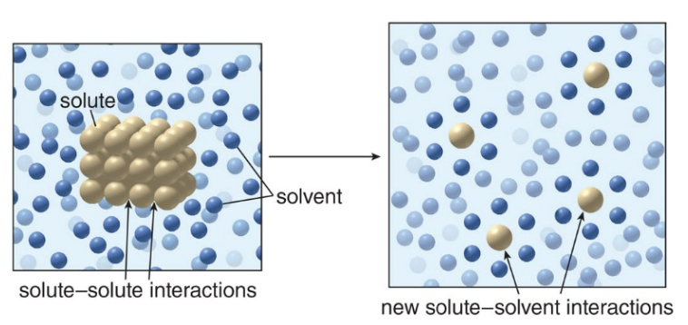

#### Solubility trends

Compounds dissolve in solvents having similar kind of intermolecular forces $\xrightarrow{slides quoting}$ $\text{Like dissolves like}$

- **Polar** compounds dissolve in polar solvents like water or alcohols capable of hydrogen bonding with the solute.

- **Nonpolar** or weakly polar compounds dissolve in
    - nonpolar solvents (e.g., carbon tetrachloride and
hexane).
    - weakly polar solvents (e.g., diethyl ether)

**Polar compounds** dissolve in **polar solvents** (like water or alcohol) due to strong interactions like **hydrogen bonding** or **dipole-dipole forces**. For example, salt dissolves in water because water can stabilize the ions. **Nonpolar or weakly polar compounds** dissolve in **nonpolar solvents** (like hexane or carbon tetrachloride) or **weakly polar solvents** (like diethyl ether). Nonpolar compounds interact through weak **van der Waals forces**, making them insoluble in polar solvents like water.

#### Solubility in ionic compounds

Most ionic compounds are soluble in water, but insoluble in organic solvents. To dissolve an ionic compund, the strong ion-ion interactions must be replaced by many weaker ion-dipole interactions.

    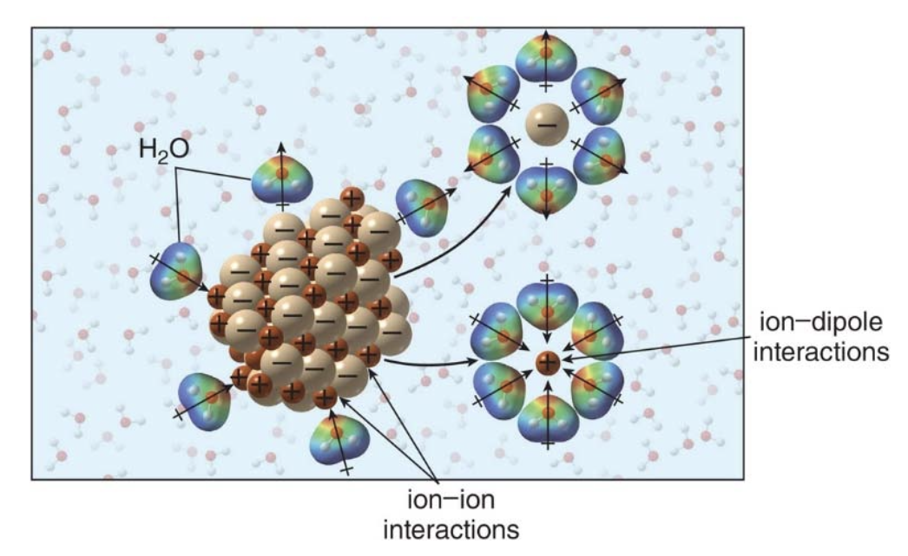

> 💡 What is an ion-dipole interaction?
> An ion-dipole interaction is a type of intermolecular force that occurs between a charged ion and a polar molecule. The strength of this interaction depends on the magnitude of the charge on the ion and the dipole moment of the polar molecule.
> - The positive end of a dipole (in a polar molecule like water) is attracted to a negative ion (anion).
> - The negative end of a dipole is attracted to a positive ion (cation).

#### Solubility of organic molecules

An organic molecule is water soluble only if it contains one polar functional group capable of hydrogen bonding with the solvent for every five $\ce{C}$atoms in contains. Compare the solubility of butane and acetone in$\ce{H2O}$and$\ce{CCl4}$

    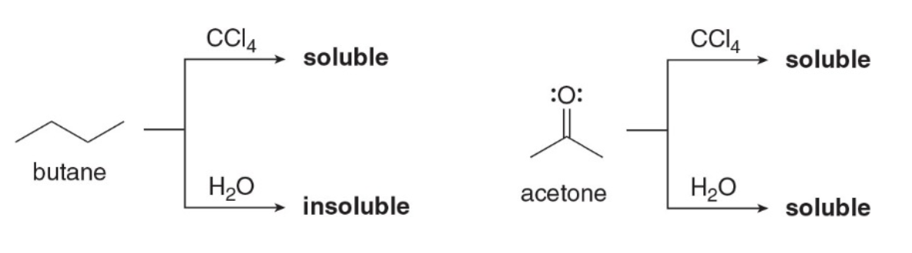

#### Butane and acetone solubility

Since butane and acetone are both organic compounds, they are both soluble in the organic solvent $\ce{CCl4}$. Butane, which is nonpolar, is insoluble in $\ce{H2O}$. Acetone is soluble in $\ce{H2O}$because it contains only three$\ce{C}$atoms and its$\ce{O}$atom can hydrogen bond with an$\ce{H}$atom of$\ce{H2O}$.

    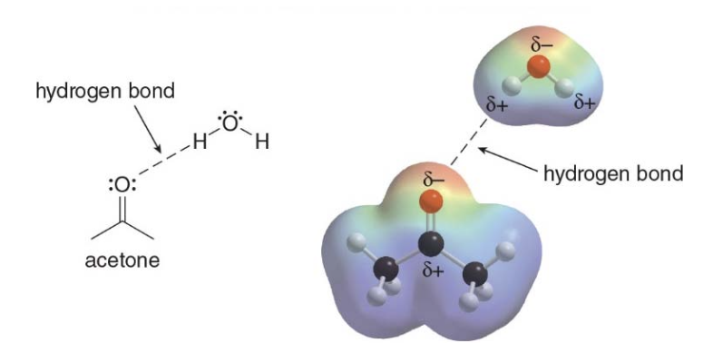

#### Water solubility of organic molecules

The size of an organic molecule with a polar functional group determines its water solubility. A low molecular weight alcohol like ethanol is water soluble.

On the other hand, Cholesterol, with 27 carbon atoms and only one OH group, has a carbon skeleton that is too large for the OH group to solubilize by hydrogen bonding $\Rightarrow$ **cholesterol is insoluble in water**

#### Solubility Properties of Representative Compounds

| **Type of Compound**  | **Solubility in H₂O** | **Solubility in Organic Solvents (such as CCl₄)** |
|-----------------------|-----------------------|---------------------------------------------------|
| **Ionic**             |                       |                                                   |
| $\ce{NaCl}$           | soluble               | insoluble                                         |
| **Covalent**          |                       |                                                   |
| $\ce{CH3CH2CH2CH3}$| insoluble (no N or O atom to hydrogen bond to$\ce{H2O}$) | soluble |
| $\ce{CH3CH2CH2OH}$    | soluble ($\leq 5$C's and an O atom for hydrogen bonding to$\ce{H2O}$) | soluble |
| $\ce{CH3(CH2)10OH}$   | insoluble ($> 5$C's; too large to be soluble even though it has an O atom for hydrogen bonding to$\ce{H2O}$) | soluble |

### Vitamins

Vitamins are organic compunds needed in small amounts for normal cell function, most cannot be synthesized in our bodies and must be obtained from diet. Most are identified by a letter, such as A, C, D, E and K.

There are several different B vitamins, so a subscript is added just to distinguish between them. Examples are $\ce{B_1}$, $\ce{B_2}$and$\ce{B_12}$.

- Vitamins can be fat soluble or water soluble depending on their structure

#### Vitamin A

- Vitamin A is an essential component of the vision receptors in our eyes. Vitamin A or *retinol* may be obtained **directly from diet**.
- It also can be obtained from the conversion of $\beta$-carotene, the orange pigment found in many plants including carrots, into vitamin A in our bodies.
- Vitamin A is water insoluble because it contains only one OH group and 20 carbon atoms.

    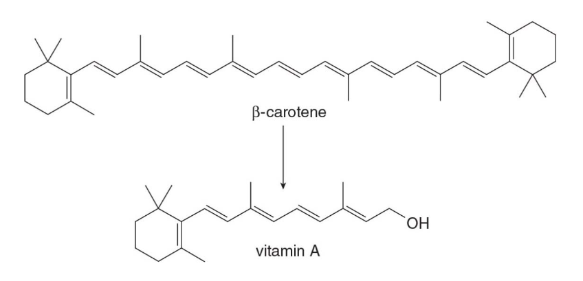

#### Vitamin C

- Vitamin C, ascorbic acid, is important in the formation of collagen. Most animals can synthesize vitamin C but Humans must obtain this vitamin from dietary sources, such as citrus fruits.

- Each carbon atom is bonded to an oxygen which makes it capable of hydrogen bonding, and thus, water soluble.

    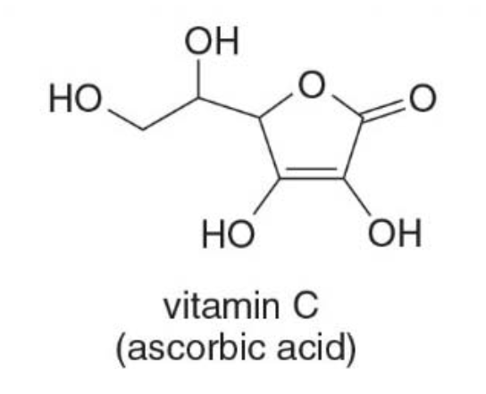

### Functional groups and electrophiles

- All functional groups contain a heteroatom, a bond, or both.
- These features create electrophilic sites and nucleophilic sites in a molecule.
- **Electron-rich sites (nucleophiles)** react with **electron-poor sites (electrophiles)**.
- An electronegative heteroatom like $\ce{N}$, $\ce{O}$, or $\ce{X}$ makes a carbon atom electrophilic, as shown below.

    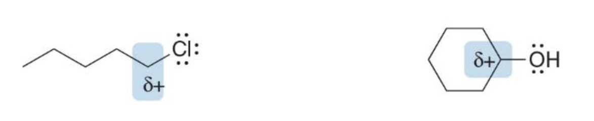

- In the examples, a partially positive carbon atom ($\delta^+$) is attached to an electronegative atom (like $\ce{Cl} or $\ce{OH}$), making the carbon **electrophilic** (electron-poor), which is susceptible to attack by nucleophiles.

### Nucleophilic sites in moleucules

A lone pair on a heteroatom makes it basic and nucleophilic

    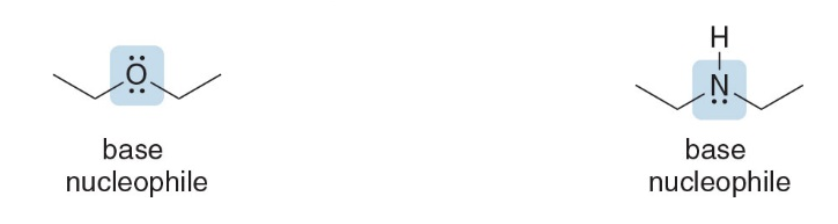

$\pi$bonds create nucleophilic sites and are more easily broken than$\sigma$ bonds.

    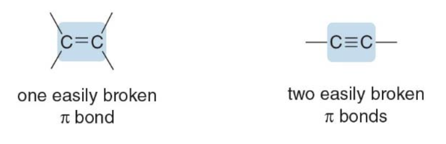

An electron-rich carbon reacts with an electrophile, symbolized as $\text{E}^+$. For example, alkenes contain an electron-rich double bond, and so they react with electrophiles $\text{E}^+$.

    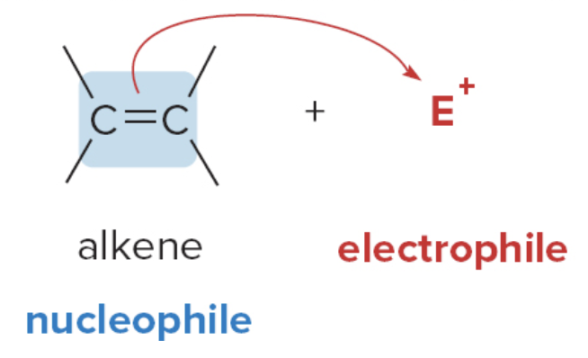

Alkyl halides possess an electrophilic carbon atom, so they react with electron-rich nucleophiles.

    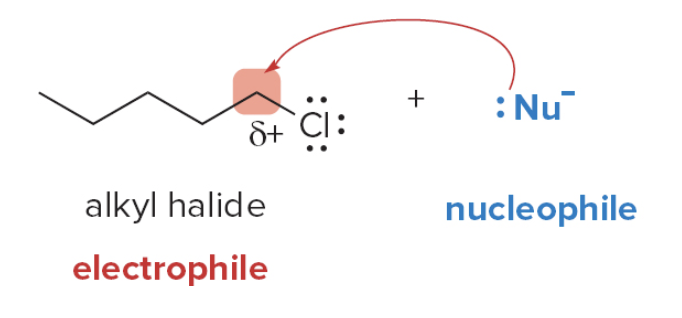

#### Biomolecules

- Biomolecules are organic compounds found in biological systems.
- Many are relatively small, with molecular weights of less than 1000 g/mol.
- Biomolecules often have several functional groups.

#### Families of Biomolecules

- There are four main families of small biomolecules:
  - **Simple sugars**: combine to form complex carbohydrates like starch and cellulose
  - **Amino acids**: join together to form proteins
  - **Nucleotides**: combine to form DNA
  - **Lipids**: commonly form from fatty acids and alcohols

    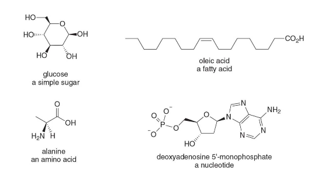

