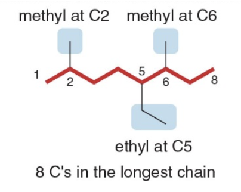

# Organic Chemistry, Academic Year 2024/2025

[TOC]

# Alkanes and cycloalkanes, structures, conformations and newman projections

## Tetrahedral geometry of Carbon

All C atoms in an alkane are surrounded by four groups, making them $\ce{sp^3}$ hybridized and tetrahedral, with all bond angles of $\text{109.5°}$. The 3D representation and ball-stick models for these alkanes indicate the tetrahedral geometry around each $\ce{C}$ atom.

<p align="center">
    
</p>

In contrast, the Lewis structures are not meant to imply any 3D arrangement.

## Drawing compounds

The three-carbon alkane $\ce{CH3CH2CH3}$ aka propane has a moleculer formula $\ce{C3H8}$. In the 3D representation, each $\ce{C}$ atom has two bonds in the plane, one in bond front and one bond behind.

<p align="center">
    
</p>

The five-carbon alkane $\ce{CH3CH2CH2CH2CH3}$ called pentane, has mol formula $\ce{C5H12}$.

The carbon skeleton for pentane can be drawn in a variety of ways really, each of the following representations has five carbons in a row and represents pentane (not an isomer of pentane).

<p align="center">
    
</p>

## Constitutional isomers

There are two different ways to arrange four carbons, giving two compounds with molecular formula $\ce{C4H10}$, named butane and isobutane. Butane and isobutane are constitutional isomers—two different compounds with the same molecular formula. Constitutional isomers (also called structural isomers) differ in the way the atoms are connected to each other

<p align="center">
    
</p>

Butane is an example of a straight-chain alkane, while isobutane is a branched-chain alkane. This difference in structure influences their boiling points, melting points, and how they interact in chemical reactions.

| Number of C atoms | Molecular formula | Name (n-alkane) | Number of constitutional isomers |
| ----------------- | ----------------- | --------------- | -------------------------------- |
| 1                 | $\ce{CH4}$        | methane         | 1                                |
| 2                 | $\ce{C2H6}$       | ethane          | 1                                |
| 3                 | $\ce{C3H8}$       | propane         | 1                                |
| 4                 | $\ce{C4H10}$      | butane          | 2                                |
| 5                 | $\ce{C5H12}$      | pentane         | 3                                |
| 6                 | $\ce{C6H14}$      | hexane          | 5                                |
| 7                 | $\ce{C7H16}$      | heptane         | 9                                |
| 8                 | $\ce{C8H18}$      | octane          | 18                               |
| 9                 | $\ce{C9H20}$      | nonane          | 35                               |
| 10                | $\ce{C10H22}$     | decane          | 75                               |
| 11                | $\ce{C11H24}$     | undecane        | 159                              |
| 12                | $\ce{C12H26}$     | dodecane        | 355                              |
| 13                | $\ce{C13H28}$     | tridecane       | 802                              |
| 14                | $\ce{C14H30}$     | tetradecane     | 1858                             |
| 15                | $\ce{C15H32}$     | pentadecane     | 4347                             |
| 20                | $\ce{C20H42}$     | icosane         | 366,319                          |

**General formula**: $\ce{C_nH_{2n+2}}$

## Cycloalkanes

Cycloalkanes have a molecular formula of $\rightarrow$ $\ce{C_nH_2_n}$ and contain carbon atoms arranged in a ring. Simple cycloalkanes are named by adding the prefix _cyclo-_ to the name of the acyclic alkane having the same number of carbons.

<p align="center">
    
</p>

**NOTE**: these all have two fewer $\ce{H}$ atoms than an acyclic alkane with the same number of carbons

## Understanding nomenclature

The name of every organic molecule has 3 parts:

1. The **parent** name indicates the number of carbons in the longest continuous chain.
2. The **suffix** indicates what functional group is present.
3. The **prefix** tells us the identity, location, and number of substituents attached to the carbon chain.

\[
\text{prefix} + \text{parent} + \text{suffix}
\]

- **Prefix:** What and where are the substituents?
- **Parent:** What is the longest carbon chain?
- **Suffix:** What is the functional group?

**NOTE**: substituents are atoms or groups of atoms that replace one or more hydrogen atoms attached to the main carbon chain (or parent structure) of a molecule. They modify the basic structure of the molecule and can significantly influence its chemical properties, reactivity, and naming.

### Naming substituents -Alkyl groups

Carbon substituents bonded to a long carbon chain are called **alkyl groups**. An alkyl group is formed by removing one H atom from an alkane.

- To name an alkyl group, change the _-ane_ ending of the parent alkane to _-yl_
  - Methane $\ce{CH4} $$\rightarrow$ Methyl $\ce{CH3}-$
  - Ethane $\ce{CH3CH3} $$\rightarrow$ Ethyl $\ce{CH3CH2}-$

### Naming three alkyl groups

Naming three or four alkyl groups is more complicated because the parent _hydrocarbons_ have more than one type of hydrogen atom. For example, consider propane: it has both 1 degree and 2 degrees $\ce{H}$ atoms and removal of each of these $\ce{H}$ atoms forms a different alkyl group with a different name, propyl or isopropyl.

An **alkyl group** is derived from an alkane (a hydrocarbon with only single bonds) by removing one hydrogen atom. This allows the group to bond to another molecule (such as another carbon chain). When you remove a hydrogen atom from different positions on a molecule, you can create different alkyl groups.

<p align="center">
    
</p>

#### Explanation using propane
In this example, the molecule in focus is **propane** ($\ce{C3H8}$), which has 3 carbon atoms. Propane can form two different alkyl groups depending on where you remove a hydrogen atom:

1. **1° (Primary) Hydrogen**: A primary hydrogen is attached to a **primary carbon**—a carbon that is connected to only **one other carbon**. In propane, the hydrogens on the **end carbons** are primary hydrogens. If you remove one of these, you get a **propyl** group ($\ce{-CH2CH2CH3}$).
   - **Propyl group**: The name "propyl" refers to an alkyl group derived from propane by removing a hydrogen atom from one of the end carbon atoms. This gives you a linear chain that can attach to another molecule.
2. **2° (Secondary) Hydrogen**: A secondary hydrogen is attached to a **secondary carbon**—a carbon that is connected to **two other carbons**. In propane, the middle carbon is a secondary carbon. Removing a hydrogen from this middle carbon gives you an **isopropyl** group ($\ce{-(CH3)CHCH3}$).
   - **Isopropyl group**: This is a branched alkyl group where the middle carbon atom is attached to two methyl groups ($\ce{CH3}$). It is derived by removing a hydrogen from the central carbon of propane, creating a Y-shaped branch.

- **Propyl** is created by removing a hydrogen from a **primary carbon** (end carbon) of propane.
- **Isopropyl** is created by removing a hydrogen from a **secondary carbon** (middle carbon) of propane.

#### Why this matters

Different alkyl groups can have different chemical properties and reactivity, even though they come from the same base molecule (propane in this case). This difference in structure is important in organic chemistry when naming compounds or predicting how molecules will react.

Would you like to go into more details about primary and secondary carbons, or how these groups affect reactivity?

### Naming four different alkyl groups

There are two different butane isomers which yield four possible alkyl groups containing four carbons.

<p align="center">
    
</p>

The prefixes like **"iso-"**, **"sec-"**, and **"tert-"** are used in the **naming of alkyl groups** to describe their **branching** patterns. These prefixes help specify how the alkyl group is attached and how the carbon atoms are arranged. Here's an explanation of each:

- **"n-" (normal or straight)**

  - **Meaning**: No branching.
  - Example: **n-butyl** ($\ce{CH3CH2CH2CH2-}$)
  - This prefix is sometimes omitted when the alkyl group is a straight chain of carbon atoms, so **butyl** usually implies a straight chain unless otherwise specified.

- **"iso-" (isomer)**

  - **Meaning**: The group has **branching**, specifically with a **methyl group** ($\ce{-CH3}$) attached to the second carbon from the end of the chain.
  - Example: **isobutyl** ($\ce{(CH3)2CHCH2-}$)
  - The "iso-" prefix indicates that the group has a branch at the second carbon, making the structure look like a "Y." For isobutyl, this branching occurs at the second carbon of a three-carbon chain, with two $\ce{CH3}$ groups attached.

- **"sec-" (secondary)**

  - **Meaning**: The hydrogen atom is removed from a **secondary carbon** (a carbon atom bonded to two other carbons).
  - Example: **sec-butyl** ($\ce{CH3CH2CH(CH3)-}$)
  - In this structure, the branching happens because the hydrogen is removed from a **secondary** (2°) carbon, which is bonded to two other carbons. It indicates that the point of attachment is at the second carbon of the chain.

- **"tert-" (tertiary)**

  - **Meaning**: The hydrogen atom is removed from a **tertiary carbon** (a carbon atom bonded to **three other carbons**).
  - Example: **tert-butyl** ($\ce{(CH3)3C-}$)
  - In this case, the "tert-" prefix tells us that the attachment occurs at a **tertiary** (3°) carbon, which is connected to three other carbons. This results in a highly branched structure.

- **Butyl** ($\ce{CH3CH2CH2CH2-}$): No branching (a straight chain).
  - **sec-Butyl** ($\ce{CH3CH2CH(CH3)-}$): The attachment happens at a **secondary carbon**.
  - **Isobutyl** ($\ce{(CH3)2CHCH2-}$): A branching with a methyl group attached to the second carbon.
  - **tert-Butyl** ($\ce{(CH3)3C-}$): A highly branched structure with the attachment at a **tertiary carbon**.

<p align="center">
    
</p>

### How to name an alkane using the IUPAC System

- **Step 1**: find the parent carbon chain and add the suffix

<p align="center">
    
</p>

If there are two chains of equal length, pick the chain with more substituents. In the following example, two different chains in the same alkane have seven $\ce{C}$ atoms. The left one identifies our main chain, as it contains a higher number of substituents.

<p align="center">
    
</p>

- **Step 2**: Numbering the atoms in the carbon chain to give the first substituent the lowest number.

<p align="center">
    
</p>

If the first substituent is the same distance from both ends, number the chain to give the second substituent the lower number

<p align="center">
    
</p>

When numbering a carbon chain results in the same numbers from either end of the chain, assign the lower number alphabetically to the first substituent

<p align="center">
    
</p>

- **Step 3**: Name and number the substituents.
  - Name the substituents as alkyl groups. Every carbon belongs to either the longest chain or a substituent, not both.
  - Each substituent needs its own number
  - If two or more identical substituents are bonded to the longest chain, use prefixes to indicate how many:
    - "di-" for two groups
    - "tri-" for three groups
    - "tetra-" for four groups
    - and so forth.

<p align="center">
    
</p>

- **Step 4**: Combine substituents names and number + parent + suffixo
  - Precede the name of the parent by the names of the substituents
  - Alphabetize the names of the substituents, ignoring all prefixes except iso, as in isopropyl and isobutyl
  - Precede the name of each substituent by the number that indicates its location

<p align="center">
    
</p>

**NOTE**: Separate numbers by commas and separate numbers from letters by hyphens. The name of an alkane is a single word, with no spaces after hyphens and commas.

#### Wrapping up the steps

Intepreting IUPAC naming via pseudocode

```
function generateIUPACName(molecule) {
    // Step 1: Find the longest continuous carbon chain in the molecule
    parentChain = findLongestChain(molecule)

    // If there are multiple chains with the same length, pick the one that has the most substituents attached
    if (multipleChainsWithSameLength(molecule)) {
        parentChain = chooseChainWithMostSubstituents(chains)
    }

    // Step 2: Number the carbons in the parent chain starting from the end that gives the first substituent the lowest possible number
    numberedChain = numberChain(parentChain)

    // Step 3: Identify all substituents attached to the chain and note their positions
    substituents = findSubstituents(numberedChain)

    // Ensure the numbering gives the first substituent the smallest number
    numberedChain = minimizeFirstSubstituentNumber(numberedChain, substituents)

    // If the first substituent is equally far from both ends, adjust numbering to give the second substituent the lower number
    numberedChain = handleEqualPositionForFirstSubstituent(numberedChain, substituents)

    // Step 4: Name and number the substituents
    for each substituent in substituents {
        // Get the alkyl name for the substituent (e.g., methyl, ethyl)
        name = getAlkylName(substituent)

        // If there are multiple identical substituents, add the correct prefix (di-, tri-)
        count = countIdenticalSubstituents(substituents, substituent)
        prefix = count > 1 ? getPrefixForCount(count) : ""

        // Combine the position number, prefix, and name for the substituent
        substituentNames.push(substituent.position + "-" + prefix + name)
    }

    // Step 5: Sort the substituent names alphabetically, ignoring di-, tri-, tetra-, except for iso-
    substituentNames.sortAlphabetically()

    // Step 6: Build the full IUPAC name by joining all the substituent names, followed by the parent chain name
    parentName = getParentChainName(parentChain.length)
    iupacName = combineNames(substituentNames, parentName)

    return iupacName
}
```

### How to name a cycloalkane using the IUAPAC

Cycloalkanes are named using similar rules, but the prefix cyclo immediately precedes the name of the parent.

$$
\text{prefix} + \text{"cyclo-"} + \text{parent} + \text{suffix}
$$

**1. Prefix** $\rightarrow$ What and where are the substituents?
**3. Parent** $\rightarrow$ How many C's are in the ring?
**4. Suffix**: $\rightarrow$ What is the functional group?

- **Step 1**: find the parent cycloalkane

<p align="center">
    
</p>

- **Step 2**: name and number the substituents. No number is needed to indicate the location of a single substituent.

<p align="center">
    
</p>

For rings with more than one substituent, begin numbering at one substituent and proceed around the ring to give the second substituent the lowest number

<p align="center">
    
</p>

**Then, just as in alkanes**: with two different substituents, number the ring to assign the lower number to the substituents alphabetically.

<p align="center">
    
</p>

#### Naming alkanes vs. cycloalkanes

If the number of carbons in the ring is greater than or equal to the number of carbons in the longest chain, the compound is named as a cycloalkane. If there are more carbons in the chain, the compound is named as an alkane.

<p align="center">
    
</p>

> **_Sidenote_**
> Whenever a cycloalkane has at least two substituents, one of them will always be assigned position 1, and here's why:
>
> - Position 1 is always assigned to one of the substituents: The ring numbering always starts at one of the carbons that has a substituent. So, in cases with two or more substituents, the IUPAC rules ensure that one substituent is at position 1.
> - The numbering is done to minimize the numbers assigned to the rest of the substituents: After position 1 is assigned, the remaining substituents are numbered to follow the lowest locant rule. If there are multiple ways to number the ring, alphabetical order is used to decide which substituent gets position 1.

A few examples more

<p align="center">
    
</p>

### Common Names for some Polycyclic Alkanes

- Some organic compounds are identified using common names that do not follow the IUPAC system of nomenclature.
- Many of these names were given long ago before the IUPAC system was adopted, and are still widely used. Additionally, some names are descriptive of shape and structure, like those below

<p align="center">
    
</p>

#### Fossil Fuels

- Many alkanes occur in nature, primarily in natural gas and petroleum.
- **Natural gas** is composed largely of methane, with lesser amounts of ethane, propane, and butane.
- **Methane** in the atmosphere comes from both natural and manmade sources.
- **Petroleum** is a complex mixture of hydrocarbons, containing 1 to 40 carbon atoms.

#### Refining of Oil

- Distilling crude petroleum (refining) separates it into fractions that differ in boiling point:
  - **Gasoline**: C$_5$H$_{12}$ – C$_{12}$H$_{26}$
  - **Kerosene**: C$_{12}$H$_{26}$ – C$_{16}$H$_{34}$
  - **Diesel fuel**: C$_{15}$H$_{32}$ – C$_{18}$H$_{36}$

#### Properties of Alkanes

- Alkanes contain only **nonpolar** C—C and C—H bonds.
  - They only exhibit **weak van der Waals forces**.
  - This affects **solubility**, **boiling points**, and **melting points** of alkanes.
- **Solubility of alkanes**:
  - Alkanes are more soluble in **organic solvents**.
  - Alkanes are **insoluble in water**.

## Boiling and melting points of alkanes

Alkanes have low bp’s and mp’s compared to more polar compounds of comparable size. Bp and mp increase as the number of carbons increases due to increased surface area.

<p align="center">
    
</p>

The bp of isomers decreases with branching due to decreased surface area, while Mp increases with increased symmetry.

<p align="center">
    
</p>

## Conformation of acyclic alkanes

Conformations are different arrangements of atoms that are interconverted by rotation about single bonds

<p align="center">
    
</p>

Names are given to two different conformations:

- **Eclipsed conformation**: The $\ce{C—H}$ bonds on one carbon are directly aligned with the $\ce{C—H}$ bonds on the adjacent carbon.
- **Staggered conformation**: The $\ce{C—H}$ bonds on one carbon bisect the $\ce{H—C—H}$ bond angle on the adjacent carbon.

Rotating the atoms on one carbon by 60 degrees converts an eclipsed conformation into a staggered conformation, and vice versa.  
The angle that separates a bond on one atom from a bond on an adjacent atom is called a **dihedral angle**.  
For ethane in the staggered conformation, the dihedral angle for the $\ce{C—H}$ bonds is 60 degrees; for eclipsed ethane, it is 0 degrees.

<p align="center">
    
</p>

## Newman projections, drawing and understanding

- End-on representations for conformations are commonly drawn using a convention called a **Newman projection**.

- **Step 1:** Look directly down the C—C bond (end-on), and draw a circle with a dot in the center to represent the carbons of the C—C bond.

<p align="center">
    
</p>

- **Step 2:** Draw in the bonds.
  - Draw the bonds on the front carbon $\ce{C}$ as three lines meeting at the center of the circle.
  - Draw the bonds on the back carbon $\ce{C}$ as three lines coming out of the edge of the circle.

<p align="center">
    
</p>

- **Step 3:** Add the atoms on each bond.

<p align="center">
    
</p>

### Newman Projections, Ethane

<p align="center">
    
</p>

- The **staggered** and **eclipsed** conformations of ethane interconvert at room temperature.
- The **staggered conformations** are more stable (lower in energy) than the **eclipsed conformations**.
    - In the staggered form the atoms attached to the carbons are positioned as far away from each other as possible, minimizing the repulsion between electrons in adjacent bonds. In contrast, the eclipsed conformation has increased electron-electron repulsion as the bonds are aligned, leading to higher energy and instability.
- **Electron-electron repulsion** between bonds in the eclipsed conformation increases its energy compared with the staggered conformation, where the bonding electrons are farther apart.

### Torsional energy in ethane

The difference in energy between staggered and eclipsed conformers is $\text{~3 kcal/mol}$, with each eclipsed $\ce{C—H}$ bond contributing $\text{1 kcal/mol}$. The energy difference between staggered and eclipsed conformers is called torsional energy.

**NOTE**: ***Torsional strain*** is an increase in energy caused by eclipsing interactions.

<p align="center">
    
</p>

Another example of conformations is **propane**

<p align="center">
    
</p>

Energy minimums and maximums occur every 60° as the conformation swaps: staggered $\rightarrow$ eclipsed. Conformations that are in neither one of the two states are said to be intermediate in energy.

<p align="center">
    
</p>

Butane, like many other high mol weight alkanes have several $\ce{C-C}$ bonds, capable of rotation.

#### Anti and gauche conformations

A staggered conformation with two larger groups 180° from each other is called **anti** whereas a staggered conformation with two larger groups 60° from each other is called **gauche**.

<p align="center">
    
</p>

<p align="center">
    
</p>

The relative energies of the individual staggered conformations depend on their steric strain. **Steric strain** is an increase in energy resulting when non-bonded atoms are forced too close to each other.

The result $\rightarrow$ gauche conformations are generally higher in energy than anti conformations because of steric strain.

$$
\text{Steric strain caused by two eclipsed } \ce{CH3} \text{ groups}
$$

<p align="center">
    
</p>

#### Energy and dihedral angle values in buthane

<p align="center">
    
</p>

- Staggered conformations 1, 3, and 5 are at energy minima.
- Anti conformation 1 is lower in energy than gauche conformations 3 and 5, which possess steric strain.
- Eclipsed conformations 2, 4, and 6 are at energy maxima.
- Eclipsed conformation 4, which has additional steric strain due to two eclipsed $\ce{CH3}$ groups, is highest in energy.

#### Torsional and steric strain energies in acyclic alkanes

The energy difference between the lowest and highest energy conformations is called a **barrier to rotation**.

| Type of interaction   | Energy Increase (KJ/mol) | Energy Increase (Kcal/mol) |
|-----------------------|--------------------------|----------------------------|
| H,H eclipsing         | 4.0                      | 1.0                        |
| H,CH₃ eclipsing       | 6.0                      | 1.4                        |
| CH₃,CH₃ eclipsing     | 11                       | 2.6                        |
| gauche CH₃ groups     | 3.8                      | 0.9                        |

The barrier to rotation determines how easily or freely a molecule can rotate around a single bond. If the barrier is small, the molecule can rotate relatively easily, whereas a large barrier would restrict free rotation. The barrier to rotation is mainly caused by torsional strain (due to eclipsed conformations, where atoms or groups are aligned and experience repulsive interactions) and, in some cases, steric strain (when large substituents clash as the molecule rotates).

## Drawing

### Zigzag skeletal structures

Since the lowest energy conformations has all bonds staggered and all larger groups in an anti conformation, alkanes are drawn using zigzag skeletal structures to reflect this.

<p align="center">
    
</p>

### Angle strain in cycloalkanes

Besides torsional and steric strain, the conformations of cycloalkanes are also affected by **angle strain** $\rightarrow$ an incrementail increase in energy when bond angle deviate from the optimal 109.5° angles found in tethrahedral structures. 

**NOTE**: Cycloalkanes with more than three $\ce{C}$ atoms in the ring are not flat molecules. They are puckered to reduce strain.

<p align="center">
    
</p>

Cycloalkanes distort their shape in to alleviate angle and torsional strain


<p align="center">
    
</p>

The image below illustrates that if cyclohexane were flat, it would experience **angle strain** due to the bond angles being 120°, larger than the ideal 109.5°. Additionally, all hydrogens would be aligned in an **eclipsed conformation**, causing **torsional strain**. 

<p align="center">
    
</p>

A flat cyclohexane structure would suffer from **angle strain**, as the bond angles (120°) deviate from the ideal tetrahedral angle (109.5°), and **torsional strain**, due to eclipsed hydrogens. Cyclohexane adopts a chair conformation to minimize these strains, creating a more stable, lower-energy structure.

<p align="center">
    
</p>

The chair conformation is so stable because it eliminates angle strain (all $\ce{C—C—C}$ angles are 109.5 degrees), and torsional strain (all hydrogens on adjacent $\ce{C}$ atoms are staggered).

<p align="center">
    
</p>

- In cyclohexane, three C atoms pucker up and three C atoms pucker down, alternating around the ring.

> **Axial vs Equatorial**
> 
> 1. **Axial Hydrogens**: These hydrogens point **straight up or down**, perpendicular to the plane of the ring. There are six axial hydrogens, one on each carbon atom. They alternate in direction—if one carbon has an axial hydrogen pointing up, the next carbon will have its axial hydrogen pointing down.
> 
> 2. **Equatorial Hydrogens**: These hydrogens point **outwards around the ring**, roughly parallel to the plane of the ring. They are spread out more, reducing crowding (steric strain), and are positioned in a staggered way with respect to the axial hydrogens.
> 
> In simple terms, **axial hydrogens stick straight up or down**, while **equatorial hydrogens stick out sideways** around the ring. This arrangement helps reduce strain in the cyclohexane molecule, making the chair conformation very stable.

#### Drawing the chair form of cyclohexane

- **Step 1**: draw the carbon skeleton
    - Draw the three parts of the chair, a wedge, a set of parallel lines and another wedge
    - Join them together
    - The bottom $\ce{C}$'s come out of the page, bonds to them are sometimes in bold

<p align="center">
    
</p>

- **Step 2**: label the up $\ce{C}$'s and the down $\ce{C}$'s on the ring
    - There are 3 up and 3 down, they alternate around the ring

<p align="center">
    
</p>

- **Step 3**: draw in the axial H atoms
    - On an up $\ce{C}$ the axial $\ce{H}$'s is up
    - On a down $\ce{C}$ the axial $\ce{H}$ is down

<p align="center">
    
</p>

- **Step 4**: Draw in the equatorial $\ce{H}$ atoms
    - The axial $\ce{H}$ is down on a down $\ce{C}$, so the equatorial $\ce{H}$ must be up
        - *On a "down" carbon, the axial hydrogen points straight down, and the equatorial hydrogen points slightly upward*
    - The axial $\ce{H}$ is up on an up $\ce{C}$, so the equatorial $\ce{H}$ must be down
        - *On an "up" carbon, the axial hydrogen points straight up, and the equatorial hydrogen points slightly downward*

<p align="center">
    
</p>


#### Ring flipping

Cyclohexanes undergo a conformational change called **ring-flipping**

As a result of a ring flip, the up carbons become down carbons and the down carbons become up carbons. Axial and equatorial $\ce{H}$ atoms are also interconverted during a **ring-flip**; axial $\ce{H}$ atoms become equatorial $\ce{H}$ atoms and equatorial $\ce{H}$ atoms become axial.

<p align="center">
    
</p>

[YT: visualize ring flipping](https://www.youtube.com/watch?v=DuX32urvZvQ)
<p align="center">
    <iframe width="560" height="315" src="https://www.youtube.com/embed/DuX32urvZvQ?si=hBKgLN1YiLz1PmqC" title="YouTube video player" frameborder="0" allow="accelerometer; autoplay; clipboard-write; encrypted-media; gyroscope; picture-in-picture; web-share" referrerpolicy="strict-origin-when-cross-origin" allowfullscreen></iframe>
</p>

There are two possible chair conformations, the equatorial position has more room than the axial position $\Rightarrow$ larger substituents are more stable in the equatorial positions.

<p align="center">
    
</p>

- Cyclohexane also can exist in a boat conformation.
- The boat forms of cyclohexane are $\text{7 kcal/mol}$ less stable than the chair forms.

The boat conformation is destabilized by torsional strain because the hydrogens on the four carbon atoms in the plane are eclipsed. Additionally, there is steric strain because two hydrogens at either end of the boat, the "flag pole" hydrogens, are forced close to each other.

<p align="center">
    
</p>

While less stable, the boat conformation is not a fixed state. Cyclohexane molecules are constantly undergoing a conformational change called "ring-flipping," which interconverts between different conformations, including the boat conformation. However, due to its higher energy, the boat conformation is less populated compared to the chair conformations at equilibrium.

> In the context of conformational analysis, "population" refers to the relative abundance of different conformations of a molecule at equilibrium. Molecules in a solution constantly interconvert between different conformations due to bond rotation. The distribution of molecules among these different conformations is determined by their relative energies $\Rightarrow$ at equilibrium, a greater proportion of cyclohexane molecules will exist in the chair conformation, making it more populated than the boat conformation.

### Drawing conformations for a substituted cyclohexane

- **Step 1**: Draw one chair form and add the substituents
    - Arbitrarily pick a ring carbon, classify it as an up or down carbon, and draw the bonds. Each $\ce{C}$ has one axial and one equatorial bond.
    - Add the substituents $\ce{H}$ and $\ce{CH3}$ placing one axial and one equatorial
    - This forms conformation $\ce{A}$

<p align="center">
    
</p>

- **Step 2**: Ring flip the cyclohexane ring
    - Convert the up $\ce{C}$'s to down $\ce{C}$'s and vice versa. The chosen $\ce{C}$ now puckers down.

<p align="center">
    
</p>

- **Step 3**: Add the substituents to the second conformation
    - Draw axial and equatorial bonds. On a down $\ce{C}$ the axial bond is down.
    - Ring flipping converts axial bonds to equatorial bonds. The equatorial $\ce{CH3}$ becomes axial.
    - This forms Conformation B.

<p align="center">
    
</p>

The two chair conformations of cyclohexane are different, so they are not equally stable. Larger axial substituents create destabilizing $\text{1,3-diaxial interactions}$. In methylcyclohexane, each unfavorable $\ce{H}$,$\ce{CH3}$ interaction destabilizes the conformation by $\text{0.9 kcal/mol}$, so Conformation $\ce{B}$ $\text{is 1.8 kcal/mol}$ less stable than Conformation $\text{A}$.

In simple terms, methylcyclohexane is a molecule that can exist in different shapes (called conformations). These shapes can change when the ring structure (cyclohexane) flips. In one of these shapes, Conformation A, the bulky methyl group ($\ce{CH3}$) is in a position where it doesn't clash much with the nearby hydrogen atoms. This makes Conformation A more stable.

However, when the ring flips to Conformation B, the methyl group is in a position where it interacts closely with the hydrogen atoms. These interactions are unfavorable because the atoms are too close to each other, causing strain. Each of these interactions adds 0.9 kcal/mol of energy, which makes the molecule less stable.

Since there are two such interactions in Conformation B, the total increase in energy is $2 \times 0.9 = \text{1.8 kcal/mol}$. This means Conformation B is $\text{1.8 kcal/mol}$ less stable than Conformation A because of these clashes between the hydrogen atoms and the methyl group.

> 💡 **What is meant by diaxial?**
> *Diaxial interactions happen when a group in the axial position of cyclohexane interacts with axial hydrogens on the same side of the ring.*
> When a bulky group, such as a methyl group $\ce{CH3}$, is placed in an axial position on the cyclohexane ring, it can come into close contact with the axial hydrogens on the same side of the ring. These are called diaxial interactions because they involve two axial substituents (the methyl group and the hydrogen atoms).

<p align="center">
    
</p>

<p align="center">
    
</p>

The larger the substituent on the six-membered ring the higher the percentage of equatorial conformation at equilibrium:
- With a very large substituent like tert-butyl $\ce{(CH3)3C-}$ essentially none of the of the conformation containing an axial tert-butyl group is present at room temperature

<p align="center">
    
</p>

This example illustrates a fundamental concept in cyclohexane chair conformations: steric hindrance and the influence of large substituents on the stability of axial versus equatorial positions.

**Steric Hindrance in the Axial Position**:
   - The tert-butyl group \((CH_3)_3C^−\) is very large and bulky. When positioned in the **axial** position (structure C), this group experiences significant steric crowding from the other axial hydrogens on carbons 3 and 5, known as **1,3-diaxial interactions**. These interactions create a highly destabilized environment for the tert-butyl group in the axial position, as depicted by the "very crowded" labeling and highlighted hydrogens in structure C.

**Stabilization in the Equatorial Position**:
   - In the **equatorial** position (structure D), the bulky tert-butyl group points outward, away from the other groups on the ring, significantly reducing steric interactions with nearby atoms. This position minimizes steric hindrance, making the equatorial conformation far more stable for such a large group.


#### Disubstituted cycloalkanes

There are two different **1,2-dimethylcyclopentanes**:
- One having two $\ce{CH3}$ groups on the same side of the ring
- One having them on opposite sides of the ring

<p align="center">
    
</p>

$$
    \text{A and B are said to be "stereoisomers"}
$$


**Stereoisomers** are isomers that differ only in the way the atoms are oriented in space. The prefix **cis** and **trans** are used to distinguish these isomers.
- The cis isomer has two groups on the same side of the ring
- The trans isomer has two groups on opposite sides of the ring

A disubstituted cycloalkane, such as **1,4-dimethylcyloahexane**, also has **cis** and **trans** stereoisomers. Each of these stereoisomers has two possible chair conformations.

<p align="center">
    
</p>


#### How to draw Disubstituted cycloalkanes

- **Step 1**: Draw one chair form and add the substituents 
    - For trans-1,4-dimethylcyclohexane, pick two $\ce{C}$'s located **1,4-** to each other, classify them as up or down and draw in the substituents.
    - The trans isomer must have one group above the ring (on an up bond) and one gorup below the ring (on a down bond). This is a diaxial arrangement.
    - The result is conformation $\ce{A}$

<p align="center">
    
</p>


- **Step 2**: Ring-flip the cyclohexane ring
    - The up $\ce{C}$ flips down, the down $\ce{C}$ flips up

<p align="center">
    
</p>

- **Step 3**: Add the substituents to the second conformation
    - Ring-flipping converts axial bonds to equatorial and vice versa

<p align="center">
    
</p>

## Ending notes

### Trans disubstituted cycloalkanes

Conformations $\ce{A}$ and $\ce{B}$ are not equally stable. Because conformation $\ce{B}$ has both $\ce{CH3}$ groups in the roomier equatorial position, it is lower in energy. A trans isomer has two substituents on opposite sides, one up and one down.

<p align="center">
    
</p>

### Cis disubstituted cycloalkanes

A cis isomer has two groups on the same side of the ring, either both up or both down. In the following example, conformations $\ce{C}$ and $\ce{D}$ have two $\ce{CH3}$ groups down *up*. Both conformations have one $\ce{CH3}$ group axial and one equatorial, making them equally stable.

<p align="center">
    
</p>

### Oxidation and reduction reactions

- Oxidation results in an increase in the number of $\ce{C-Z}$ bonds.
- Oxidation results in an decrease in the number of $\ce{C-H}$ bonds.
- Reduction results in an decrease in the number of $\ce{C-Z}$ bonds.
- Reduction results in an increase  in the number of $\ce{C-H}$ bonds.

<p align="center">
    
</p>

### Combustion of alkanes

Alkanes undergo combustion, that is they burn in the presence of oxygen to form carbon dioxide and water. This is an example of an oxidation-reduction reaction. Every $\ce{C-H}$ and $\ce{C-C}$ bond in the starting material is converted to a $\ce{C-O}$ bond in the product.

<p align="center">
    
</p>
