# Organic Chemistry, Academic Year 2024/2025

[TOC]

# Fundamentals of Stereochemistry: Chirality, Stereogenic Centers, Descriptors, Isomerism, and Optical Activity

## Stereochemistry

**Stereochemistry** refers to the three-dimensional structure of a molecule. As a consequence of stereochemistry apparently minor differences in 3D structure can result in vastly different properties. We can observe this by considering starch and cellulose which are both composed of the same repeating unit. 

In cellulose the $\ce{O}$ atom joins two rings using equatorial bonds, in stach the $\ce{O}$ atom joins two rings using one equatorial and one axial bond.

Due to these differences in stereochemistry, humans can metabolize starch for energy, but cannot digest cellulose.

    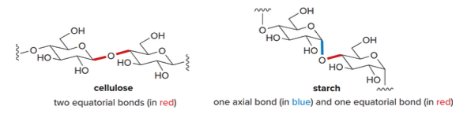
    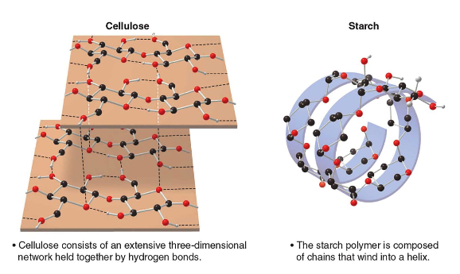

### Recall: constitutional isomers

Isomers are different compunds having the same molecular formula but different structure. The two major classes of isomers are constitutional isomers and stereo isomers.
- Constitutional/structural isomers have
    - different IUPAC names
    - same or different functional groups
    - different physical properties
    - different chemical properties

**Stereoisomers**
- Differ only in the way the atoms are oriented in space
- Have identical IUPAC names (except for prefixes like "cis" and "trans")
- Always have the same functional groups
- Differ in configuration

    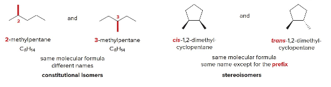

### Chirality and Achirality

#### Concept of superimposability and enantiomers

**Chirality** in molecules refers to the property of having a non-superimposable mirror image, similar to how left and right hands are mirror images but cannot be perfectly aligned. Molecules that cannot be superimposed on their mirror images are called chiral.

    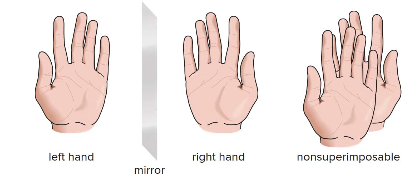

**Achirality** in molecules refers to the property of having a superimposable mirror image, like a pair of identical socks. Molecules that can be perfectly aligned with their mirror images are considered achiral.

    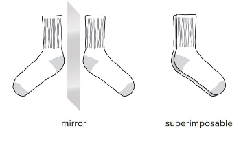

#### Achiral Molecules

We can now consider several molecules to determine whether or not they are [chiral](https://en.wikipedia.org/wiki/Chirality_(chemistry)).

    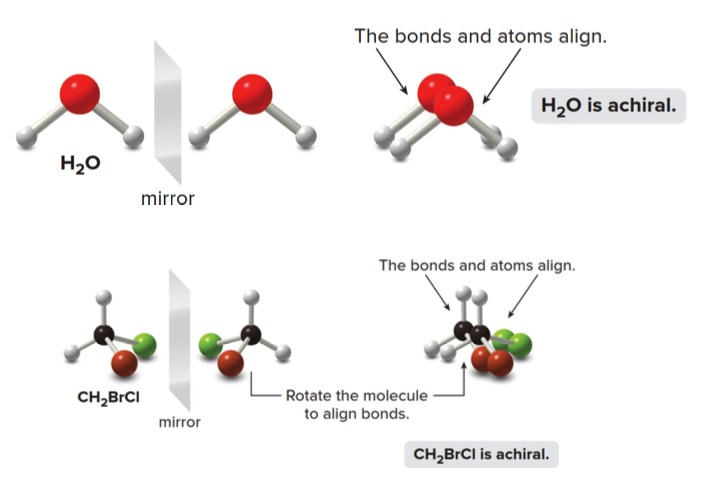

- The bonds and atoms of $\ce{H2O}$ align perfectly with its mirror image, making it achiral.
- Similarly, $\ce{CH2BrCl}$ is also achiral as its mirror image can be rotated to perfectly align with itself.

#### Chiral Molecules

The molecule $\ce{A}$ and its mirror image labeled $\ce{B}$ are not superimposable.

- No matter how you rotate $\ce{A}$ and $\ce{B}$, the atoms never align.
- Thus, $\ce{CHBrClF}$ is a chiral molecule, with $\ce{A}$ and $\ce{B}$ as distinct compounds.

    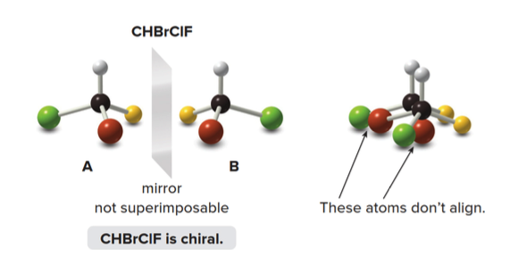

A and B are stereoisomers—specifically, they are **enantiomers**. A carbon atom with four different groups is a tetrahedral **stereogenic center**.

#### Stereogenic centers

In general, a molecule with no stereogenic centers will not be chiral (though there are exceptions)
- With no stereogenic center a molecule will always be chiral
- With two or more stereogenic centers a molecule may or may not be chiral

> The most common cause, albeit not the only one, of chirality in an organic molecule is the presence of a tetrahedral atom, generally a carbon, linked to four different groups (stereogenic center).

In order for a molecule to be chiral, it must not have a plane of symmetry

#### Planes of symmetry

A plane of symmetry is a mirror plane that cuts the molecule in half, so that one half of the molecule is a reflection of the other half.

    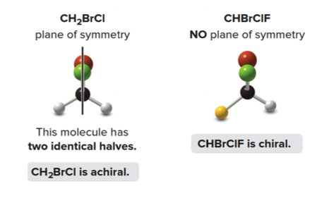

Achiral molecules usually contain a plane of symmetry but chiral molecules do not

#### Chirality recap

Everything has a mirror image. The fundamental question in chirality is whether a molecule and its mirror image are superimposable. If they are not superimposable, the molecule is chiral and lacks a plane of symmetry.

If the mirror images are superimposable, the molecule is achiral and will contain a plane of symmetry. While the terms "stereogenic center" and "chiral molecule" are related, they are distinct. **A chiral molecule must have one or more stereogenic centers.**

#### Looking for stereogenic centers

To locate a stereogenic center, examine each tetrahedral carbon atom in a molecule, focusing on the four distinct groups—rather than the four atoms—attached to it.

Always exclude carbon atoms that cannot be tetrahedral stereogenic centers:
- **CH₂ and CH₃ groups**: These groups do not have four distinct substituents. For example, CH₂ has two identical hydrogen atoms, and CH₃ has three, making them incapable of forming a chiral center.
- **sp or sp² hybridized carbons**: These carbons are not tetrahedral; they are linear (sp) or trigonal planar (sp²) and therefore cannot possess the three-dimensional geometry necessary for chirality.

    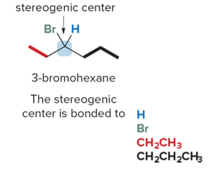

Larger organic molecules can have two, three, or even hundreds of stereogenic centers

### Enantiomers

Enantiomers are non-superimposable mirror image molecules. Any molecule with one stereogenic center exists as a pair of enantiomers. 

    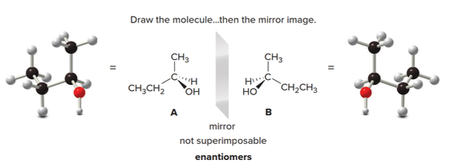

To draw both enantiomers of a chiral compound such as 2-butanol, use the typical convention for depicting a tetrahedron.

1. For the first enantiomer, arbitrarily place the four groups—$\ce{H}$, $\ce{OH}$, $\ce{CH3}$, and $\ce{CH2CH3}$—on any bond to the stereogenic center.
2. Then, draw the mirror image.

    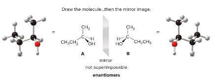

In the example, molecules A and B represent the two enantiomers of 2-butanol. These mirror images are not superimposable, confirming their status as enantiomers.

    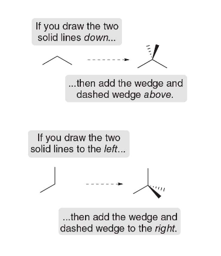

#### Stereogenic centers in cyclic compounds

Stereogenic centers may also occur at carbon atoms that are part of a ring. To find stereogenic centers on ring carbons, always draw the rings as flat polygons, and look for tetrahedral carbons that are bonded to four different groups.

    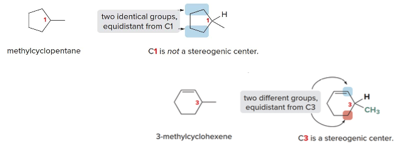

**Examples and biologically active mols with stereogenic centers**

    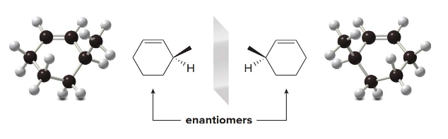

In **3-methylcyclohexene**, the $\ce{CH3}$ and $\ce{H}$ substituents that are above and below the plane of the ring are drawn with wedges and dashes as usual.

    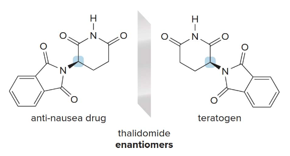

    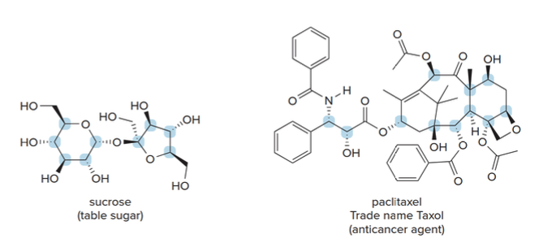

#### Labelliing stereogenic centers using R or S

Since enantiomers are distinct compounds with unique spatial arrangements, they are distinguished by adding the prefix **R** or **S** to their IUPAC names. This designation helps identify the specific 3D orientation of each enantiomer.

**Steps to Assign R/S Configuration**

**Rule 1:** To assign an enantiomer as **R** or **S**, priorities must be given to each group attached to the stereogenic center, following these guidelines:
- Prioritize each group based on the atomic number of the atom directly attached to the stereogenic center.
- The atom with the **highest atomic number** receives the highest priority, labeled as **1**.

    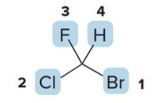

  
For example, if the groups attached to the stereogenic center are $\ce{H}$, $\ce{OH}$, $\ce{CH3}$, and $\ce{Cl}$:
  - $\ce{Br}$ has the highest atomic number among the attached atoms, so it is assigned priority **1**.
  - $\ce{Cl}$ has the next highest atomic number, giving it priority **2**.
  - $\ce{F}$ comes next, with priority **3**.
  - $\ce{H}$, having the lowest atomic number, is assigned priority **4**.

**Rule 2 for Assigning R/S Configuration**

When two atoms attached to the stereogenic center are identical, assign priority based on the atomic number of the atoms bonded to these identical atoms. The atom with the higher atomic number among these bonded atoms determines the higher priority.

Consider the stereogenic center in butan-2-ol, where the groups attached to the chiral carbon are $\ce{OH}$, $\ce{CH2CH3}$, $\ce{CH3}$, and $\ce{H}$.

    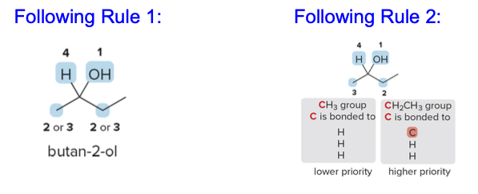

- **Applying Rule 1**:
   - $\ce{OH}$ has the highest atomic number and thus receives priority **1**.
   - Hydrogen ($\ce{H}$), with the lowest atomic number, is given priority **4**.

- **Applying Rule 2 for $\ce{CH3}$ and $\ce{CH2CH3}$**:
   - Both $\ce{CH3}$ and $\ce{CH2CH3}$ are initially similar because each group has a carbon directly attached to the stereogenic center.
   - To break the tie, examine the atoms bonded to these carbons.
     - In $\ce{CH2CH3}$, the carbon is bonded to two hydrogens and another carbon (higher atomic number).
     - In $\ce{CH3}$, the carbon is bonded to three hydrogens only.
   - Since $\ce{CH2CH3}$ has a carbon attached (higher atomic number than hydrogen), it receives priority **2**, while $\ce{CH3}$ is assigned priority **3**.

**Rule 3 for Assigning R/S Configuration**

If two isotopes of the same element are bonded to the stereogenic center, assign priorities based on their **mass numbers**, with the isotope of higher mass receiving the higher priority.

When comparing isotopes of hydrogen:
- **Deuterium** ($\ce{D}$), with a mass number of 2 (1 proton and 1 neutron), has a higher priority than **hydrogen** ($\ce{H}$), which has a mass number of 1 (1 proton only).
- Therefore, if both deuterium and hydrogen are attached to a stereogenic center, deuterium will receive a higher priority than hydrogen.

This rule ensures that isotopic differences are considered when determining the R/S configuration of a chiral center.

> 💡 **What are isotopes?**
> Isotopes are different forms of the same chemical element that have the same number of protons but different numbers of neutrons in their nuclei. Because the number of protons defines the element, isotopes share the same atomic number but differ in mass number (the sum of protons and neutrons).
> In stereochemistry, isotopes are important because they allow us to differentiate between otherwise identical atoms based on their mass, affecting priority assignments in chiral centers.

**Rule 4 for Assigning R/S Configuration: Multiple Bonds**

When assigning priority to an atom involved in a multiple bond (double or triple bond), treat the multiply bonded atom as if it were connected to an equivalent number of singly bonded atoms.

For example:
- In a $\ce{C=O}$ double bond, the carbon is treated as if it is bonded to two separate oxygen atoms.
- This equivalent bonding approach allows us to compare priorities effectively in complex molecules.

Consider a molecule with a carbonyl group ($\ce{C=O}$):
- The carbon in $\ce{C=O}$ is considered to be bonded to two "virtual" oxygens.
- Similarly, each oxygen in this group is considered bonded to two "virtual" carbons.

This equivalent bonding rule helps in assigning priorities correctly when determining the R/S configuration in molecules with double or triple bonds.

    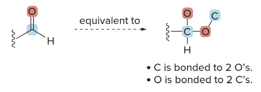

### HOW TO ACTUALLY ASSIGN R or S, QUICKLY

1. **Assign Priorities**:
   - Rank the four groups attached to the stereogenic center by atomic number (highest atomic number = priority 1).
   - If two groups have the same atom, apply Rule 2 to rank based on the next atoms along each branch.

2. **Orient the Molecule**:
   - Arrange the molecule so that the lowest priority group (4) is pointing away from you (on a dashed wedge).
   - Visualize only the remaining three groups (1, 2, and 3) in the plane.

    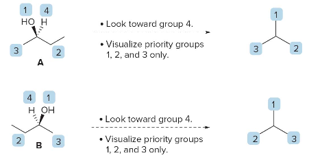

3. **Determine R or S**:
   - Trace a path from priority $\text{ 1 } \rightarrow \text{ 2 } \rightarrow \text{ 3 }$.
     - **Clockwise** = **R** (rectus).
     - **Counterclockwise** = **S** (sinister).

    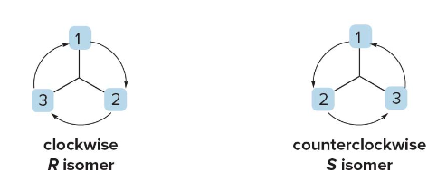

### Example Summary

- If the circle from $\text{ 1 } \rightarrow \text{ 2 } \rightarrow \text{ 3 }$ is clockwise, label as **R**.
- If the circle from $\text{ 1 } \rightarrow \text{ 2 } \rightarrow \text{ 3 }$ is counterclockwise, label as **S**.

The letter R or S preceeds the IUPAC name of the molecule using a prefix (S)- or (R)-

    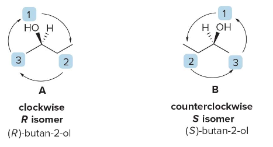

**NOTE**: If the lowest priority group is not facing towards back, rotate the molecule 120 degrees around a stationary bond axis.

    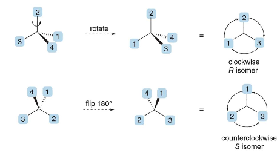

