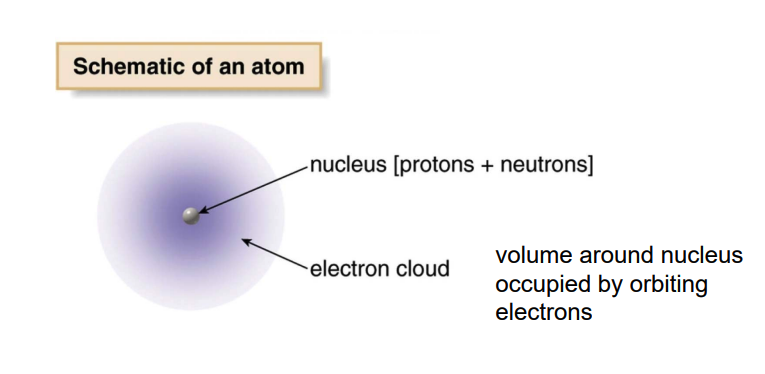
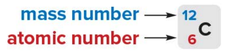
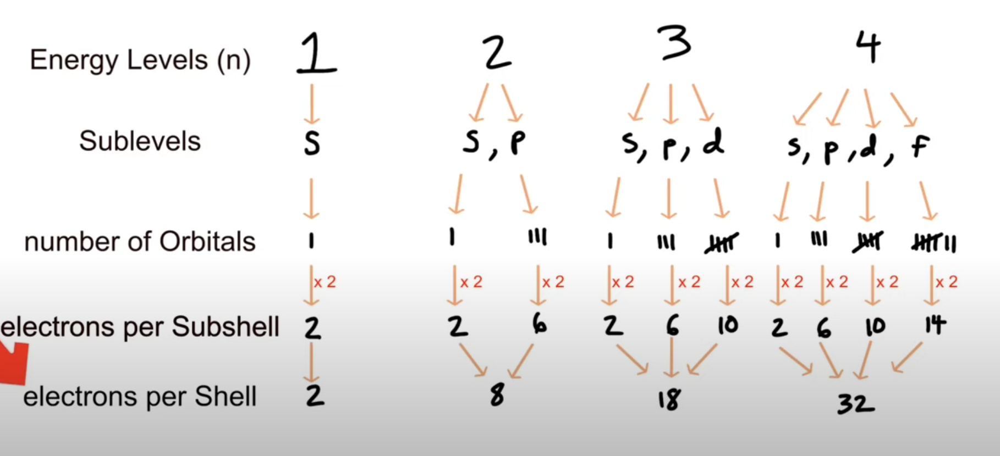
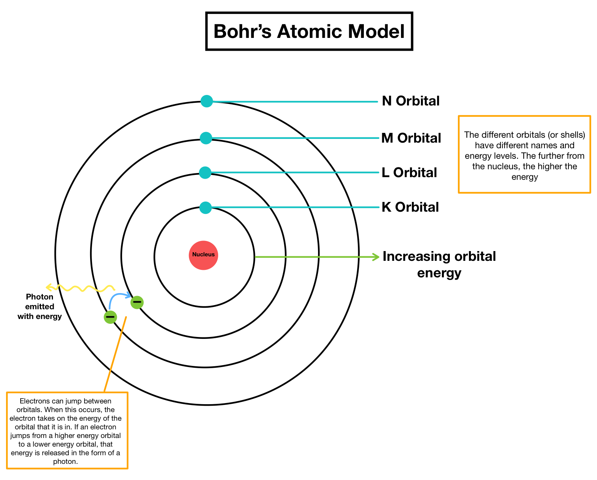
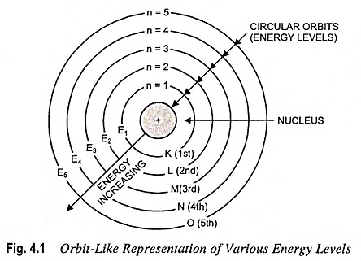
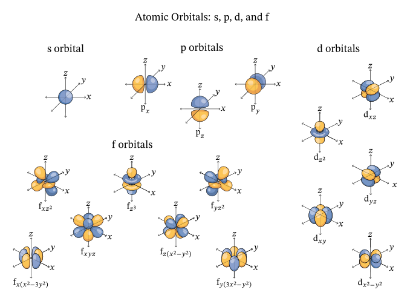
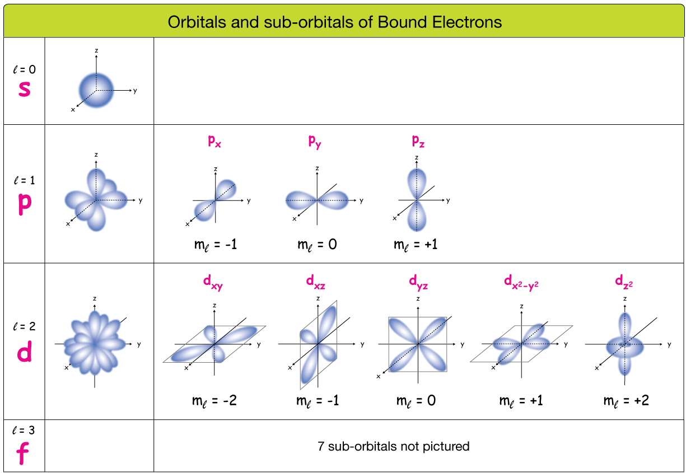

# Organic Chemistry, Academic Year 2024/2025

## Lesson 2 outline

1. Atomic structure
2. Atomic orbitals
3. Chemical bonding
4. Lewis structures
5. Resonance structures
6. 3D structures
7. Hybrid orbitals
8. Bond polarity

## Atomic Structure

An atom consists of a nucleus at its center, which contains protons (positively charged) and neutrons (neutral).

Surrounding the nucleus are electrons (negatively charged), which move in regions called electron shells or orbitals. These shells represent different energy levels, with the electrons **closest to the nucleus having lower energy** and those **further away having higher energy**.

**Identity and behavior**:
The number of protons defines the element, while the arrangement of electrons influences the atom's chemical behavior.

- Atomic number
  - The atomic number of an element is the number of protons in the nucleus of an atom of that element

- Mass number
  - The mass number is the number of protons plus neutrons in the nucleus
  

The atomic weight of a particular element is the weighted average of the mass of all its isotopes reported in atomic
mass unit (amu).

- This difference in neutron count causes the isotopes to have different atomic masses (mass number = protons + neutrons), while still being the same element.

For this particular reason the atomic mass of a given element is calculated as a weighted average.

💡 What is an isotope of a given element?
  > - *An isotope of an element refers to atoms of the same element that have the same number of protons but different numbers of neutrons. This means that isotopes of an element have the same atomic number (same number of protons) but different mass numbers (total number of protons and neutrons). For example, carbon has two common isotopes: Carbon-12 (6 protons and 6 neutrons) and Carbon-14 (6 protons and 8 neutrons).*

### Charged ions

An ion is an atom that has gained or lost one or more electrons, resulting in a net charge
- Cations
  - Ions with a positive because they have **lost** electons. 
- Anions
  - Ions with a negative charge because they have **gained** an electron.

## Atomic Orbitals

Atomic orbitals are regions around an atom's nucleus where there is a high probability of finding an electron. Orbitals are described by quantum mechanics and represent the wave-like behavior of electrons around the nucleus. Each orbital has a specific shape and energy level.

### S Orbital

**s orbitals** are spherical because the probability distribution of finding an electron is the same in every direction around the nucleus. This spherical symmetry results from the mathematical solutions to the Schrödinger equation for an electron in a hydrogen atom.

### P Orbitals

**p orbitals** are a type of atomic orbital with a dumbbell or figure-eight shape, and they are more complex than s orbitals

An element presenting p orbitals arrangements is comprised of 3 p orbital, one for each 3-Dimensional axis repectively: Px, Py and Pz.
  - Each p orbital has two lobes extending outwards starting from the nucleus, resembling a dumbbell shape.
  - These lobes represent regions where the probability of finding an electron is highest.
  - Between the two lobes, at the nucleus, there is a node, where the probability of finding an electron is zero.
  - Each p orbital can hold a maximum of two electrons with opposite spins.
    - This has something to do with the *Pauli Exclusion Principle* which is stuff coming from Quantum Mechanics. The priciple states that:
    > *"No two electrons in the same orbital can have the same quantum numbers"* for whatever this means...

You can literally imagine the shape as dictating where there's a high probability of finding an electron.

### Shells, subshells and energy levels

- Energy levels are labeled by the pricipal quantum number *n* (1, 2, 3 and so on...).
- As you go up in energy levels the energy increases and so does the capacity to hold more electrons.
- The total number of electrons in an energy level is given by 2n^2
  - First shell can hold 2(1**2) = 2 electrons
  - Second shell can hold 2(2**2) = 8 electrons
  - Third shell can hold 2(3**2) = 18 electrons

- Each energy level contains one or more subshells (s, p, d and f). These subshells are represented in the diagram:
  - 1st shell: 1s (can hold 2 electrons).
  - 2nd shell: 2s and 2p (together can hold 8 electrons: 2 in 2s and 6 in 2p).
  - 3rd shell: 3s, 3p, and 3d (together can hold 18 electrons: 2 in 3s, 6 in 3p, and 10 in 3d).
  - ...

- Each subshell has a certain amount of orbitals and each orbital can hold two electrons

> 💡 Videos and resources
> - [Gumball Degree: Shells, Subshells, and Orbitals](https://www.youtube.com/watch?v=UDmrRWeFWwU): simple video on bohr's model
> - [Some guy rendering p type subshells](https://www.youtube.com/watch?v=igEGO8h3N-A)
> - [Three Twentysix: What ARE atomic orbitals?](https://www.youtube.com/watch?v=23bNW4G9DZk): great video explaining the concept of electron density and why subshells are represented as shapes, which aren't really electron containers but rather a density plot of the places where an electron is most likely to be found around it's atom.
> - [minutephysics: A Better Way To Picture Atoms](https://www.youtube.com/watch?v=W2Xb2GFK2yc)
> - [Sci Pills: Atomic orbitals 3D](https://www.youtube.com/watch?v=Nr40fnfHccQ): Shows realistic 3D pictures of the simplest atomic orbitals of hydrogen
> - [Atom wave functions (animation)](https://www.youtube.com/watch?v=IlkY-HtjrkA)

### BOHR's Atomic model

### Subshells shapes

### Orbitals and sub-orbitals (or shells and subshells) of Bound Electrons

u/BayGO said on [reddit](https://www.reddit.com/r/explainlikeimfive/comments/amxfba/comment/efrxjai): 
> *"A Suborbital* simply refers to the "type" (shape) of the orbital that the electron is orbiting around."*

